# 2026-08-26 / ステップB着手前の環境確認

- **org**: `dcng-prod` / `dcng-stg` / `dcng-dev1`（CLI alias は `dcng-` 接頭辞付き）
- 前提: 2026-08-07 にステップA（`WI-000001` を dev1 → stg → prod まで昇格）を完了してから**19日間放置**

---

## 1. CLI 認証は3本とも生きていた

`sf org list` の結果（accessToken は含まれない出力）。

| alias | Username | 状態 |
|---|---|---|
| `dcng-prod` | `<EMAIL_REDACTED>` | Connected |
| `dcng-stg` | `<EMAIL_REDACTED>` | Connected |
| `dcng-dev1` | `<EMAIL_REDACTED>` | Connected |

`dev2` は認証されていない（2026-08-07 時点から変わらず）。
`sf config` の `target-org` は Local スコープで `dcng-prod`。

## 2. ワークアイテムは `CLOSED` のまま

```
SELECT Id, Name, Subject, Status FROM WorkItem ORDER BY CreatedDate
→ WI-000001 / 取引先にカスタム項目を追加 / CLOSED
```

## 3. 項目レベルセキュリティは 15 / 2 / 2 のまま

```
SELECT COUNT(Id) FROM FieldPermissions
WHERE Field = 'Account.VerificationNote__c' AND Parent.IsOwnedByProfile = true
```

| dev1 | stg | prod |
|---|---|---|
| 15 | 2 | 2 |

2026-08-07 の観測（15 → 2 → 2）と一致する。**19日間で動いていない。**

### ⚠ ただし数え方で件数が変わる

`Parent.IsOwnedByProfile = true` の条件を外すと **dev1 が 16、stg と prod が 3** になる。
増える1件はどの org でも同じで、プロファイルではなく**権限セット**だった。

```
SELECT Parent.Label, Parent.IsOwnedByProfile, SystemModstamp FROM FieldPermissions
WHERE Field = 'Account.VerificationNote__c' AND Parent.IsOwnedByProfile = false

→ Slack インテグレーションユーザー / false / 2026-07-31T00:00:00.000+0000
```

`SystemModstamp` が **`2026-07-31T00:00:00`**。
項目 `VerificationNote__c` を作ったのは 2026-08-07T02:31:37 なので、**項目より前の時刻**が入っている。
項目ごとに付与された行ではなく、org が自動管理する権限セットが返す行と読める。

**2026-08-07 のログの「15件」はプロファイルに絞った数字。** 今回の 16 と食い違うのは
状態が変わったからではなく、条件の違いによる。
→ **以降 `FieldPermissions` を数えるときは `Parent.IsOwnedByProfile = true` を付ける。**

## 4. 触っていないのに `SourceMember` が 7件 → 9件に増えた

```
SELECT MemberType, MemberName, RevisionCounter, IsNameObsolete FROM SourceMember
ORDER BY RevisionCounter   （Tooling API / dcng-dev1）
```

| MemberType | MemberName | Rev | 2026-08-07 時点 |
|---|---|---|---|
| CustomField | `Account.VerificationNote__c` | 1 | あり |
| Layout | `Account-取引先 レイアウト` | 2 | あり |
| Profile | `Read Only` | 3 | あり |
| Profile | `Admin` | 4 | あり |
| ExternalCredential | `ALMDevOpsCenterHub` | 9 | あり |
| PermissionSet | `AccessDevOpsCenterNamedCredentials` | 18 | あり |
| NamedCredential | `ALMDevOpsCenterHub` | 31 | あり |
| **DigitalExperienceBundle** | **`fragment_space/DefaultWidgetSpace`** | **34** | **なし** |
| **DigitalExperience** | **`fragment_space/DefaultWidgetSpace.sfdc_cms__languageSettings/languages`** | **36** | **なし** |

下2件は 2026-08-07 のログ（19章「dev1 の SourceMember 全7件」）に無い。
**19日間、この org に人は触っていない。** リビジョンカウンタも 31 → 36 に進んでいる。

### 誰が作ったか → `Process Automated`

`SourceMember` には `CreatedDate` と `ChangedBy` がある（`sf sobject describe` で確認）。

```
SELECT MemberType, MemberName, RevisionCounter, CreatedDate, ChangedBy, IsNewMember
FROM SourceMember WHERE MemberType LIKE 'DigitalExperience%'
```

| org | Rev | CreatedDate | ChangedBy |
|---|---|---|---|
| dev1 | 34 / 36 | `2026-08-10T12:14:53` / `12:14:55` | `<SALESFORCE_ID>` |
| stg | 7 / 9 | `2026-08-10T12:14:49` / `12:14:51` | `<SALESFORCE_ID>` |

**`<SALESFORCE_ID>` は `Process Automated`**（`autoproc@<SALESFORCE_ID>` / `UserType = AutomatedProcess`）。
人ではなく、プラットフォームの自動処理ユーザー。

**同じ 2026-08-10 12:14:49 に、`SetupAuditTrail` に Salesforce 側の処理が記録されている。**

```
2026-08-10T12:14:49  value_PROV_SCRATCH_DAILY_LIMIT   提供済みの 1 日のスクラッチ組織制限を 80 から 80 に変更
2026-08-10T12:14:49  value_PROV_SNAPSHOT_ACTIVE_LIMIT プロビジョニング済みスナップショットの有効な制限を 40 から 40 に変更
2026-08-10T12:14:49  value_MAX_STREAMING_TOPICS_PROV  ストリーミングトピックの最大数
（CreatedBy は空欄）
```

同種の記録は **08-10 / 08-17 / 08-24 の毎週月曜**にある（`CreatedBy` は毎回空欄）。
`DigitalExperience` 系が作られたのは **08-10 の回だけ**で、17日と24日には増えていない。

- **確認したこと**: dev1 と stg の**両方**で、同一秒に `Process Automated` が作成した
- **未確認**: DevOps Center の UI で**変更リストに出るか**。
  `WI-000001` は `CLOSED` なので、変更リストを見るには新しいワークアイテムが必要
- **未確認**: 08-10 に何が有効化されたのか（`SetupAuditTrail` に該当する記録は無い）
- 関係する既存の観測: 2026-08-07 に「DevOps Center へのサインインが開発環境にメタデータを作る」
  （`ExternalCredential` / `NamedCredential` / `PermissionSet`）を記録した。
  今回のものは**サインインとも無関係の時点で、人を介さず**増えている点が違う

## 5. prod には `SourceMember` オブジェクトが存在しない

```
SELECT COUNT(Id) FROM SourceMember   （Tooling API / dcng-prod）

ERROR at Row:1:Column:23
sObject type 'SourceMember' is not supported.
```

`dev1` と `stg` では同じクエリが通る。
**本番組織にソース追跡が無いことを、オブジェクトの不在という形で実機で確認した。**
それまでの判断は、ドキュメントに本番組織が列挙されていないことを根拠としていた。

---

## 6. 実験: 1プロファイルだけ FLS を変更した

**当初は「標準ユーザーに参照権を付与」する想定だったが、`標準ユーザー` は 08-07 の
ウィザードですでに参照権を持っていた**（15プロファイル全部にチェックが入っていた）。
そこで「1プロファイルだけを設定画面から変更する」条件を保つため、**編集権のみを外す**形にした。

### 操作

`dev1` の設定 → オブジェクトマネージャー → 取引先 → 項目とリレーション → `検`（`VerificationNote__c`）
→ **「項目レベルセキュリティの設定」**。

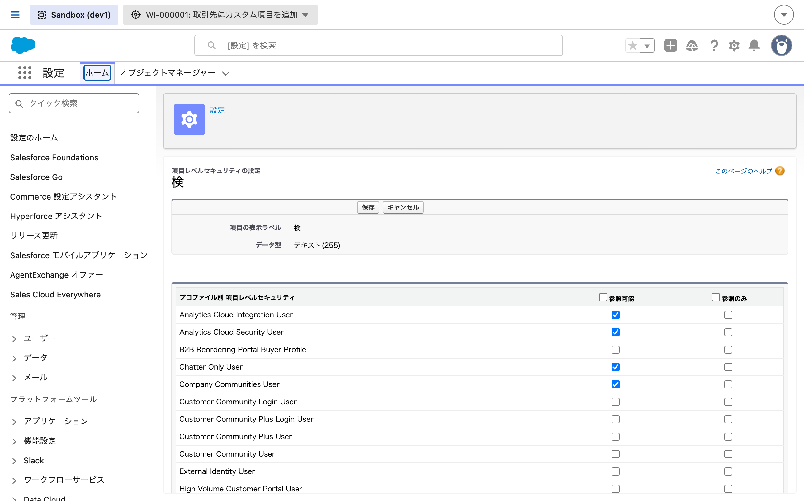

**08-07 に撮り逃したグリッドが撮れた。** 画面の見出しは「プロファイル別 項目レベルセキュリティ」で、
列は **「参照可能」と「参照のみ」の2つ**。

- 参照可能 ✓ / 参照のみ ✗ → 参照 + 編集
- 参照可能 ✓ / 参照のみ ✓ → 参照のみ
- 参照可能 ✗ → アクセスなし

変更前は**15プロファイルすべてが「参照可能」✓ かつ「参照のみ」✗**（＝参照 + 編集）。
SOQL の15件と一致する。

`標準ユーザー` の「参照のみ」だけをチェックして保存した。

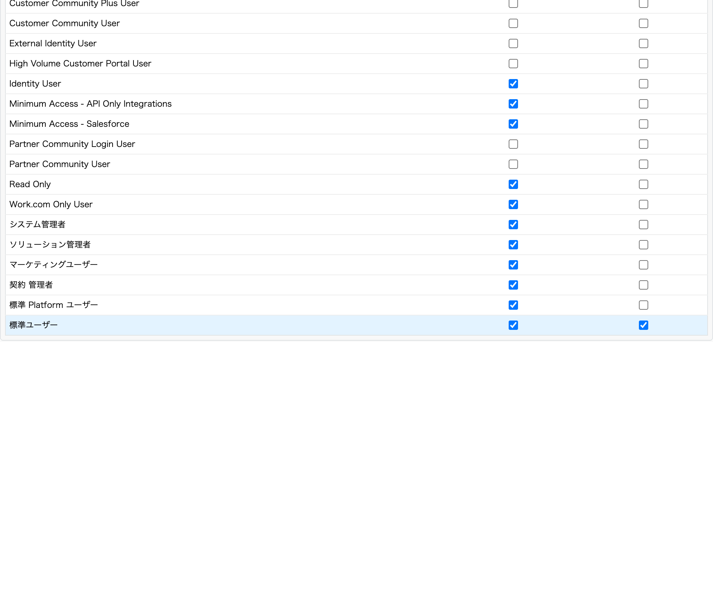

### 結果1: `FieldPermissions` は変わった

```
SELECT Parent.Profile.Name, PermissionsRead, PermissionsEdit, SystemModstamp
FROM FieldPermissions
WHERE Field = 'Account.VerificationNote__c' AND Parent.Profile.Name = '標準ユーザー'

→ 標準ユーザー, true, false, 2026-08-26T10:44:52.000+0000
```

`PermissionsEdit` が `false` になった。保存は **10:44:52**。

### 結果2: `SourceMember` には現れない

保存の25秒後と45秒後に2回クエリした。

```
SELECT MemberType, MemberName, RevisionNum, RevisionCounter, CreatedDate, LastModifiedDate
FROM SourceMember ORDER BY RevisionCounter DESC   （Tooling API）
```

| MemberType | MemberName | Rev | LastModifiedDate |
|---|---|---|---|
| NamedCredential | `ALMDevOpsCenterHub` | 38 | **2026-08-26T10:43:11** |
| DigitalExperience | `fragment_space/...languages` | 36 | 2026-08-10T12:14:55 |
| DigitalExperienceBundle | `fragment_space/DefaultWidgetSpace` | 34 | 2026-08-10T12:14:54 |
| PermissionSet | `AccessDevOpsCenterNamedCredentials` | 18 | 2026-08-07T02:44:45 |
| ExternalCredential | `ALMDevOpsCenterHub` | 9 | 2026-08-07T02:44:43 |
| Profile | `Admin` | 4 | 2026-08-07T02:31:40 |
| Profile | `Read Only` | 3 | 2026-08-07T02:31:40 |
| Layout | `Account-取引先 レイアウト` | 2 | 2026-08-07T02:31:37 |
| CustomField | `Account.VerificationNote__c` | 1 | 2026-08-07T02:31:37 |

- **`Profile / Standard` の行は作られなかった。** 件数は9件のまま
- **既存の `Profile / Admin` と `Profile / Read Only` の `LastModifiedDate` も 08-07 のまま。**
  FLS を変えたプロファイルの行が更新される、という形でもない

### 結果3: ログインが `NamedCredential` を更新した

`NamedCredential / ALMDevOpsCenterHub` の `RevisionCounter` が **31 → 38**、
`LastModifiedDate` が **2026-08-26T10:43:11** に変わっている。
これは**この作業のために `sf org open` で dev1 にログインした時刻**（10:42〜10:43）と一致する。

2026-08-07 に「DevOps Center へのサインインが開発環境にメタデータを作る」と記録したが、
**作るだけでなく、以後のログインでも更新される**。

### 何が言えて、何が言えないか

- **確認したこと**: 設定画面から1プロファイルの項目レベルセキュリティを変更しても、
  `SourceMember` に行は作られず、既存の行も更新されない
- **未確認**: **DevOps Center の変更リストに出るか。**
  `SourceMember` に出ないなら出ないはずだが、DevOps Center が独自に差分を取っている可能性は潰していない。
  確認するには新しいワークアイテムが必要（`WI-000001` は `CLOSED`）
- **未解明のまま**: **08-07 に `Profile / Admin` と `Profile / Read Only` の2件が追跡された理由。**
  今回の結果からすると、あの2件は FLS 変更が原因ではない別の機構で追跡されたことになる
- **今回試していないこと**: 参照権そのものの剥奪（「参照可能」のチェックを外す）。
  編集権だけを外した場合の結果である

---

## 7. 変更リストに何が出るか（B-0a）

> **⚠ この章は間違った画面を見ている（→ 12章）。** 観測は残すが、推論は撤回済み。

### prod で「DX インスペクターの契約条件」に同意を求められた

DevOps Center アプリ（`/lightning/app/standard__AlmDevops`）を開いたら、
**Slack のウェルカムダイアログ**と**DX インスペクターの契約条件**の2つが重なって出た。

原文:

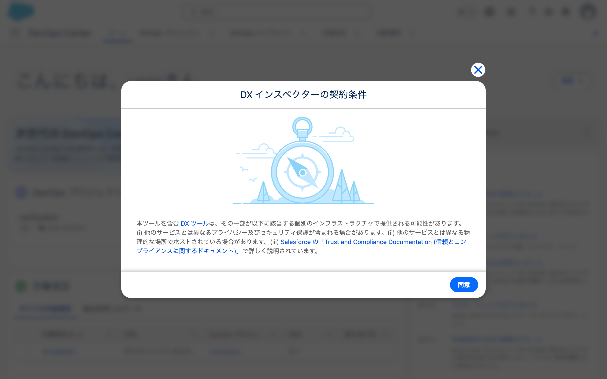

> **DX インスペクターの契約条件**
>
> 本ツールを含む DX ツールは、その一部が以下に該当する個別のインフラストラクチャで提供される
> 可能性があります。(i) 他のサービスとは異なるプライバシー及びセキュリティ保護が含まれる場合があります。
> (ii) 他のサービスとは異なる物理的な場所でホストされている場合があります。
> (iii) Salesforce の「Trust and Compliance Documentation (信頼とコンプライアンスに関するドキュメント)」で
> 詳しく説明されています。
>
> ［同意］

2026-08-07 の `SetupAuditTrail` には `dxGlobalTermsAcceptedOffOn`（02:42:19）が **`dev1` 側**に記録されている。
**prod では今回が初めての同意だった。**
→ **org ごとに同意が要る**と読めるが、ユーザーごとの可能性も潰していない（同じ admin ユーザーで操作している）。

### `WI-000002` を作った

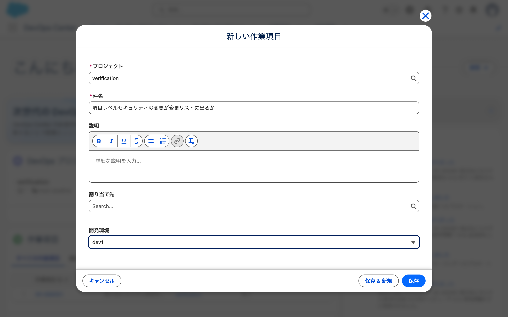

| 入力 | 値 |
|---|---|
| プロジェクト | `verification` |
| 件名 | `項目レベルセキュリティの変更が変更リストに出るか` |
| 開発環境 | `dev1`（選択肢は `--なし--` / `dev1` / `dev2`） |

**`WI-000002`** が `新規` で作られた（20:01）。

> **Lightning の combobox は `fill` で候補が出ない。** キー入力（Backspace → 1文字打つ → ArrowDown → Enter）が必要だった。
> さらに **候補リストは a11y ツリーに現れず、画面にだけ出た。**
> a11yスナップショットだけでは、画面に出た候補を証拠にできなかった。

### 「新規」の時点で 0 件

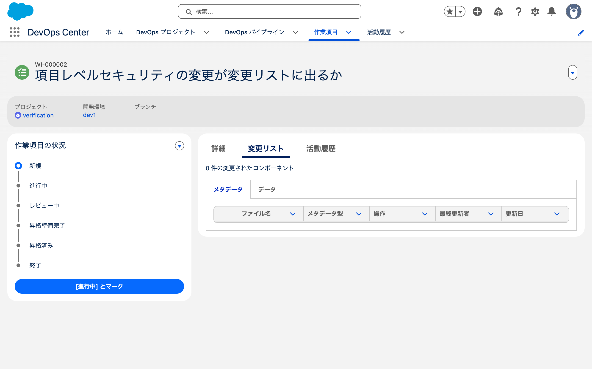

> **0 件の変更されたコンポーネント**

タブは **「メタデータ」と「データ」の2つ**（データのデプロイは GA で追加された機能）。
列は ファイル名 / メタデータ型 / 操作 / 最終更新者 / 更新日。

### 「進行中」にしてブランチが作られても 0 件

「[進行中] とマーク」を押すと、ブランチ
**`example-project/WI-000002`** が作られた。
2026-08-07 の `WI-000001` と同じ命名規則。

左パネルの案内は「開発環境の変更を確定し、レビューを作成します。」に変わった。

**変更リストは 0 件のまま。ページをリロードしても 0 件。**

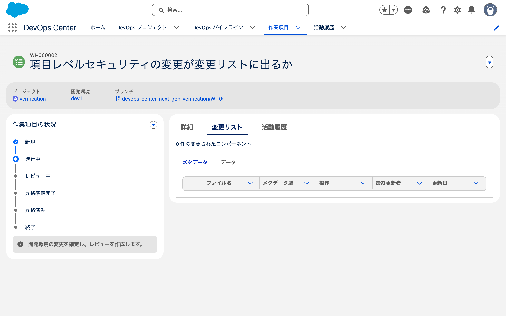

### 0 件だったのは FLS だけではない

この時点で `dev1` の `SourceMember` は **9件**ある（4章・6章）。そのうち **08-07 のコミット以降に
リビジョンカウンタが動いたものが3件**ある。

| MemberType | MemberName | Rev | いつ動いたか |
|---|---|---|---|
| NamedCredential | `ALMDevOpsCenterHub` | 38 | 2026-08-26 10:43（ログイン時） |
| DigitalExperience | `fragment_space/...languages` | 36 | 2026-08-10（`Process Automated`） |
| DigitalExperienceBundle | `fragment_space/DefaultWidgetSpace` | 34 | 2026-08-10（`Process Automated`） |

**どれも変更リストに出ていない。**

- **確認したこと**: `dev1` の `SourceMember` に9件（うち08-07以降に動いたもの3件）ある状態で、
  新しいワークアイテムの変更リストは 0 件だった

> **⚠ ここから先に書いていた「絞り込みの機構がある」という推論は撤回した（→ 12章）。**

- **未確認**: FLS を持つプロファイル（`Profile / Standard`）を
  **DX Inspector の「メタデータを追加」で選べるか**（B-0b）。
  なお 08-27 に `CustomField` では選べることを確認した（19章）

---

## 8. 後片付けで分かったこと

### API 経由の項目レベルセキュリティ変更も追跡されない

`dev1` の `標準ユーザー` の編集権を戻すのに API を使った。

```
sf data update record -o dcng-dev1 -s FieldPermissions -i <DEVOPS_RECORD_ID> -v "PermissionsEdit=true"
→ Success（SystemModstamp = 2026-08-26T14:18:05）
```

**`FieldPermissions` は API で更新できる。** そして10秒後に `SourceMember` を見たが:

- 件数は **9件のまま**
- `Profile` 型は `Admin`（rev 4）と `Read Only`（rev 3）で、どちらも `LastModifiedDate` が 08-07 のまま

→ **画面からでも API からでも、項目レベルセキュリティの変更は追跡されない。**
6章の結果（画面操作）と合わせて、**操作経路によらないことが確認できた。**

### ワークアイテムを削除する導線は無い。「対象外」にするのが終わり方

`WI-000002` を閉じようとして、2つのメニューを開いた。

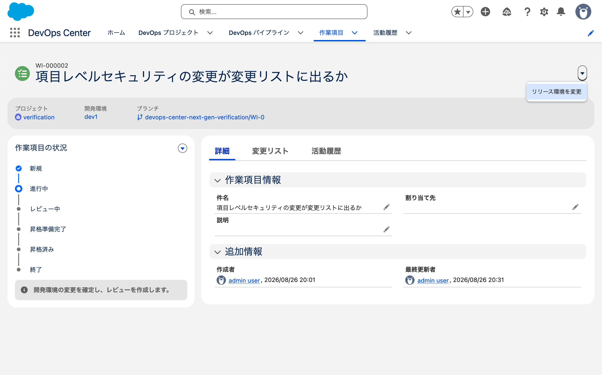

| メニュー | 中身 |
|---|---|
| 画面右上「その他のアクションを表示」 | **「リリース環境を変更」だけ** |
| 作業項目の状況パネル「その他のアクション」 | **「状況を [対象外] に変更」だけ** |

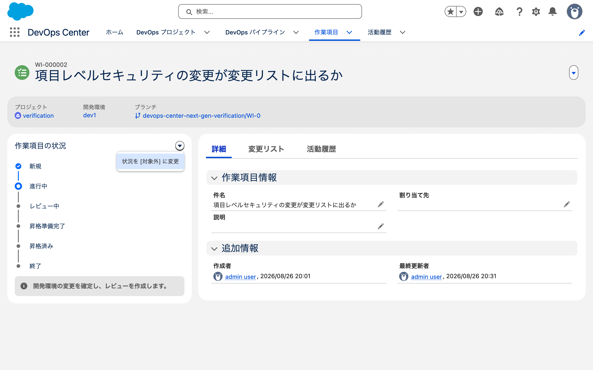

**削除の導線は無い。** 2024年3月の自社記事が挙げた期待②「プロジェクト/ワークアイテムの削除」は、
**ワークアイテムについては「対象外にする」で代替される形。**

### 確認ダイアログの原文（日本語が壊れている）

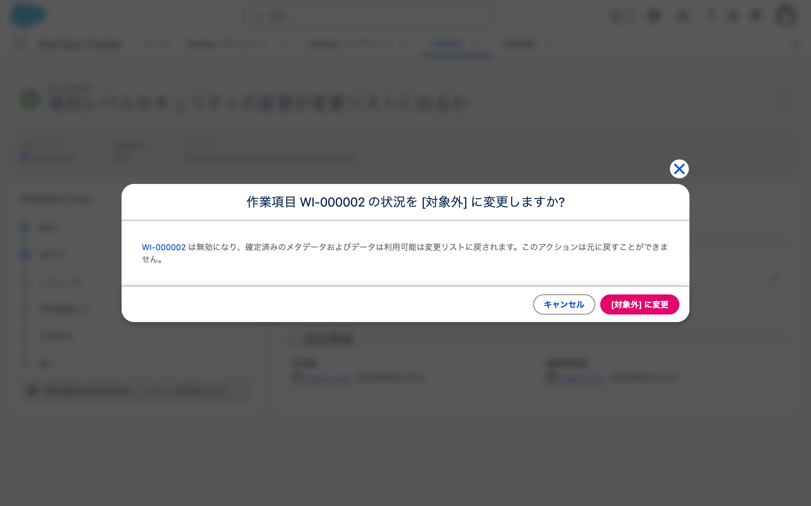

> **作業項目 WI-000002 の状況を [対象外] に変更しますか?**
>
> WI-000002 は無効になり、確定済みのメタデータおよびデータは**利用可能は**変更リストに戻されます。
> このアクションは元に戻すことができません。
>
> ［キャンセル］［[対象外] に変更］

- **「利用可能は変更リストに戻されます」** ← 日本語化漏れ。おそらく "available" の訳が浮いている
- **「このアクションは元に戻すことができません」** ← 不可逆

実行後の状態:

```
SELECT Name, Status FROM WorkItem
→ WI-000001 / CLOSED
→ WI-000002 / NEVERED
```

**`NEVERED`** になった。2026-08-07 のデータモデル調査で
「旧版の『status を Never にすると変更が他のワークアイテムに戻る』概念が次世代にもある」と
記録していた値が、実際に使われた。

今回は変更リストが0件だったので `SourceMember` は9件のまま変わらない
（戻るものが無いので、「変更リストに戻される」挙動そのものは観測できていない）。

---

## 9. B-2b の開始: prod に項目を直接追加した

**目的**: 本番だけに追加した項目が、昇格（差分／フル）で消えるかを見る。

### 操作

prod の設定 → オブジェクトマネージャー → 取引先 → 項目とリレーション → 新規。
開始前のカスタム項目は `VerificationNote__c` の1つだけだった。

| ステップ | 入力 |
|---|---|
| 1. データ型の選択 | テキスト |
| 2. 詳細を入力 | 表示ラベル `本番だけで作ったメモ` / 項目名 `ProdOnlyNote` / 文字数 255 |
| 3. 項目レベルセキュリティの設定 | **既定のまま**（下記） |
| 4. ページレイアウトへの追加 | **既定のまま**（「取引先 レイアウト」にチェック） |

作成時刻は `2026-08-26T14:35:57`。

### ステップ3の既定値が判明した（08-07 に撮り逃した画面）

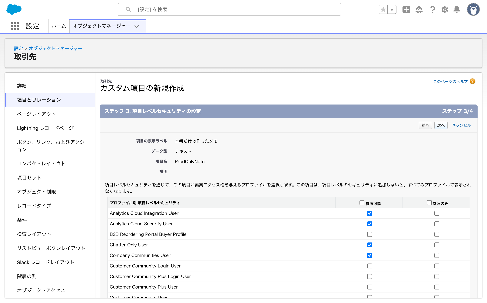

画面の説明文（原文）:

> 項目レベルセキュリティを通じて、この項目に編集アクセス権を与えるプロファイルを選択します。
> この項目は、項目レベルのセキュリティに追加しないと、すべてのプロファイルで表示されなくなります。

**既定でチェックが入っているのは15プロファイル。** 内訳:

| 既定で ✓（15件） | 既定で未チェック（9件） |
|---|---|
| Analytics Cloud Integration User / Analytics Cloud Security User / Chatter Only User / Company Communities User / Identity User / Minimum Access - API Only Integrations / Minimum Access - Salesforce / Read Only / Work.com Only User / システム管理者 / ソリューション管理者 / マーケティングユーザー / 契約 管理者 / 標準 Platform ユーザー / 標準ユーザー | B2B Reordering Portal Buyer Profile / Customer Community Login User / Customer Community Plus Login User / Customer Community Plus User / Customer Community User / External Identity User / High Volume Customer Portal User / Partner Community Login User / Partner Community User |

**外部ユーザー（コミュニティ / ポータル）向けのプロファイルだけが未チェック。**

→ **2026-08-07 のログの記述を訂正する。** あのログは
「ウィザードは既定で全プロファイルにチェックが入っており、そのまま次へ進んだ」と書いていたが、
**正しくは「内部ユーザー向けの15プロファイルにチェックが入っている」。**
08-07 に FLS が15件付いたのは、**ウィザードの既定値がそうなっているから**だった。

### 同じ org・同じオブジェクトで、作り方の違いだけで FLS の件数が違う

```
SELECT COUNT(Id) FROM FieldPermissions
WHERE Field = 'Account.<項目>__c' AND Parent.IsOwnedByProfile = true   （dcng-prod）
```

| 項目 | どう作ったか | prod の FLS |
|---|---|---|
| `VerificationNote__c` | dev1 で作って**昇格で運んだ**（08-07） | **2件** |
| `ProdOnlyNote__c` | **本番で画面から直接作った**（08-26） | **15件** |

**同じウィザードで同じデータ型の項目を作っても、パイプラインを通すと13件落ちる。**

- **確認したこと**: 同一 org・同一オブジェクト・同一データ型で、作成経路の違いだけで FLS の件数が 15 と 2 に分かれた
- **これは 6章・7章の結果（FLS 変更が追跡されない）の対照実験になっている。**
  「追跡されないから運ばれない」を、同じ org 内の比較で示せる
- **未確認**: この項目が昇格で消えるか（B-2b の本題。次の手順）

---

## 10. B-2b の続き: dev1 で別の項目を作った

### `WI-000003` を作り、dev1 で作業する前の変更リストは 0 件

`WI-000003`「本番だけの項目が昇格で消えるか」を作成（開発環境 `dev1`）。
「[進行中] とマーク」でブランチ `example-project/WI-000003` が作られた。

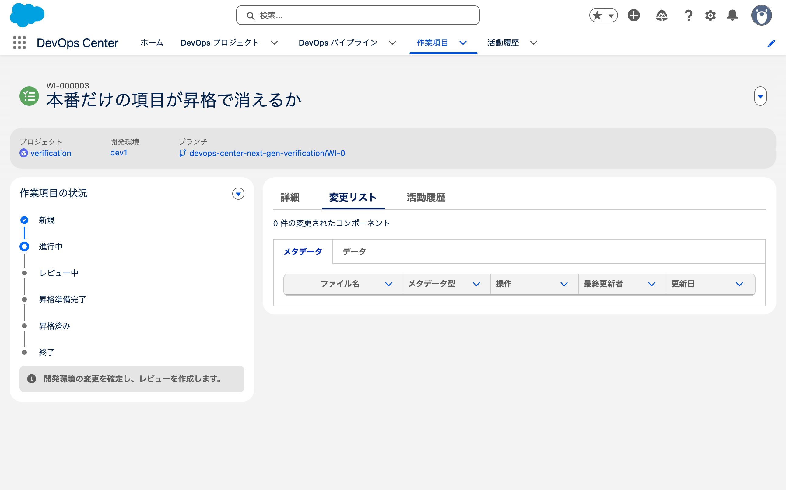

**この時点で変更リストは 0 件。** `dev1` の `SourceMember` には9件あり、
うち3件は 08-07 のコミット以降に動いている（4章・7章）が、**どれも出ない。**

→ **絞り込みの基準は「ワークアイテム作成時点より後の変更」らしい**（B-0e の手がかり）。

### dev1 で `DevSideNote__c` を作った

prod と同じ手順で `Account` にテキスト項目を追加（`14:47:06`）。
ステップ3の既定値も prod と同じ15プロファイル。

**dev1 の DX Inspector パネルは `WI-000001`（08-07 に完了したもの）を表示したままだった。**
`WI-000003` に切り替えずに項目を作った。

### 動いた `SourceMember` は4件。08-07 と同じパターン

| MemberType | MemberName | Rev の変化 | CreatedDate |
|---|---|---|---|
| CustomField | `Account.DevSideNote__c` | **新規 41** | 2026-08-26 14:47:06 |
| Layout | `Account-取引先 レイアウト` | 2 → **42** | 08-07（更新） |
| Profile | `Read Only` | 3 → **43** | 08-07（更新） |
| Profile | `Admin` | 4 → **44** | 08-07（更新） |

**15プロファイルに FLS が付いたのに、`Profile` 型で追跡されるのは `Admin` と `Read Only` の2件だけ。**
2026-08-07 と完全に同じパターンで、**再現性が確認できた**（B-0f はまだ未解明だが、偶然ではない）。

### 変更リストのレコードが作られていない

`WI-000003` の変更リストは、項目を作った後もリロード後も **0 件**。


SOQL で親子を確認した。

```
SELECT Id, Name, WorkItemId FROM WorkItemComponentList
→ <RECORD_ID> / <DEVOPS_RECORD_ID>（WI-000001）
→ <RECORD_ID> / <DEVOPS_RECORD_ID>（WI-000001）
```

**`WI-000003` の `WorkItemComponentList` が存在しない。** WI-000001 の分が2件あるだけ
（08-07 に2回コミットした = 1回失敗 + 1回成功に対応）。

`WorkItemComponent` の中身（WI-000001 の分）:

| MemberName | MemberType | ChangeType |
|---|---|---|
| `Account.VerificationNote__c` | CustomField | NEW |
| `Account-取引先 レイアウト` | Layout | CHANGE |
| `Read Only` | Profile | CHANGE |
| `Admin` | Profile | CHANGE |

- **確認したこと**: `dev1` で項目を作って `SourceMember` が4件動いたのに、
  `WI-000003` の変更リストは 0 件で、`WorkItemComponentList` レコードも作られていない

> **⚠ ここに書いた「有力な原因」（作業項目の切り替え）は外れだった（→ 11章・12章）。**

## 11. 作業項目を切り替えても変更リストは 0 件だった（見立てが外れた）

> **⚠ 切り分けの前提が間違っている（→ 12章）。** 副産物の観察は有効。

`dev1` の DX Inspector パネルで作業項目を `WI-000003` に切り替えた。

### 導線

パネルの「work item actions」メニューの中身は3つ。

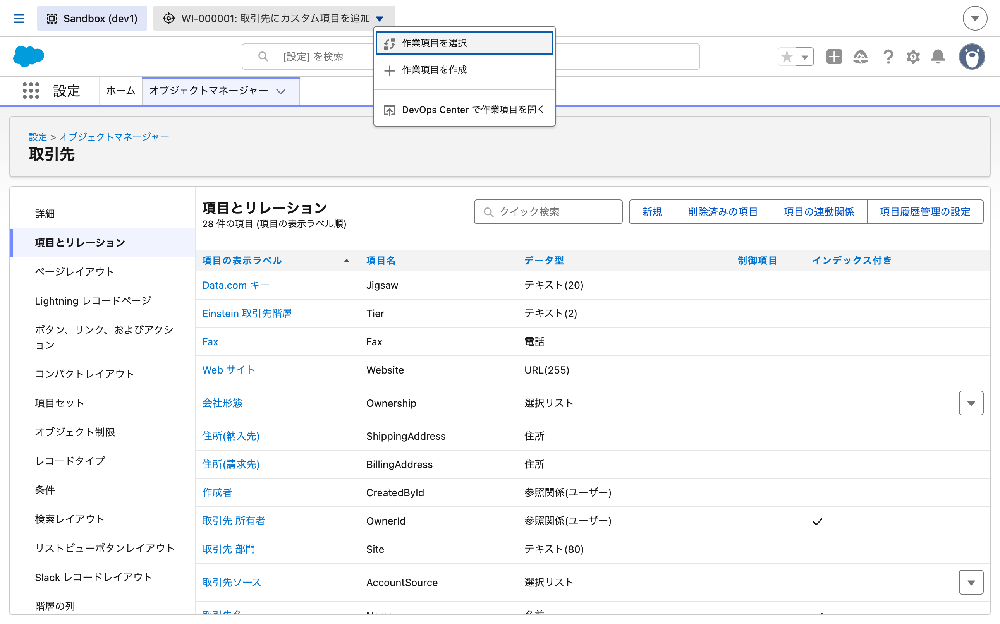

- 作業項目を選択
- 作業項目を作成
- DevOps Center で作業項目を開く

### 一覧に出ないものが選択されたまま残っていた

「作業項目を選択」のダイアログに出た候補は **`WI-000003`（`IN_PROGRESS`）の1件だけ。**

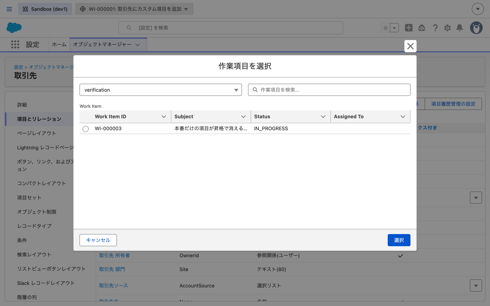

- 完了した `WI-000001`（`CLOSED`）は**候補に出ない**
- 対象外にした `WI-000002`（`NEVERED`）も**出ない**

**それなのにパネルは `WI-000001` を表示し続けていた。**
つまり**選択肢に存在しないものが選択された状態で19日間残っていた。**

> **⚠ `NEW` の作業項目も選択できる**（08-27 / 18章）。ここで言えるのは
> 「`CLOSED` と `NEVERED` は候補に出ない」まで。

> **一覧に出ないものが選択されたままになる。** 実務では「前回の作業の続き」と思って
> 画面を触ると、完了済みの作業項目に紐づいた状態になる。

### 切り替えても変更リストは 0 件

`WI-000003` を選択して確定した（`23:54`）。**それでも変更リストは 0 件のまま。**


**→ 「DX Inspector が古い作業項目を保持していたのが原因」という見立ては外れた。**

### 途中で立てた前提も外れていた

`WorkItemComponentList` レコードの有無で変更リストを判定しようとしたが、これは誤り。

```
SELECT Name, WorkItemId FROM WorkItemComponentList
→ <RECORD_ID> / WI-000001
→ <RECORD_ID> / WI-000001
```

**この2件は 08-07 の2回のコミット（1回失敗 + 1回成功）に対応する。**
つまり `WorkItemComponentList` は**コミット時に作られるレコード**で、
画面の変更リスト（コミット前の候補一覧）とは別物。**レコードの有無では判定できない。**

### 原因はまだ分かっていない

確認できた事実:

| | |
|---|---|
| `dev1` に項目を作った | `SourceMember` に4件（rev 41〜44） |
| 順序 | `WI-000003` 作成（23:42）→ 項目作成（23:47）。**ワークアイテムが先** |
| ブランチ | `WI-000003` が作られている |
| 開発環境 | `dev1` が紐づいている |
| DX Inspector | `WI-000003` に切り替え済み |
| 変更リスト | **0 件** |

**次に試すこと（優先順）:**

1. **2026-08-07 のログを読み直す。** あの日は変更リストに4件出た。**何をして出たのかが書いてある**はず。
   手順の差分を突き合わせるのが最短
2. 数分〜数十分待って再確認（非同期ジョブの可能性）
3. DX Inspector のパネル（`Toggle Panel`）を開いて、変更の取得や同期の導線があるか探す

> **→ 1 が正解だった（12章）。** 見ていた画面が違っただけで、原因は製品側に無かった。
> **ここまでの10章・11章の推論は、ほぼ全部この誤りの上に立っている。**

---

## 12. 今日の観測の半分は手順の誤りによる誤読だった

**2026-08-07 のログを読み直したら答えが書いてあった。**

- 6章「DevOps Center 側の『変更リスト』は 0 件のまま」
- 15章「**『変更リスト』が埋まった（0件問題の解決）**」

**DevOps Center の「変更リスト」タブは、コミット前は 0 件で正常。** コミット候補の一覧ではなく、
**コミット済みの一覧**だった。コミットは **DX Inspector 側**（画面左上のハンバーガーアイコン ☰）でやる。

### DX Inspector を開いたら、全部並んでいた

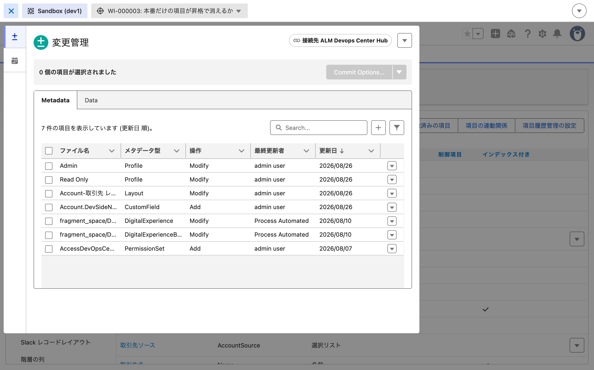

画面名は「変更管理」。右上に「接続先 ALM Devops Center Hub」。**7件**が並んでいた。

| ファイル名 | メタデータ型 | 操作 | 最終更新者 | 更新日 |
|---|---|---|---|---|
| Admin | Profile | Modify | admin user | 2026/08/26 |
| Read Only | Profile | Modify | admin user | 2026/08/26 |
| Account-取引先 レイアウト | Layout | Modify | admin user | 2026/08/26 |
| Account.DevSideNote__c | CustomField | **Add** | admin user | 2026/08/26 |
| fragment_space/…languages | DigitalExperience | Modify | **Process Automated** | 2026/08/10 |
| fragment_space/DefaultWidgetSpace | DigitalExperienceBundle | Modify | **Process Automated** | 2026/08/10 |
| AccessDevOpsCenterNamedCredentials | PermissionSet | Add | admin user | 2026/08/07 |

### 撤回する記述

| 撤回するもの | 実際 |
|---|---|
| 「変更リストは `SourceMember` をそのまま出していない。絞り込みの機構がある」（B-0e） | **絞り込みなど無い。** 08-10 の `Process Automated` の2件も 08-07 の `PermissionSet` も、DX Inspector に全部出ている |
| 「ワークアイテム作成時点より前の `SourceMember` は変更リストに出ない」 | **誤り。** 08-07 / 08-10 のものが出ている |
| 「`dev1` の DX Inspector が古い作業項目を保持していたのが原因」 | **誤り**（11章）。切り替えても 0 件のままだった。原因は手順が1つ足りなかったこと |
| 7章の「変更リストにも出ない」を B-0 の根拠に並べたこと | **無意味な観測だった。** コミット前なら 0 件が正常なので、FLS が出ないことの証拠にならない |

### B-0 の結論は保たれる

**項目レベルセキュリティが運べない**という結論は変わらない。根拠は次の2つ。

1. **`SourceMember` に載らない**（6章。Tooling API を直接見ているので、コミットとは無関係）
2. **DX Inspector の7件にも入っていない。** `Profile` は `Admin` と `Read Only` の2件だけで、
   08-26 に編集権を変えた `標準ユーザー` は出ていない

**DX Inspector は `SourceMember` を表示する**（08-07 のログ「`SourceMember` の4件がそのまま並ぶ」）。
載らないものは選べないので、コミットできない。**運ぶ手段が無い。**

## 13. コミットを通した

上4件を選んで `Commit Options...` → 「ファイルを確定」ダイアログ。

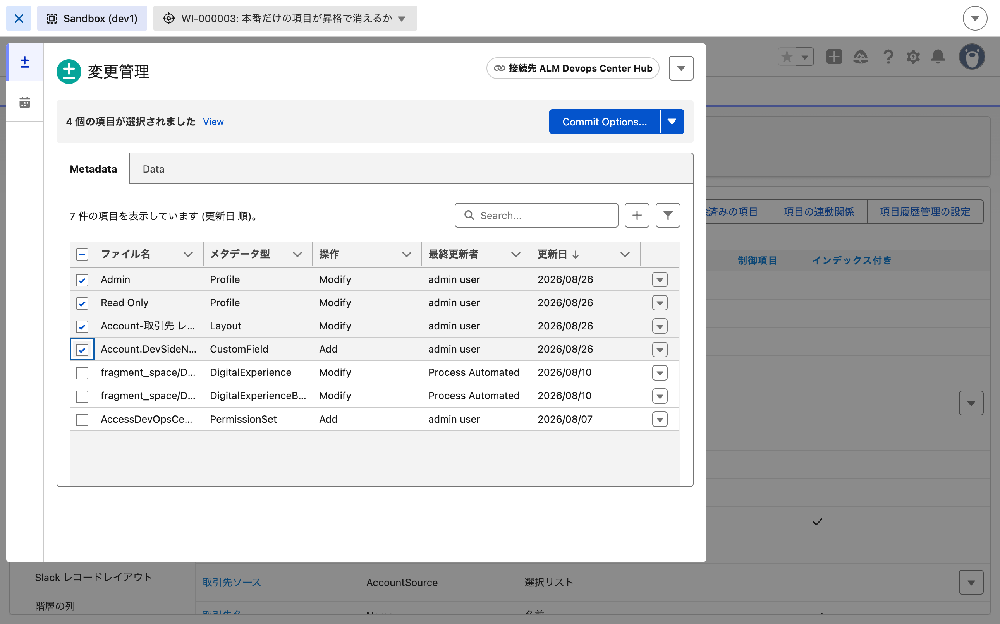

ステップ1で作業項目（`WI-000003`）を選び、ステップ2でコメントを入れて Commit。

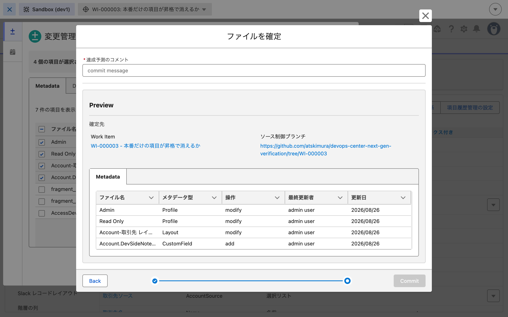

> **⚠ 日本語化の不備**: コミットメッセージの入力欄のラベルが **「達成予測のコメント」**。
> プレースホルダは `commit message`。**原文は "Commit comment" だと思われるが「達成予測」になっている。**

### 結果

| | |
|---|---|
| `DevopsRequestInfo` | `<RECORD_ID>` / `COMMIT` |
| `WorkItemComponentList` | **`<RECORD_ID>` が作られた**（WI-000003 の分） |
| 変更リストの中身 | `Admin`(CHANGE) / `Read Only`(CHANGE) / `Account-取引先 レイアウト`(CHANGE) / `Account.DevSideNote__c`(**NEW**) |
| GitHub | ブランチ `WI-000003` にコミット。**メッセージは日本語のまま通った** |
| コミット作者 | **`DevOps Center`**（08-07 と同じ。個人名は残らない） |

**中身は 08-07 とまったく同じ4件。** 15プロファイルに FLS が付いたのに `Profile` は2件だけ。

---

## 14. レビュー作成 → PR

コミット後、DX Inspector の上部バーに **`Create Review`** が出た（08-07 と同じ）。

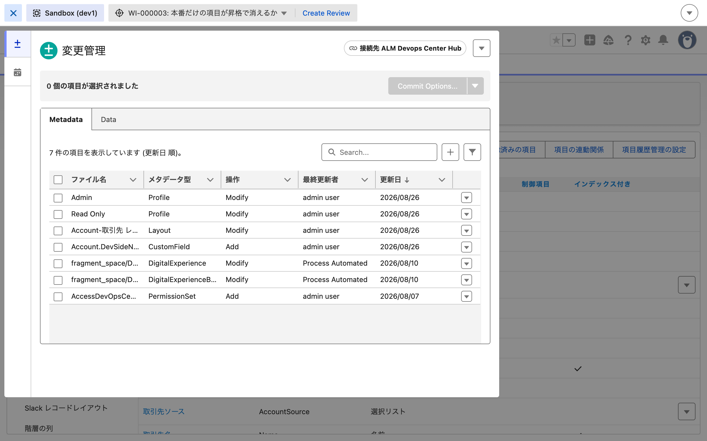

**コミットしても DX Inspector の一覧は7件のまま。** コミットした4件も残っている。
（08-07 のログにある「コミットすると他のワークアイテムの変更リストから消える」は
**共有開発環境の話**で、同じワークアイテム内では残ると読める。→ 共同開発に関する検証 の 3-9 で確認する）

`Create Review` を押した結果:

| | |
|---|---|
| `WorkItem.Status` | `IN_PROGRESS` → **`IN_REVIEW`** |
| `WorkItem.ReviewRemoteReference` | **`3`** |
| PR | **`#3 [DevOps Center] Merge WI-000003 to staging`** / `WI-000003` → `staging` / OPEN |

PR のタイトルは自動生成（ワークアイテムの件名は使われない）。08-07 と同じ形式。

**リポジトリの PR 一覧:**

| # | タイトル | ブランチ | 状態 |
|---|---|---|---|
| 3 | [DevOps Center] Merge WI-000003 to staging | `WI-000003` → `staging` | OPEN |
| 2 | Promotion: staging → main | `staging` → `main` | MERGED |
| 1 | [DevOps Center] Merge WI-000001 to staging | `WI-000001` → `staging` | MERGED |

→ **ステージ間昇格（#2）とワークアイテム昇格（#1・#3）でタイトルの形式が違う。**
前者は `Promotion: staging → main`、後者は `[DevOps Center] Merge <WI> to <stage>`。

---

## 15. staging への差分昇格（B-2b 手順1）

`WI-000003` を「[昇格準備完了] とマーク」で `READY_TO_PROMOTE` にしてから、
パイプライン画面の「承認済み作業項目」で選択して「選択された項目を昇格」を押した。

昇格オプションのダイアログは 08-07 と同じ2択で、**既定（差分）のまま昇格した。**

| | |
|---|---|
| `DevopsEnvDeployment` | `<RECORD_ID>` |
| `IsFullDeploy` | **`false`**（差分） |
| `TestLevel` | `Default` |
| `Status` | `SUCCESS` |
| `WorkItem.Status` | **`PROMOTED`** |

`StartRevisionCounter` / `EndRevisionCounter` は**どちらも空**だった（`<RECORD_ID>` も同じ）。

### 運ばれたメタデータ（`DevopsEnvDeploymentMbr`）

| MemberName | MemberType | ChangeType | VersionNumber |
|---|---|---|---|
| `Account.DevSideNote__c` | CustomField | NEW | 41 |
| `Account-取引先 レイアウト` | Layout | CHANGE | 42 |
| `Read Only` | Profile | CHANGE | 43 |
| `Admin` | Profile | CHANGE | 44 |

コミットした4件がそのまま運ばれている。

### stg 側の結果

```
$ sf data query -o dcng-stg -q "SELECT DeveloperName FROM CustomField WHERE TableEnumOrId = 'Account'" --use-tooling-api
VerificationNote
DevSideNote
```

| 項目 | dev1 の FLS | stg の FLS |
|---|---|---|
| `VerificationNote__c` | 15 | 2 |
| `DevSideNote__c` | **15** | **2** |

### 「15 → 2」の由来が確定した（B-0f への回答）

dev1 で `DevSideNote__c` に FLS があるプロファイルは15件ある。

```
Analytics Cloud Integration User / Analytics Cloud Security User / Chatter Only User /
Company Communities User / Identity User / Minimum Access - API Only Integrations /
Minimum Access - Salesforce / Read Only / Work.com Only User /
システム管理者 / ソリューション管理者 / マーケティングユーザー / 契約 管理者 /
標準 Platform ユーザー / 標準ユーザー
```

**このうち昇格で運ばれたのは `Admin`（＝システム管理者）と `Read Only` の2件だけ。**
残る13プロファイルの `FieldPermissions` は `SourceMember` に載らず、運ばれない。
だから stg の FLS は2件になる。

→ **08-07 の「15 / 2 / 2」は、追跡されるプロファイルが2つしかないことの結果だった。**
FLS そのものが追跡されないのではなく、**追跡されるプロファイルの範囲が狭い**という形の制約である。

**まだ分からないのは、なぜ `Admin` と `Read Only` の2つだけなのか**（B-0f として残す）。
両者は 08-07 と 08-26 の2回とも同じ組み合わせで、再現性はある。

---

## 16. 本番への差分昇格（B-2b 手順2）

パイプライン画面のステージング側に「**フェーズを昇格 →**」ボタンが出ていた。

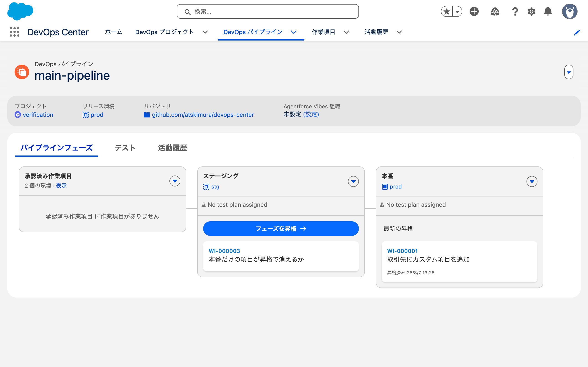

押すと「昇格オプション」ダイアログが開いた。原文:

> **昇格オプション**
>
> \* **昇格する変更**
> ◉ 変更が 本番 フェーズではありません ← 既定
> ○ 本番 フェーズのブランチ内のすべてのメタデータ
>
> \* **テストオプション**
> ◉ デフォルト ← 既定
> ○ ローカルテストを実行
> ○ すべてのテストを実行
> ○ 指定されたテストを実行
>
> \* **テストクラス名**
> （テストクラス名をカンマ区切りで入力）

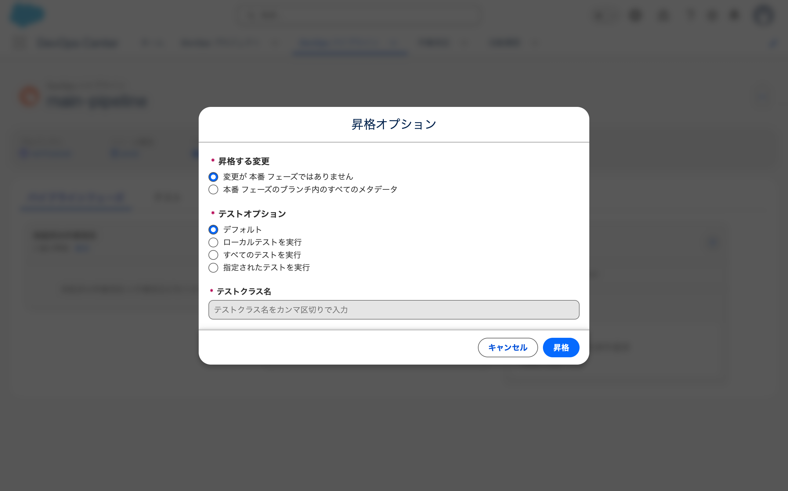

ステージ間昇格でもワークアイテム昇格と同じ2択だった。**既定（差分）のまま昇格した。**

| | |
|---|---|
| `DevopsEnvDeployment` | `<RECORD_ID>` |
| `IsFullDeploy` | **`false`**（差分） |
| `TestLevel` | `Default` |
| `Status` | **`SUCCESS`** |

運ばれたメタデータは `<RECORD_ID>`（staging 昇格）と同じ4件。

| MemberName | MemberType | ChangeType | VersionNumber |
|---|---|---|---|
| `Account.DevSideNote__c` | CustomField | NEW | 41 |
| `Account-取引先 レイアウト` | Layout | CHANGE | 42 |
| `Read Only` | Profile | CHANGE | 43 |
| `Admin` | Profile | CHANGE | 44 |

### 項目そのものは残った

```
$ sf data query -o dcng-prod -q "SELECT DeveloperName FROM CustomField WHERE TableEnumOrId = 'Account'" --use-tooling-api
VerificationNote
ProdOnlyNote      ← 残っている
DevSideNote       ← 昇格で入った
```

FLS も変わっていない。

| 項目 | prod の FLS（昇格後） |
|---|---|
| `VerificationNote__c` | 2 |
| `DevSideNote__c` | 2 |
| `ProdOnlyNote__c` | **15**（本番で作ったときのまま） |

### レイアウトからは消えた

昇格後の prod のレイアウトを retrieve して中身を見た。

```
$ sf project retrieve start -o dcng-prod -m "Layout:Account-取引先 レイアウト" --target-metadata-dir ...
→ <field> は17件、うちカスタム項目は ['VerificationNote__c', 'DevSideNote__c']
```

**`ProdOnlyNote__c` がレイアウトから消えている。**
9章のとおり、この項目は作成ウィザードのステップ4（既定のまま）で「取引先 レイアウト」に追加されていた。

リポジトリ（`main` ブランチ）側の同じファイルを見ると、カスタム項目は同じ2件で、
**`ProdOnlyNote` という文字列はリポジトリのどこにも無い。**

```
$ grep -rl "ProdOnlyNote" --exclude-dir=.git .
（該当なし）
```

→ **prod のレイアウトはリポジトリの内容で丸ごと置き換わった。**

### 画面でも消えている

prod の取引先レコード（`ｸﾞﾛｰﾊﾞﾙﾒﾃﾞｨｱ･ｼﾞｬﾊﾟﾝ`）の「詳細」タブ:

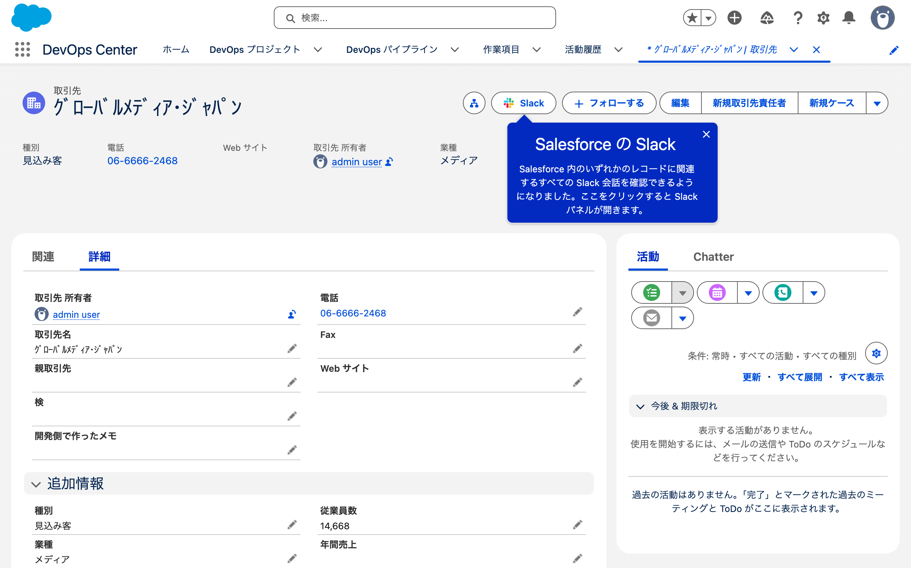

見えるカスタム項目は「検」と「開発側で作ったメモ」の2つ。
**「本番だけで作ったメモ」は出ていない。**

項目はオブジェクトマネージャーには残っているが、レイアウトに無いので画面には出ない。
**使う側から見れば消えたのと同じ。**

### Layout と Profile で挙動が違う

同じ昇格で、Layout と Profile の扱いが分かれた。

| メタデータ | リポジトリ側の中身 | 昇格後の prod | |
|---|---|---|---|
| Layout `Account-取引先 レイアウト` | カスタム項目は2件（`ProdOnlyNote__c` 無し） | **`ProdOnlyNote__c` が消えた** | 丸ごと置き換わる |
| Profile `Admin` / `Read Only` | `fieldPermissions` は2項目分だけ | **`ProdOnlyNote__c` の FLS は残った** | 書かれた分だけ更新される |

リポジトリの `Admin.profile-meta.xml` は882行あるが、`fieldPermissions` は
`Account.DevSideNote__c` と `Account.VerificationNote__c` の2件しか無い
（`userPermissions` は216件ある）。それでも prod の `ProdOnlyNote__c` の FLS 15件は残った。

→ **「差分昇格だから本番の直接変更は残る」は、メタデータの種類によって成り立たない。**
`ProdOnlyNote__c` は、項目としては残り、FLS も残り、レイアウト配置だけ消えた。

- **確認したこと**: 差分昇格（`IsFullDeploy = false`）でも、Layout が昇格対象に含まれていれば、
  本番でそのレイアウトに直接加えた項目配置は消える
- **未確認**: フル昇格（「本番 フェーズのブランチ内のすべてのメタデータ」）で
  **項目そのもの**が消えるか。これが B-2b の残りの本題
- **未確認**: 消えたレイアウト配置を戻す手順（2R-1 の一部）

### 副産物: 08-07 の項目のラベルが1文字だった

```
$ sf sobject describe -o dcng-prod -s Account
VerificationNote__c -> '検'
ProdOnlyNote__c     -> '本番だけで作ったメモ'
DevSideNote__c      -> '開発側で作ったメモ'
```

**`VerificationNote__c` の表示ラベルが「検」の1文字**になっている。
08-07 に「検証用メモ」と入力したつもりが、1文字しか入っていなかった。
ブラウザ操作で表示ラベルを入れたときの取りこぼしで、昇格でもそのまま運ばれている
（Lightning の入力欄への `fill` は取りこぼすことがある、の実例）。

---

## 17. フル昇格は単独では実行できない

（ここから日付は 08-27 に入っている。`<RECORD_ID>` の昇格時刻は `26/8/27 0:34`）

差分昇格が終わったあとのパイプライン画面。

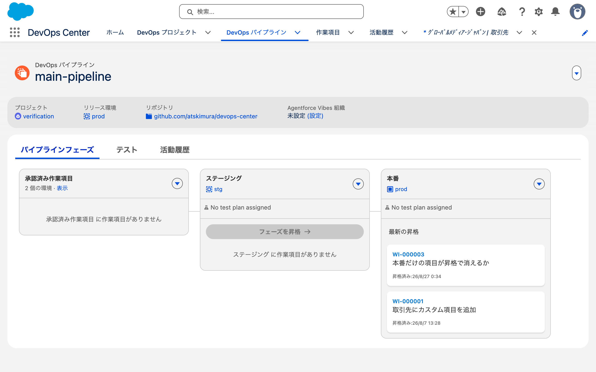

- ステージングは「**ステージング に作業項目がありません**」
- 「フェーズを昇格」ボタンは**グレーアウト（`disabled`）**
- `WI-000003` は本番の「最新の昇格」に移動（`昇格済み:26/8/27 0:34`）

フル昇格（「本番 フェーズのブランチ内のすべてのメタデータ」）を試したいが、この状態では押せない。
他に導線が無いかメニューを全部開いた。

| メニュー | 中身 |
|---|---|
| ステージングの「パイプラインアクション」 | 環境を開く / ソース制御でブランチを表示 |
| 本番の「パイプラインアクション」 | 環境を開く / ソース制御でブランチを表示 |
| ヘッダーの「その他のアクションを表示」 | パイプラインを無効化 / プロジェクト接続を編集 / Agentforce Vibes 組織を設定 |

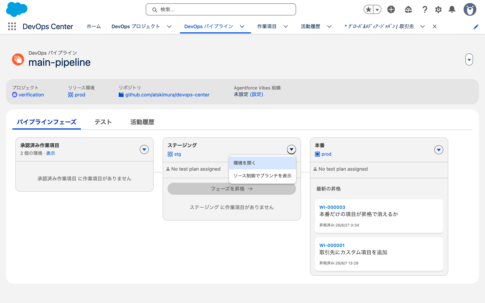

**どこにも昇格の導線は無い。**

→ **「フル配備」は独立した操作ではなく、昇格の実行時に選ぶオプションでしかない。**
昇格待ちの変更が1つも無いと、ブランチの内容を本番に配備し直すことができない。

- **確認したこと**: 昇格対象が空のとき「フェーズを昇格」は `disabled`。
  パイプライン画面のどのメニューにも代替の導線が無い
- **この先の手順への影響**: フル昇格を試すには、**乗り物として何か1つ変更を通す**必要がある。
  日常運用に関する検証（日常運用）の「本番を配備し直したいだけのとき何をするか」にも関わる

---

## 18. フル昇格の乗り物を作る（`WI-000004`）

17章のとおりフル昇格には昇格待ちの変更が必要なので、乗り物を1つ作った。

### 手順と所要

| 手順 | 操作 | 結果 |
|---|---|---|
| 1 | dev1 の `DevSideNote__c` の「説明」を編集 | `SourceMember` の `RevisionCounter` が 58 に上がった |
| 2 | DevOps Center の作業項目 → 新規 | `WI-000004` / `NEW` |
| 3 | DX Inspector で `WI-000004` に切り替え | 切り替わった |
| 4 | 変更リストを見る | **0 件** |
| 5 | `[進行中] とマーク` | `IN_PROGRESS` / ブランチ `WI-000004` ができた |
| 6 | 変更リストを見る（リロードもした） | **0 件のまま** |
| 7 | dev1 に新しい項目 `FullDeployVehicle__c` を作る（CLI） | `RevisionCounter` 71 で追跡された |
| 8 | 変更リストを見る（`Refresh` も押した） | **0 件のまま** |

新規作業項目のダイアログ（入力欄は プロジェクト（必須）/ 件名（必須）/ 説明 / 割り当て先 / 開発環境）:

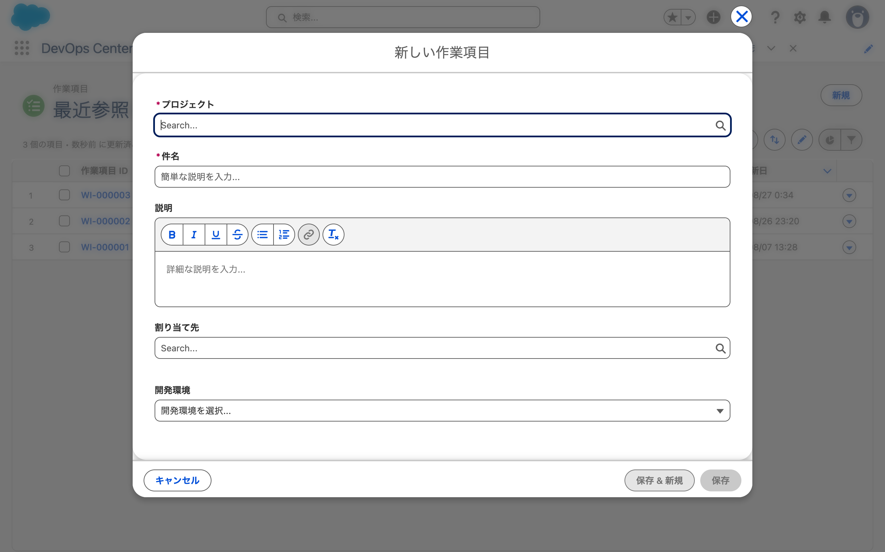

作業項目の選択ダイアログには `WI-000004`（`NEW`）が出た。
**08-26 の11章で「選択できるのは進行中のものだけ」と書いたが、`NEW` の作業項目も選択できる。**

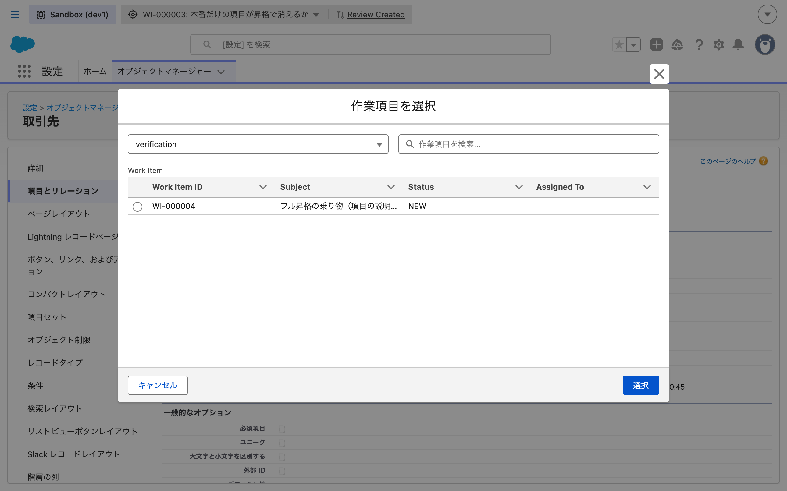

### 「0 件」は取得の失敗だった

画面は「0 件の項目を表示しています (更新日 順)。」と出す。テーブルの中には読み込み中の点が回り続け、
100秒待っても変わらない。

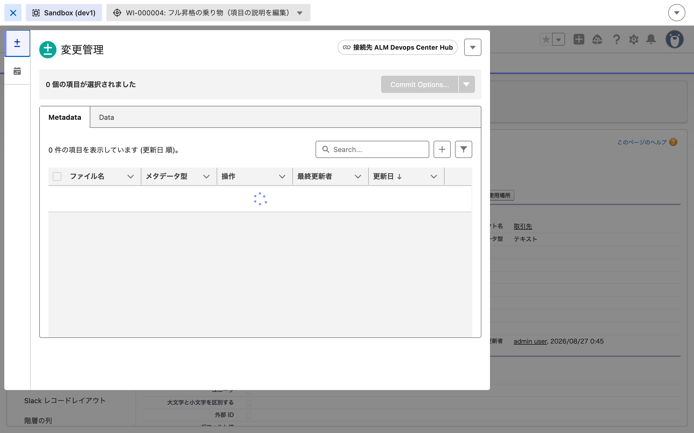

ブラウザのコンソールを見ると、エラーが出ていた（原文）:

```
Uncaught (in promise) Error: {
  "message": "GET_CHANGES_UNKNOWN_ERROR:Failed to fetch changes — the service returned no data.
              Check the DevOps Center connection and try again.",
  "data": { "statusCode": 400, "errorCode": "INTERNAL_ERROR" }
}
```

**変更の取得が 400 で失敗している。** 画面にはエラーが一切出ず、「0 件」とだけ表示される。

- **確認したこと**: DX Inspector の変更リストが「0 件」と表示されていても、
  それは「変更が無い」ではなく「取得に失敗した」場合がある。
  **画面上に区別する手がかりが無い**（コンソールを開かないと分からない）
- **この現象が起きた条件**: `WI-000003`（昇格済み・`CLOSED`）から `WI-000004` に切り替えた直後。
  ページのリロード、パネルの開閉、`Refresh` ボタンのどれでも直らなかった
- **未確認**: 08-26 に「1時間溶かした」ときの 0 件が、コミット前の正常な 0 件だったのか、
  この取得失敗だったのか。**あのときコンソールを見ていない**ので判別できない
- **未確認**: 復旧の方法（次に接続のやり直しを試す）

### 副産物: 既存項目の説明の編集も追跡される

`DevSideNote__c` の「説明」を編集しただけで `SourceMember` の `RevisionCounter` が上がった（58）。
リポジトリの `DevSideNote__c.field-meta.xml` には `<description>` が無いので、差分にはなる。
ただし DX Inspector が 400 で落ちているため、**変更リストに出るかどうかは確認できていない。**

---

## 19. 400 で止まったときの回復手段を探した

18章の状態から、軽い手順から順に試した。

| # | 試したこと | 結果 |
|---|---|---|
| 1 | ページをリロード | 400 のまま |
| 2 | キャッシュを無視してリロード（Hard Reload） | 400 のまま |
| 3 | パネルを閉じて開き直す | 400 のまま |
| 4 | `Refresh` ボタン | 400 のまま |
| 5 | **別の設定画面で DX Inspector を開く**（項目詳細 → 設定のホーム） | 400 のまま |
| 6 | **「メタデータを追加」から手で足す** | **通った** |

### 「メタデータを追加」は別の経路で動く

パネルの「メタデータを追加」（`Add Metadata`）を開き、`Metadata Type` に `CustomField` を選ぶと、
**組織のカスタム項目が3件、正しく一覧された。**

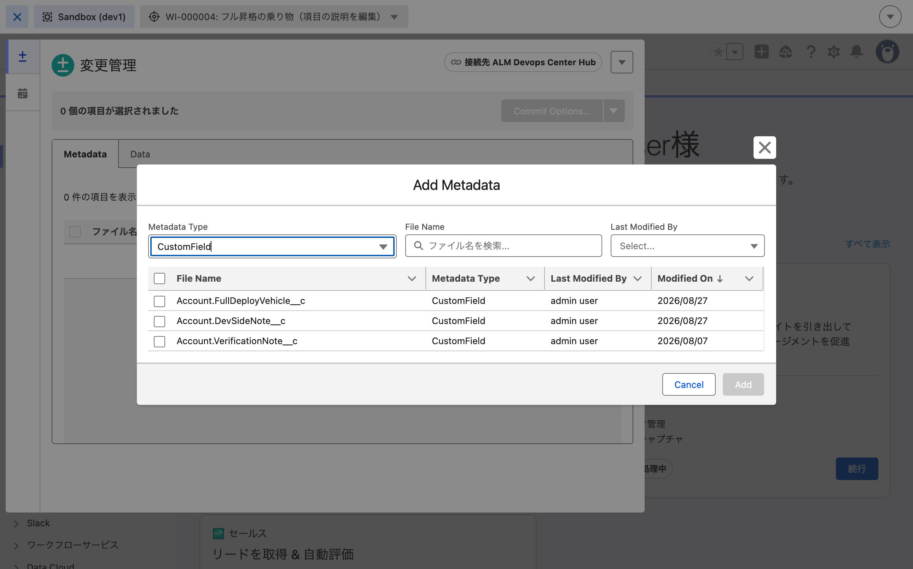

| File Name | Metadata Type | Last Modified By | Modified On |
|---|---|---|---|
| `Account.FullDeployVehicle__c` | CustomField | admin user | 2026/08/27 |
| `Account.DevSideNote__c` | CustomField | admin user | 2026/08/27 |
| `Account.VerificationNote__c` | CustomField | admin user | 2026/08/07 |

`FullDeployVehicle__c` を選んで `Add` を押すと、**変更リストが「1 件の項目を表示しています」に変わった。**

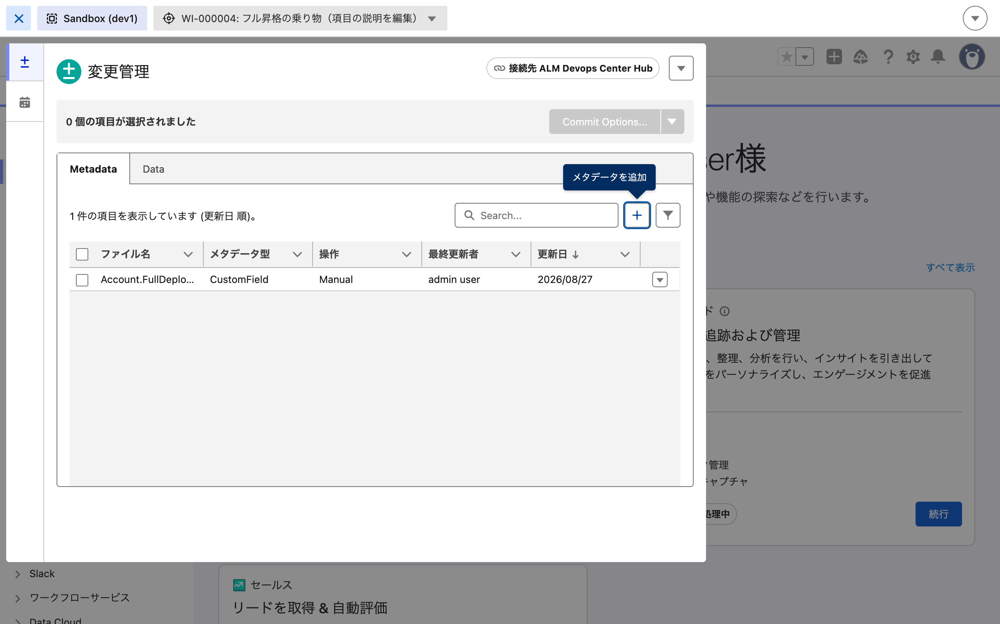

- **確認したこと**: 変更リストの一覧取得（`GET_CHANGES`）が 400 で落ちていても、
  **「メタデータを追加」の一覧取得は別の経路で、そちらは動く。**
  手で足せばコミット対象を作れるので、作業を続けられる
- **未確認**: `GET_CHANGES` が落ちた原因。「DevOps Center 接続を削除」→ 再サインインは試していない
  （回復できたので試す必要がなくなった）
- **未確認**: この状態で足した1件をコミットできるか（次の手順）
- 「メタデータを追加」は本来、**ソース追跡に載らないメタデータを手で持ち込むための機能**
  （2026-08-07 の9章で確認）。それが**取得の失敗を回避する迂回路にもなっている**

### 日本語化の不備をさらに2件

`Add Metadata` ダイアログは、見出しと列名が英語のまま、説明文だけ日本語という混在:

> **Add Metadata**
> Metadata Type / File Name / Last Modified By / Modified On ← 英語
> 「選択...」「ファイル名を検索...」「**データがありません** / メタデータ型を選択してみてください。」← 日本語
> `Cancel` / `Add` ← 英語

パネル本体のボタンも `CommitOptions` / `More Options` が英語のまま。

---

## 20. `WI-000004` を通した（Add Metadata 経由でもコミットから昇格まで動く）

19章で足した1件を、そのままコミットから昇格まで通した。

| 手順 | 結果 |
|---|---|
| `Commit Options...` → 「ファイルを確定」 | ステップ1で作業項目を選ぶ（`WI-000004` / `IN_PROGRESS`）→ `Next` |
| ステップ2 | 「達成予測のコメント」にメッセージ / `Preview` に確定先とブランチ URL / **操作は `manual`** |
| `Commit` | `<RECORD_ID>` / GitHub の `WI-000004` ブランチにコミット `<COMMIT_SHA>` |
| `Create Review` | `IN_REVIEW` / `ReviewRemoteReference = 5` / **PR #5** |
| `[昇格準備完了] とマーク` | `READY_TO_PROMOTE` |
| 承認済み作業項目 → 選択 → 昇格（差分） | `<RECORD_ID>` / `SUCCESS` / `WI-000004` → `PROMOTED` |

> 2026-08-31追記：この検証で作成したPR #5を、昇格済みの状態で撮影した。

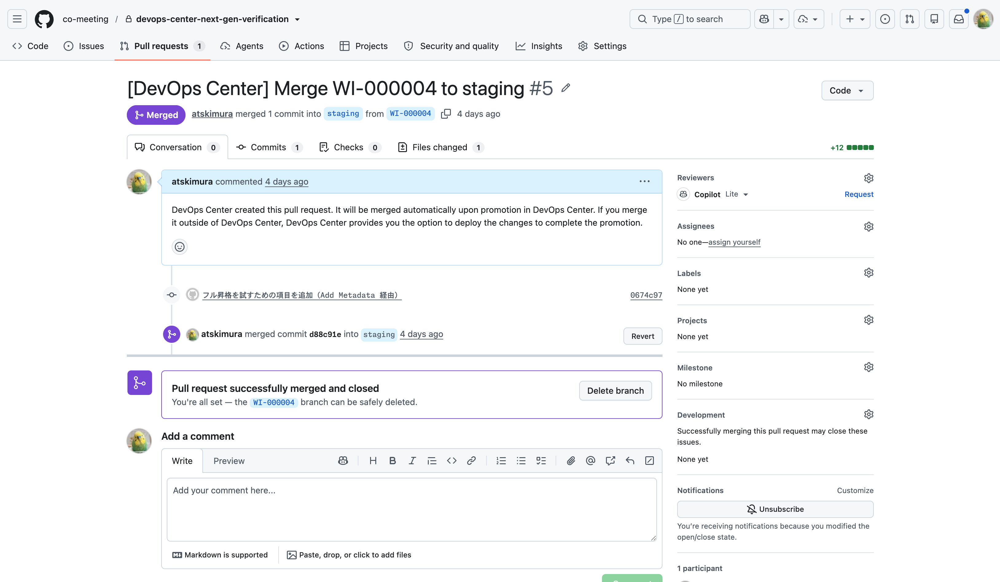

DevOps Centerが生成したタイトルと本文は定型文のまま残っている。
昇格によるマージは、接続に使ったGitHubアカウント（`github-user`）の操作として記録された。

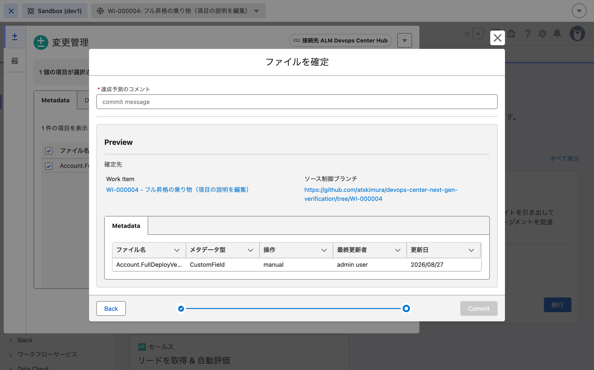

コミットされたファイルには、CLI で入れた `<description>` がそのまま入っていた。

```xml
<CustomField xmlns="http://soap.sforce.com/2006/04/metadata">
    <fullName>FullDeployVehicle__c</fullName>
    <description>フル昇格を実行するための乗り物（2026-08-27）</description>
    <label>フル昇格の乗り物</label>
    ...
```

`DevopsEnvDeploymentMbr` の `ChangeType` は **`MANUAL`**。
「メタデータを追加」で足したものは、以降ずっと `MANUAL` として扱われる
（08-07 のログで「`Manual` は `ChangeType` の値に対応しそう。未確認」と書いた分の答え）。

- **確認したこと**: 変更リストの一覧が 400 で取れなくても、
  「メタデータを追加」→ コミット → レビュー → 昇格まで**通しで動く**
- **確認したこと**: 手で足した変更は `ChangeType = MANUAL` になる
- **確認したこと**: 「メタデータを追加」で足せるのは**組織にあるメタデータ**で、
  リポジトリとの差分の有無は問われない（`FullDeployVehicle__c` は差分だったが、
  `VerificationNote__c` のように既に運んだものも候補に出ていた）

---

## 21. フル昇格しても、本番だけの項目は消えなかった

### 実行したこと

staging → prod の「フェーズを昇格」で、**「本番 フェーズのブランチ内のすべてのメタデータ」を選んで**昇格した。
押す前のダイアログ（2つ目が選択された状態）:


**この選択肢を選んでも、警告文や確認は一切追加されない。**
差分のときと同じダイアログのまま「昇格」を押せる。

### 結果

| | |
|---|---|
| `DevopsEnvDeployment` | `<RECORD_ID>` |
| `IsFullDeploy` | **`false`** ← フルを選んだのに false |
| `Status` | `SUCCESS` |
| 運ばれたもの | `Account.FullDeployVehicle__c` / CustomField / **`MANUAL`** の**1件だけ** |

prod の状態は、`FullDeployVehicle__c` が増えた以外**何も変わらなかった。**

| 項目 | 昇格前 | 昇格後 |
|---|---|---|
| `VerificationNote__c` の FLS | 2 | 2 |
| `DevSideNote__c` の FLS | 2 | 2 |
| **`ProdOnlyNote__c`**（本番だけの項目） | 項目あり / FLS 15 | **項目あり / FLS 15**（消えていない） |
| `FullDeployVehicle__c` | なし | **項目あり / FLS 0** |
| レイアウトのカスタム項目 | `VerificationNote__c` / `DevSideNote__c` | 同じ |

`DevopsEnvDeployment` は6件すべて `IsFullDeploy = false`。

この時点では「フルが本当に効いたのか、選択が製品に届かなかったのか」を区別できていなかった。
`DevopsEnvDeploymentMbr` が1件なので、差分と同じに見えた。

### prod 側のデプロイ記録を見たら、フルは効いていた

`DevopsEnvDeploymentMbr` は**作業項目に紐づく変更**を記録するもので、
**実際に配備されたコンポーネントの数ではない。** 本当の記録は prod 側の `DeployRequest` にある。

```
SELECT Id, Status, StartDate, NumberComponentsTotal, NumberComponentsDeployed
FROM DeployRequest ORDER BY StartDate DESC   （dcng-prod / Tooling API）
```

| StartDate (UTC) | 対応する昇格 | 選んだ選択肢 | コンポーネント数 |
|---|---|---|---|
| 2026-08-26T16:35:29 | `<RECORD_ID>` | **フル** | **6 / 6** |
| 2026-08-26T15:33:53 | `<RECORD_ID>` | 差分 | 4 / 4 |
| 2026-08-07T04:28:47 | `<RECORD_ID>` | 差分 | 4 / 4 |

**フルのときだけ6件配備されている。** リポジトリの `main` ブランチの中身とも一致する。

```
force-app/main/default/objects/Account/fields/VerificationNote__c.field-meta.xml
force-app/main/default/objects/Account/fields/DevSideNote__c.field-meta.xml
force-app/main/default/objects/Account/fields/FullDeployVehicle__c.field-meta.xml
force-app/main/default/layouts/Account-取引先 レイアウト.layout-meta.xml
force-app/main/default/profiles/Admin.profile-meta.xml
force-app/main/default/profiles/Read Only.profile-meta.xml
```

項目3 + レイアウト1 + プロファイル2 = **6件。ブランチの全メタデータが配備された。**
（`Account.object-meta.xml` は標準オブジェクトの入れ物なので数に入らない）

### B-2b の答え

**フル昇格でブランチの全メタデータを配備しても、本番だけの項目は消えない。**

| 対象 | 差分昇格 | フル昇格 |
|---|---|---|
| 本番だけの項目（`CustomField`） | 残る | **残る** |
| その項目の FLS（15件） | 残る | **残る** |
| 本番でレイアウトに加えた配置 | **消える**（Layout が全置換） | **消える**（同じ） |

配備の仕組みとしては筋が通っている。**Metadata API のデプロイは、
削除の指示（destructive changes）が無ければ組織のコンポーネントを消さない。**
リポジトリに無いものは「触られない」だけで、「消される」わけではない。

**消えるのは、リポジトリにあるファイルの中に本番の変更が混ざっている場合だけ。**
レイアウトは1ファイルに全項目の配置が入っているので、丸ごと置き換わると本番で足した配置が落ちる。
プロファイルは書かれた項目だけ更新されるので落ちない（16章）。

- **確認したこと**: 差分でもフルでも、本番だけの項目そのものは消えない
- **確認したこと**: 消えるのはレイアウトのような「1ファイルに全体が入る」メタデータの中身
- **確認したこと**: **`IsFullDeploy` はフルを選んでも `false` のまま。この列は当てにならない。**
  実際に何件配備されたかは prod 側の `DeployRequest.NumberComponentsTotal` で見る
- **確認したこと**: フルを選んでも警告や追加の確認は出ない
- **未確認**: 消えたレイアウト配置をどう戻すか（2R-1）

### 昇格の配備元は開発環境ではなく git

昇格が組織から組織へコピーしているのか、git から配備しているのかは、
**時刻の並びで判別できた。**

| 時刻 (UTC) | 何が起きたか |
|---|---|
| 16:33:16 | `<RECORD_ID>` = stg へ差分昇格（1件） |
| 16:33:33 | PR #5 マージ（`WI-000004` → `staging`） |
| **16:35:26** | **`main` に `Merge branch 'staging'`（`<COMMIT_SHA>`）** |
| **16:35:29** | **prod への配備開始（6件 / `DeployRequest`）** |
| 16:35:38 | PR #6 のマージ記録（`staging` → `main`） |

**git へのマージが配備の3秒前。** 差分昇格も同じ形で、
`main` へのマージ `<COMMIT_SHA>`（15:33:50）の3秒後に配備が始まっている（15:33:53 / 4件）。

昇格は毎回この順で動いている。

1. 昇格元のブランチを**昇格先のブランチにマージする**（git を先に進める）
2. **マージ後のブランチの内容**を組織に配備する

→ **差分もフルも配備元は git。** 違いは「そのブランチのうちどこまでを配備するか」だけ。
開発環境（`dev1`）が配備元になることはない。開発環境は**コミットの材料を取る場所**で、
そこから先は常に git を経由する。

これは件数からも言える。**`dev1` の全メタデータなら6件では済まない**
（標準オブジェクトもプロファイルも含めれば数千件になる）。
6件だったのは、それが**リポジトリの `main` の中身と一致する**から。

ダイアログの「**本番 フェーズの**ブランチ内のすべてのメタデータ」は、
昇格元（ステージング）ではなく**昇格先のブランチ**（`main`）を指している。

**作業項目のブランチ（`WI-000004`）ではない。** 今回は作業項目が1つずつしか無いので
中身がほぼ同じで件数では区別が付かないが、指しているものが違う。

| 昇格先 | フル昇格が見るブランチ |
|---|---|
| ステージング | `staging` |
| 本番 | `main` |

→ **フル昇格は作業項目単位で切り出されない。**
他の作業項目で既にそのブランチに入っているものも、一緒に再配備される。

- **未確認**: 上の推論は実機では確かめていない（この環境では作業項目が1つずつしか無かった）。
  ブランチの内容を配備している以上そうなるはず、という読み。
  **共同開発に関する検証（共同作業）で、2つの作業項目を並行させたときに確かめられる**
- もしそうなら、**他人の昇格に自分の変更が便乗して再配備される**ことになる。
  内容が組織と一致していれば無害だが、その間に誰かが本番を直接触っていた場合、
  **自分が関わっていないファイルまで上書きされる**

### 「ブランチの全メタデータ」とは何か（2つのレイヤーを混ぜない）

今日「メタデータを追加」で選んだのは `FullDeployVehicle__c` の**1件だけ**なのに、
フル昇格では**6件**が配備された。これは別のレイヤーの話が2つあるため。

| レイヤー | 操作 | 決めること |
|---|---|---|
| 1 | 「メタデータを追加」→ コミット | **git に何を入れるか**（今日は1件） |
| 2 | 昇格オプションの 差分 / フル | **git のどこまでを組織に流すか** |

`main` ブランチには、これまでのコミットが積み上がっている。

```
main ブランチの中身（6コンポーネント）
  VerificationNote__c    ← 2026-08-07 のコミット
  DevSideNote__c         ← 2026-08-26 のコミット
  FullDeployVehicle__c   ← 2026-08-27 のコミット（Add Metadata で選んだ1件）
  Account-取引先 レイアウト  ← 08-07 と 08-26 のコミットで更新
  Admin プロファイル        ← 同上
  Read Only プロファイル    ← 同上
```

**「本番 フェーズのブランチ内のすべてのメタデータ」= この6件。**
今回1件しかコミットしていなくても、過去の積み上げが全部流れる。

配備件数（prod の `DeployRequest`）がそれを裏付けている。

| 昇格 | 選択 | 配備件数 | 中身 |
|---|---|---|---|
| `<RECORD_ID>`（→ stg） | 差分 | 1 | 今日コミットした1件 |
| `<RECORD_ID>`（→ prod） | **フル** | **6** | ブランチの積み上げ全部 |
| `<RECORD_ID>`（→ prod） | 差分 | 4 | 08-26 のコミット4件 |

**差分の件数は、その作業項目でコミットした件数と一致する。**

「フルなら全部行く」の意味は「**全部上書きする**」で、
リポジトリと組織の内容が一致していれば結果は変わらない。
今回 prod で実際に変わったのは `FullDeployVehicle__c` が増えたことだけだった。

→ **フルの影響は「余計なものが配備される」ことではなく、
リポジトリで管理していないファイル内の変更が上書きで消える範囲が広がること。**

### 差分とフルの違いは「本番の直接変更が失われる範囲」

観測できた違いは配備するコンポーネントの数（4 と 6）だけだが、
何が配備されるかを整理すると、実務上の違いはここに出る。

| | 差分 | フル |
|---|---|---|
| 配備するもの | その昇格に含まれる作業項目の変更分 | ブランチの全メタデータ |
| 今回の件数 | 4 | 6 |
| **リポジトリに無いコンポーネント** | 消さない | **消さない**（同じ） |
| **リポジトリにあるファイルの中の本番変更** | そのファイルが昇格対象なら消える | **全ファイルで消える** |

**今回 `ProdOnlyNote__c` のレイアウト配置が差分で消えたのは、
その昇格に Layout が含まれていたから**である（`DevSideNote__c` をレイアウトに追加したため）。
もし昇格の中身が Apex クラスだけだったら、差分ではレイアウトは触られず配置は残り、
フルでは消えたことになる。

→ **フルは「本番の直接変更が失われる範囲」を広げる操作**と読める。

- **未確認**: 上の読みは今回の実験では**分離できていない。**
  差分の段でレイアウトが既に置き換わったので、フルの段で新たに失われるものが無かった。
  「フルにしたことで初めて消えるもの」を直接は見ていない
- **分離する実験の形**（実行時期は未定）:
  1. 本番でレイアウトに項目を足す
  2. dev1 で**レイアウトに触らない変更**を1つ作る（Apex クラス、または既存項目の説明だけ）
  3. 差分で昇格 → レイアウト配置は残るか
  4. 同じ状況からフルで昇格 → レイアウト配置は消えるか

  3と4で分かれれば違いを1つの実験で示せる。分かれなければ
  「差分でも全ファイルを置き換えている」ことになり、それも結果になる
- **未確認**: 所要時間の差。今回はどちらも4〜5秒で差が出なかった（規模が小さいため）

---

## 22. 昇格を押した時点でブランチはマージされる（人はマージしない）

21章で「昇格はブランチをマージしてから配備する」と書いたが、
**そのマージを誰がやっているか**を確かめた。GitHub 側の操作は一度もしていない。

### マージコミットの名義は昇格先の環境のユーザー

```
<COMMIT_SHA>  <EMAIL_REDACTED>   Merge branch 'WI-000004' into staging
<COMMIT_SHA>  <EMAIL_REDACTED>       Merge branch 'staging'
<COMMIT_SHA>  DevOps Center <EMAIL_REDACTED>   フル昇格を試すための項目を追加（Add Metadata 経由）
```

| Git 上の操作 | 名義 |
|---|---|
| コミット | `DevOps Center <EMAIL_REDACTED>` |
| `WI-000004` → `staging` のマージ | **`<EMAIL_REDACTED>`**（stg のユーザー） |
| `staging` → `main` のマージ | **`<EMAIL_REDACTED>`**（prod のユーザー） |

**昇格先の環境のユーザー名義でマージされる。** 08-07 と同じパターンで再現した。

### 昇格レコードがマージコミットの SHA を持っている

```
SELECT Id, MergeRemoteReference, CreatedDate FROM DevopsPipelnStgPromWkItem
```

| CreatedDate (UTC) | `MergeRemoteReference` | 対応 |
|---|---|---|
| 16:35:19 | `<COMMIT_SHA>...` | `staging` → `main`（フル昇格） |
| 16:33:16 | `<COMMIT_SHA>...` | `WI-000004` → `staging`（差分昇格） |
| 15:33:41 | `<COMMIT_SHA>...` | `staging` → `main`（差分昇格） |
| 15:27:10 | `<COMMIT_SHA>...` | `WI-000003` → `staging`（差分昇格） |

**昇格レコードの `MergeRemoteReference` が、そのままマージコミットの SHA。**
昇格1回が「マージ」と「デプロイ」の2段で構成されていることが、
レコードの側からも確認できる。

### PR の作成とマージは別の話

| | PR の作成 | マージ |
|---|---|---|
| 作業項目 → ステージング | `Create Review` を**人が押す** | **昇格で自動** |
| ステージ間（`staging` → `main`） | **昇格で自動** | **昇格で自動** |

- **確認したこと**: **人が GitHub で PR をマージする操作は無い。** 昇格に含まれる
- **確認したこと**: マージの名義は**昇格先の環境のユーザー**
- **訂正した記述**: 過去の記録に「PR #1 は…マージも別操作だった」と書いていたが誤り。
- **これが意味すること**: PR は**レビューの置き場**であって、マージの関門ではない。
  GitHub 側で PR を承認しなくても、DevOps Center 側で昇格すればマージされる
- **未確認**: GitHubのブランチ保護（必須レビューなど）を掛けたときに昇格が止まるか。

---

## この時点で確定していること

- ステップB の実験（FLS の付与と剥奪）の**開始状態は 2026-08-07 と同じ 15 / 2 / 2**
- 数える条件を固定した（`Parent.IsOwnedByProfile = true`）
- `dev1` の変更リストには、**自分が作っていない差分が2件混ざっている**状態で実験を始める
  （`Process Automated` が 08-10 に作ったもの。`stg` にも同じものがある）
- **本番組織に `SourceMember` オブジェクトが無い**ことを実機で確認した（本番との差分に関する検証 の根拠が1段強くなる）
- **1プロファイルの FLS 変更は `SourceMember` に載らない**（`dev1` の `標準ユーザー` で編集権を剥奪して確認）
- `dev1` の `標準ユーザー` は**編集権を外した状態のまま**にしてある（戻していない）
- **API 経由の項目レベルセキュリティ変更も追跡されない**（操作経路によらない）
- **ワークアイテムを削除する導線は無い。**「対象外」（`NEVERED`）にするのが終わり方で、**不可逆**
- 後片付け済み: `dev1` の `標準ユーザー` の編集権を戻した（`PermissionsEdit = true`）/ `WI-000002` は `NEVERED`
- **項目レベルセキュリティのウィザードの既定値は内部ユーザー向け15プロファイル**（外部ユーザー向け9件は未チェック）。
  08-07 の「15件」の由来がこれ
- **同じ org・同じオブジェクトで、本番直接作成なら FLS 15件、昇格経由なら2件**
- **項目作成で動く `SourceMember` は4件**（CustomField 新規 / Layout 更新 / Profile `Admin` 更新 / Profile `Read Only` 更新）。
  08-07 と同じパターンで再現性あり
- **解決: 変更リストが 0 件だったのは手順が足りなかっただけ**（12章）。
  **DevOps Center の変更リストはコミット後に埋まる。コミットは DX Inspector（☰）でやる**
- **完了した作業項目が開発環境のパネルに選択されたまま残る**（選択ダイアログの候補には出ないのに）
- `WorkItemComponentList` は**コミット時に作られるレコード**。コミット前の変更リストの判定には使えない
- **`WI-000003` のコミットは通った**（4件。`<RECORD_ID>`）。GitHub の `WI-000003` ブランチに乗っている
- **日本語化の不備をもう1件**: コミットメッセージ欄のラベルが「達成予測のコメント」

- **昇格で運ばれるプロファイルは `Admin` と `Read Only` の2つだけ**（15件のうち）。
  「15 → 2」の正体はこれ。**なぜこの2つなのかは未解明**（B-0f）
- 差分昇格の `DevopsEnvDeployment` では `StartRevisionCounter` / `EndRevisionCounter` が**空**

- **差分昇格でも、本番でレイアウトに直接加えた項目配置は消える。**
  Layout は丸ごと置き換わり、Profile は書かれた分だけ更新される
- 項目そのもの（`CustomField`）と FLS は差分昇格では消えない
- ステージ間昇格の昇格オプションは、ワークアイテム昇格と同じ2択（既定は差分）
- 08-07 に作った `VerificationNote__c` の**表示ラベルが「検」の1文字**だった（入力の取りこぼし）

- **DX Inspector の変更リストの「0 件」は、取得の失敗（400）でも同じ表示になる**（18章）。
  **画面では区別できない**
- **その状態から抜ける手は「メタデータを追加」**（19章）。リロード類はすべて効かない
- **「メタデータを追加」で足した変更は `ChangeType = MANUAL`** になり、そのまま昇格まで通る
- **フル昇格の選択肢を選んでも、警告や追加の確認は出ない**
- **B-2b の答え: 差分でもフルでも、本番だけの項目そのものは消えない**（21章）。
  消えるのは**レイアウトのような「1ファイルに全体が入る」メタデータの中身**。
  Metadata API は削除の指示が無ければ組織のコンポーネントを消さないため
- **`IsFullDeploy` はフルを選んでも `false` のまま。この列は当てにならない。**
  実際の配備件数は prod 側の `DeployRequest.NumberComponentsTotal`（フル 6 / 差分 4）
- `DevopsEnvDeploymentMbr` は**作業項目に紐づく変更**の記録で、配備されたコンポーネント数ではない

### B-2b の現在地

| org | 状態 |
|---|---|
| prod | `ProdOnlyNote__c`（項目・FLS 15件は残る / **レイアウトから消えた**）/ `VerificationNote__c`（FLS 2件）/ `DevSideNote__c`（FLS 2件）/ `FullDeployVehicle__c`（FLS 0件） |
| stg | `VerificationNote__c` / `DevSideNote__c` / `FullDeployVehicle__c` |
| dev1 | `VerificationNote__c`（FLS 15件）/ `DevSideNote__c`（FLS 15件・説明を追加）/ `FullDeployVehicle__c` |
| 作業項目 | `WI-000001` 完了 / `WI-000002` 実行なし / `WI-000003` 完了 / `WI-000004` `PROMOTED` |
| 昇格 | `<RECORD_ID>`〜`006`。**全件 `IsFullDeploy = false`** / すべて `SUCCESS` |
| PR | #1 #2 #3 #4 マージ済み / **#5**（`WI-000004` → `staging`） |

**後片付けが必要な残留物**（現時点）:

| org | 消すもの |
|---|---|
| prod | `ProdOnlyNote__c` / `DevSideNote__c` / `FullDeployVehicle__c` |
| stg | `DevSideNote__c` / `FullDeployVehicle__c` |
| dev1 | `DevSideNote__c` / `FullDeployVehicle__c`（`DevSideNote__c` の説明も） |
