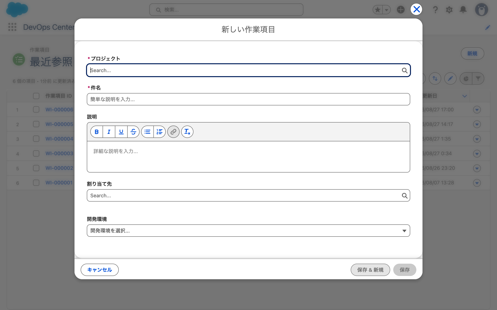
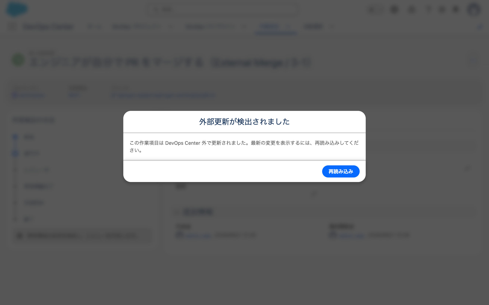
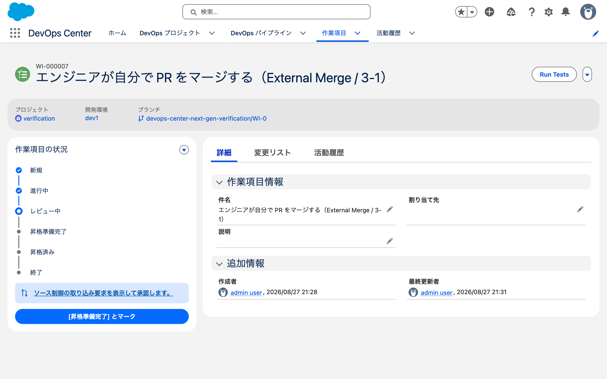
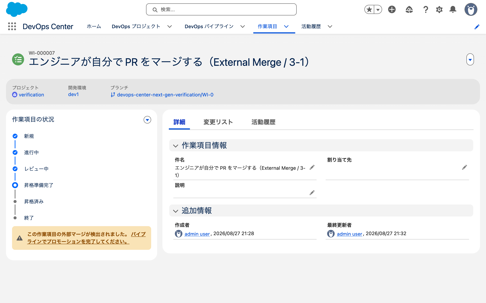
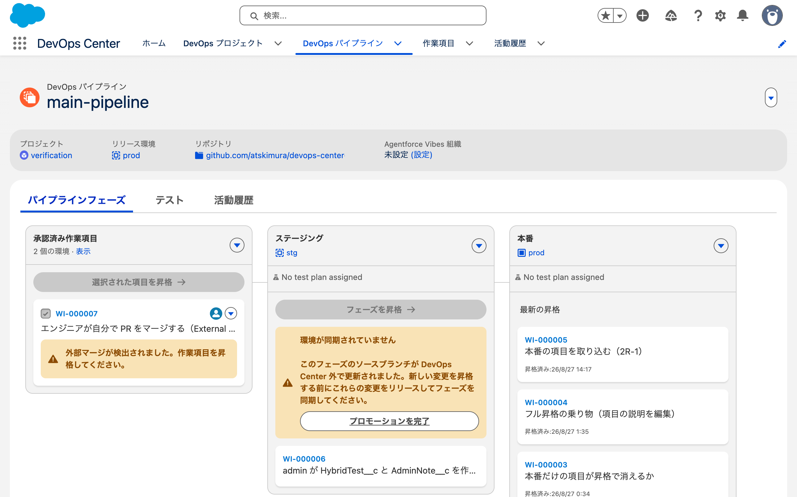
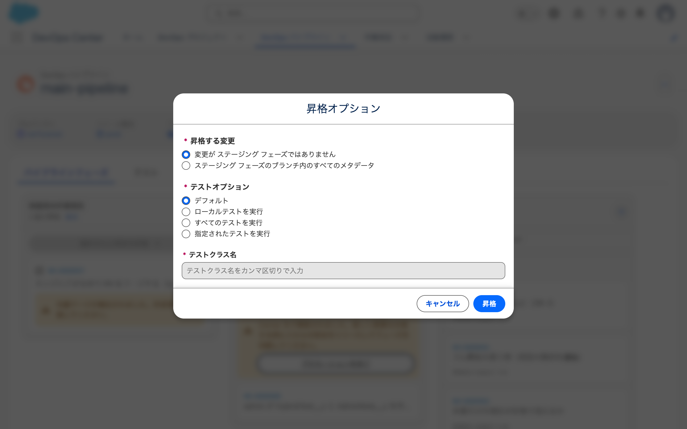

# 2026-08-27 External Merge を1周させた（3-1）

- 目的: 開発者が GitHub で自分で Pull Request を作ってマージしたとき、DevOps Center がどう反応するか。
- 手順の出所: Salesforceの公式デモ。
- 2026-08-27 の午前に同じ項目を試みて失敗している。
  **External Merge を「ステージブランチへの直接 push」と取り違えていた。**
  今回が正しい手順での初回。
- 使った org: `dcng-prod`（Hub）/ `dcng-stg`

---

## 1. 作業項目は画面で作った（開発環境を指定するため）

MCP の `create_devops_center_work_item` には開発環境のパラメータが無い
（→ MCPに関する検証）。画面のダイアログには欄がある。



| 欄 | 必須 | 内容 |
|---|---|---|
| プロジェクト | ○ | `verification` |
| 件名 | ○ | エンジニアが自分で PR をマージする（External Merge / 3-1） |
| 説明 | | 空 |
| 割り当て先 | | 空 |
| **開発環境** | | **`--なし--` / dev1 / dev2** |

**開発環境の既定値は `--なし--` だった。**

→ MCP で作った `WI-000006` の開発環境が `null` だったのは、**画面の既定値と同じ状態**である。
「パラメータが無いから欠けた」のではなく、既定のまま作られていた。

dev1 を選んで保存した。`WI-000007` ができた（`DevelopmentEnvironmentId` に dev1 が入った）。

**Lightning の combobox はキー入力で選ぶ**（`fill` では候補が出ない。既知）。
プロジェクトは「veri」と打って ArrowDown → Enter、開発環境は ArrowDown → Enter。

## 2. ブランチの作成は MCP でできた

```
update_devops_center_work_item_status(dcng-prod, WI-000007, "In Progress")
→ { "success": true, "status": "In Progress" }
```

GitHub に `WI-000007` ブランチができ、**開発環境の dev1 も保持されていた。**

### ブランチはステージブランチから切られる

```
$ git log origin/WI-000007 --oneline -2
<COMMIT_SHA> HybridTest__c に EngineerNote__c を追加     ← 自分の push
<COMMIT_SHA> Merge pull request #11 from github-user/chore/ignore-files  ← 分岐元
```

`<COMMIT_SHA>` は **PR #11 をマージした直後の `staging` の先端**である。

- **確認したこと**: 作業項目ブランチは `staging`（第1ステージのブランチ）から切られる。
  `main` からではない。判定は親コミットで行った

**`.gitignore` の有無では分岐元を判定できない。**
2026-08-27 に `main` と `staging` の両方に入れたので、どちらから切っても入る。

## 3. ローカルで開発して push した（`.gitignore` が効いた）

`HybridTest__c` に `EngineerNote__c`（表示ラベル「開発者メモ」）を追加した。

```
$ git status --short
?? force-app/main/default/classes/
?? force-app/main/default/objects/HybridTest__c/fields/EngineerNote__c.field-meta.xml
```

**`.sf/` が出ていない。** 午前は同じ操作で17ファイルが混ざっていた
（→ [MCP のログ](2026-08-27-mcp-workitem.md) の5章）。
`.gitignore` を置いた効果がここで出た。

- **確認したこと**: 公式テンプレートの `.gitignore` を置くと `.sf/` が git に入らない

## 4. 自分で PR を作った段階で、DevOps Center が反応した

```
gh pr create --base staging --head WI-000007 --title "..." --body "..."
→ https://github.com/.../pull/12
```

**PR を作った直後の SOQL では作業項目の状態は `IN_PROGRESS` のまま。**
そのあと DevOps Center で作業項目を開いたら、ダイアログが出た。



> 外部更新が検出されました
>
> この作業項目は DevOps Center 外で更新されました。最新の変更を表示するには、再読み込みしてください。
>
> [再読み込み]

**マージする前に検知されている。** VCS 同期の監視対象に「change request（PR）を開く」が
入っているため。

### 状態が自動で「レビュー中」に進んだ



| | PR 作成前 | PR 作成後 |
|---|---|---|
| 状況 | 進行中 | **レビュー中**（進捗33%） |
| 案内文 | 開発環境の変更を確定し、レビューを作成します。 | **ソース制御の取り込み要求を表示して承認します。**（PR #12 へのリンク） |
| ボタン | レビューを作成 | **[昇格準備完了] とマーク** |
| | | **Run Tests**（新しく出た） |

**「レビューを作成」を押していないのに、DevOps Center が自分で作った PR を
change request として認識した。**

### 変更リストも自動で作られた

```sql
SELECT Name, CommitReference, CommitMessage FROM WorkItemComponentList WHERE WorkItemId = '<DEVOPS_RECORD_ID>'
→ <RECORD_ID> / <COMMIT_SHA> / 自分が書いたコミットメッセージ
```

**DX Inspector を使わず、ローカルから push しただけで変更リストができた。**

- **確認したこと**: PR を開くと DevOps Center が検知し、作業項目を「レビュー中」に進める
- **確認したこと**: 自分で作った PR が change request として扱われる
- **確認したこと**: 変更リストは push したコミットから作られる

---

## 5. マージすると「外部マージが検出されました」に変わった

```
gh pr merge 12 --merge
→ 21:32:12 MERGED
```



作業項目の画面（原文）:

> この作業項目の外部マージが検出されました。 パイプラインでプロモーションを完了してください。

| | マージ前 | マージ後 |
|---|---|---|
| 状況 | レビュー中（33%） | **昇格準備完了**（50%） |
| 文言 | 外部**更新**が検出されました（ダイアログ） | 外部**マージ**が検出されました（画面内の警告） |

**「外部更新」と「外部マージ」で2段階ある。**

### git はマージ済み、org は未デプロイ

```
git ls-tree -r origin/staging | grep EngineerNote
→ force-app/main/default/objects/HybridTest__c/fields/EngineerNote__c.field-meta.xml

sf data query -o dcng-stg --use-tooling-api -q "SELECT DeveloperName FROM CustomField WHERE DeveloperName = 'EngineerNote'"
→ 0 件
```

**公式ドキュメントの記述が実機で再現した。**

> "If you merge the change request in the source control system, the changes are in a
> **partially promoted state** because they've been merged but not yet deployed to the
> associated pipeline environment."

## 6. パイプライン画面では昇格が全部止まっていた



**警告が2箇所に出た**（原文）。

承認済み作業項目の列（`WI-000007`）:

> ⚠ 外部マージが検出されました。作業項目を昇格してください。

ステージングの列:

> ⚠ 環境が同期されていません
>
> このフェーズのソースブランチが DevOps Center 外で更新されました。
> 新しい変更を昇格する前にこれらの変更をリリースしてフェーズを同期してください。
>
> [プロモーションを完了]

**「選択された項目を昇格」と「フェーズを昇格」の両方が `disabled` になっていた。**

- **確認したこと**: **staging から prod への昇格（「フェーズを昇格」）が止まる。**
  staging にいた `WI-000006` は prod へ行けなかった
- **未確認**: 「選択された項目を昇格」が他の作業項目でも押せないのか。
  承認済み列には `WI-000007`（External Merge 待ち）しか無かったので、
  **そのボタンが `disabled` だったのは `WI-000007` 自身の状態のせいかもしれない。**
  別の作業項目を承認済みまで持ってきて試す必要がある

---

## 7. 「プロモーションを完了」は通常の昇格と同じダイアログだった

押すと「昇格を検証中...」→「昇格オプション」が出た。



| 区分 | 選択肢 |
|---|---|
| 昇格する変更 | **「変更が ステージング フェーズではありません」**（既定）/ 「ステージング フェーズのブランチ内のすべてのメタデータ」 |
| テストオプション | デフォルト（既定）/ ローカルテストを実行 / すべてのテストを実行 / 指定されたテストを実行 |

**1つ目の選択肢の日本語が壊れている。**
"Changes not in the Staging phase"（ステージングにまだ無い変更 = 差分）の誤訳に見える。

既定のまま「昇格」を押した。

### org に届いた

| 時刻 | 何 |
|---|---|
| 21:34:27 | 「プロモーションを完了」を押す |
| 21:35:36 | `DevopsEnvDeployment` が `SUCCESS`（`IsFullDeploy` = false） |
| 21:36 | staging org に `EngineerNote__c` を確認 |

作業項目は `PROMOTED`（ステージは staging）。

---

## 8. 3-1 の答え

**External Merge は例外的な逃げ道ではなく、開発者の通常ルートとして成立する。**

| 段 | 誰が | 何を | 時刻 |
|---|---|---|---|
| 1 | admin / 開発者 | 画面で作業項目を作る（開発環境を指定） | 21:28 |
| 2 | 開発者 | MCP か画面で「進行中」にしてブランチを作る | 21:29 |
| 3 | 開発者 | ローカルで開発して push | 21:30:18 |
| 4 | 開発者 | **自分で PR を作る** | 21:30:41 |
| 5 | — | DevOps Center が検知して「レビュー中」に進める | 21:31 |
| 6 | 開発者 | **自分でマージする** | 21:32:12 |
| 7 | — | 「外部マージが検出されました」。**org は未デプロイ** | 21:33 |
| 8 | 誰か | パイプライン画面で「プロモーションを完了」 | 21:34:27 |
| 9 | — | org に届く | 21:35:36 |

**全体で約8分。** うち画面操作は手順1（作業項目の作成）と手順8（プロモーションを完了）だけ。
**残りは CLI と `gh` で完結する。**

- **確認したこと**: DevOps Center の「レビューを作成」を押さなくても、
  自分で PR を作れば change request として扱われる
- **確認したこと**: マージした時点では org に届かない。
  **「プロモーションを完了」を押すまで、そのステージから先の昇格が止まる**

> 08-28 に範囲が分かった。**他の開発環境から同じステージへの昇格も1回空振りする。**
> エラーは出ず、指定した作業項目の代わりに未解消の External Merge が処理される
> （→ [5-5 のログ](2026-08-28-cli-promotion-5-5.md) 19章）
- **未確認**: 手順8 を MCP からできるか（12ツールに該当するものが見つかっていない）

### そもそも自分でマージする必要があるのか

> 開発者が開発するときも、PR 作成はするけど、マージは DevOps Center からってのが
> 正しそうな気がする

**今日の結果を見ると、自分でマージする利点が薄い。**

| | 自分でマージ | DevOps Center にマージさせる |
|---|---|---|
| 手数 | 「プロモーションを完了」を別に押す | 昇格1回でマージとデプロイ |
| 副作用 | **そのステージから先の昇格が止まる** | なし |

**GitHub のレビュー運用を守りたい場合だけ、自分でマージする理由がある。**
2026-08-27 に確認したとおり、`update_devops_center_work_item_status` で
「昇格準備完了」にしても **GitHub の PR は OPEN・レビュー0件のまま**だった
（→ [MCP のログ](2026-08-27-mcp-workitem.md) の8章）。
CODEOWNERS やレビュー必須を効かせるには GitHub 側でマージする必要がある。
squash merge を使いたい場合も同じ（DevOps Center の自動マージは merge commit）。

**未検証の経路がある。** 今日、自分で PR を作った直後（マージ前）に
**「[昇格準備完了] とマーク」ボタンが出ていた。**
これを押せば DevOps Center 側でマージされた可能性がある。

| 順 | 誰が | 何を |
|---|---|---|
| 1 | 開発者 | GitHub で PR を作る（レビューもここでやる） |
| 2 | 開発者 | DevOps Center で「[昇格準備完了] とマーク」→ 昇格 |
| 3 | — | マージとデプロイが一気に進む（External Merge にならない） |

**これが成立するなら、それが通常ルートで、
External Merge は「先にマージしてしまった場合の救済」という位置づけになる。**
公式が "frequently" を非推奨とする理由もそれで説明できる。

→ 後続の検証項目にした。

---

## 9. 3-12: マージを DevOps Center にやらせると External Merge にならない

8章で出た論点をそのまま試した。**手順は 3-1 と同じで、マージだけしない。**

### 作業項目の作成が画面なしで完結した

`WorkItem.DevelopmentEnvironmentId` は **`updateable: True`** だった。

```
create_devops_center_work_item(...)          → WI-000008（開発環境は null）
sf data update record -s WorkItem -i <DEVOPS_RECORD_ID> \
  -v "DevelopmentEnvironmentId=<DEVOPS_RECORD_ID>" -o dcng-prod
→ Success
```

**画面で選ばなくても開発環境を設定できる。**
→ 3-1 の1章で「開発環境を指定するには画面が要る」と書いたが、**API で書ける。**

### PR を作った段階の挙動は 3-1 と同じ

自分で PR #13 を作り、**マージせずに**画面を開いた。

| | SOQL | 画面 |
|---|---|---|
| 開いた直後 | `IN_REVIEW` | **「進行中」のまま表示された** |
| リロード後 | 同じ | 「レビュー中」/ 「ソース制御の取り込み要求を表示して承認します。」 |

**画面の表示が SOQL より遅れる。** 同期は走っているが、開いた瞬間の描画には反映されない。

### 「[昇格準備完了] とマーク」は Salesforce 側だけを変える

画面のボタンを押した結果:

| | 状態 |
|---|---|
| 作業項目 | `READY_TO_PROMOTE` |
| **GitHub の PR #13** | **OPEN のまま / レビュー0件** |

**MCP の `update_devops_center_work_item_status` と同じ挙動だった。**
画面のボタンでも GitHub の PR は承認されない。

### 昇格すると PR がマージされ、org に届いた

```
promote_devops_center_work_item(dcng-prod, ["WI-000008"])
→ { "status": "SUBMITTED" }
```

| 時刻 | 何 |
|---|---|
| 22:01:31 | `DevopsEnvDeployment` が `SUCCESS` |
| **22:01:46** | **PR #13 が MERGED**（DevOps Center がマージした） |
| 22:02 | staging org に `ReviewerNote__c` を確認 |

**「外部マージが検出されました」は一度も出なかった。**
パイプライン画面の警告も出ていない。

### 3-12 の答え

**自分で PR を作ってよい。マージは DevOps Center にやらせるほうが速い。**

| | 3-1（自分でマージ） | 3-12（DevOps Center にマージさせる） |
|---|---|---|
| 所要 | 約8分 | **約4分** |
| 画面操作 | 作業項目の作成 + プロモーションを完了 | **「[昇格準備完了] とマーク」だけ**（MCP で代替可） |
| External Merge の警告 | 出る | **出ない** |
| そのステージから先の昇格 | **止まる** | 止まらない |

**External Merge は「先にマージしてしまった場合の状態」である。**
公式が "frequently" を非推奨とするのは、**止まる状態を毎回作ることになるから**と読める
（→ 8章の未確認だった点に答えが出た）。

- **確認したこと**: DevOps Center が作った PR でなくても、昇格時にマージされる
- **確認したこと**: `DevelopmentEnvironmentId` は API で更新できる。
  作業項目の作成に画面は不要
- **確認したこと**: 画面の「[昇格準備完了] とマーク」も GitHub の PR を承認しない。
  MCP と差が無い
- **未確認**: この経路で画面操作をゼロにできるか
  （「[昇格準備完了] とマーク」を MCP に置き換えるだけなので、通る見込みが高い）
