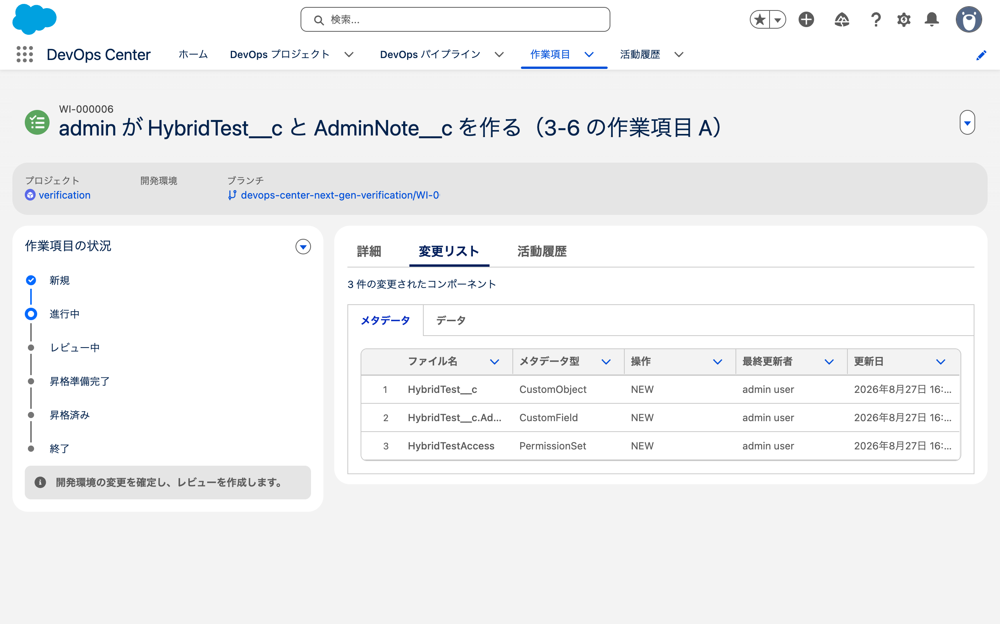
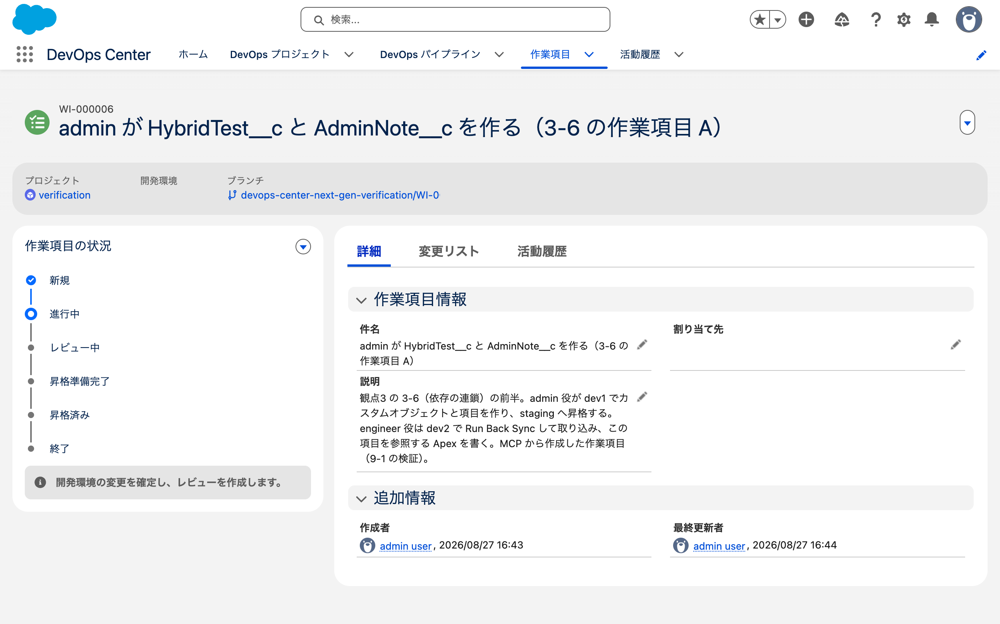
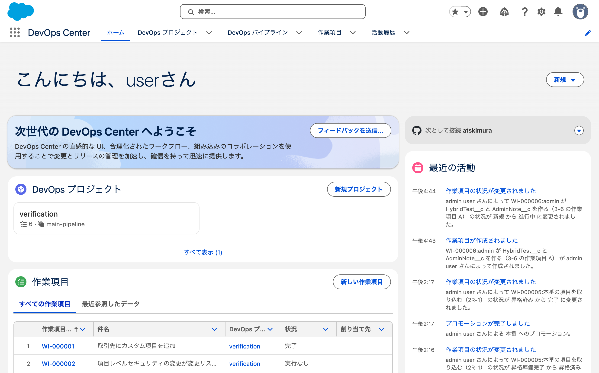
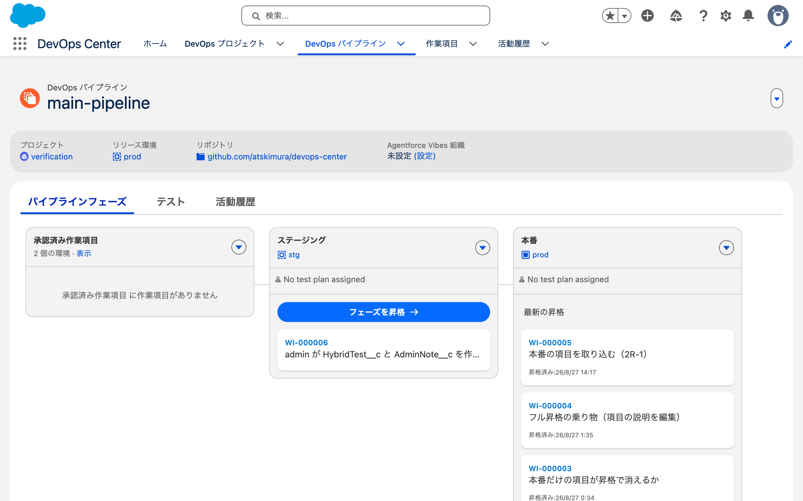
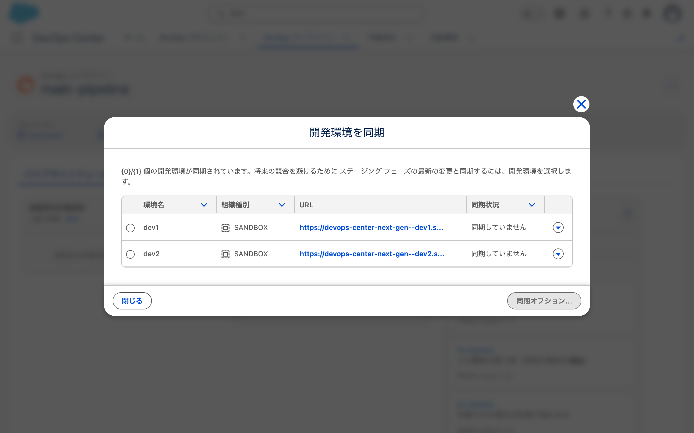
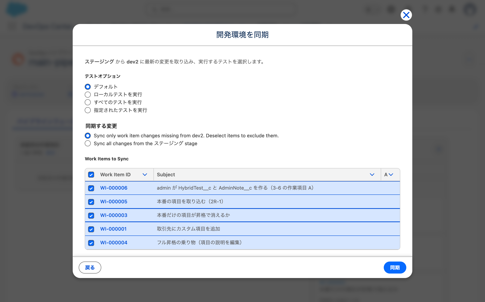
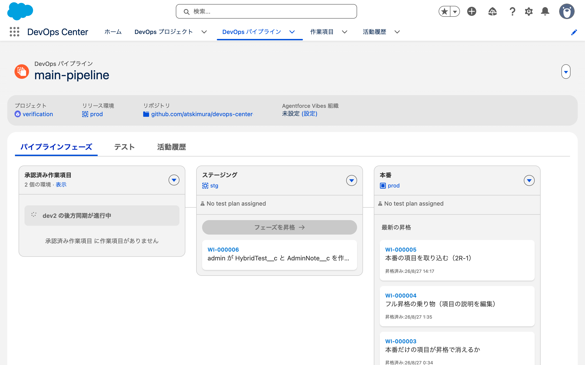
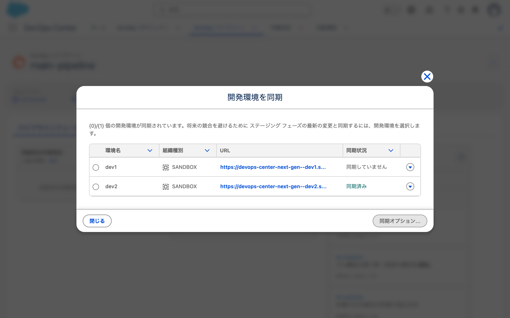
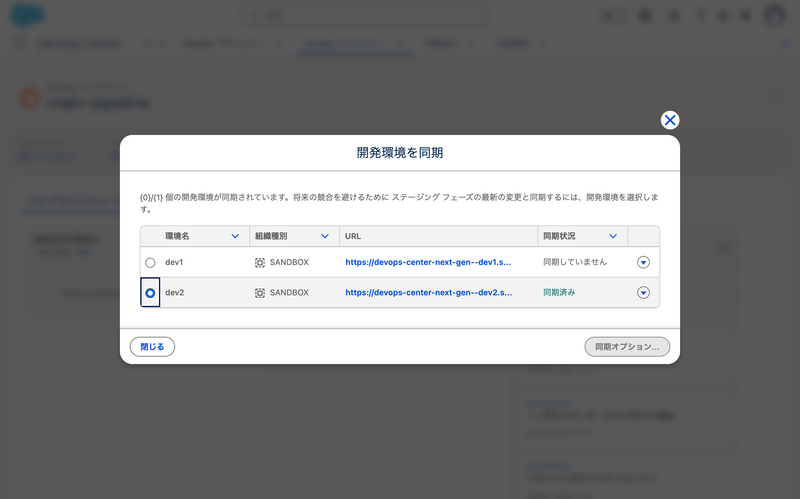

# 2026-08-27 MCP から作業項目を一周させる（9-1 / 3-6 / B-0c）

- 目的: Claude Codeから作業項目の作成、変更の登録、レビュー作成、昇格までを完走させる。
  あわせて、項目と権限セットの依存関係を扱えるかも確かめる。
- きっかけ: 画面操作と、メタデータ追加時の変更リストに混ざるノイズを減らせるか確認したかった。
- 使った org: `dcng-prod`（Hub）/ `dcng-dev1`（開発環境）
- 開始 16:42:25

---

## 1. 前提の確認（dev2 は既に接続されていた）

申し送りには「`dev2` 未接続」と書いていたが、**DevOps Center 側は接続済みだった。**

| 環境 | `OrgIdentifier` | `IsDevEnvironment` |
|---|---|---|
| dev1 | `<SALESFORCE_ID>` | true |
| dev2 | `<SALESFORCE_ID>` | true |
| prod | `<SALESFORCE_ID>` | false |
| stg | `<SALESFORCE_ID>` | false |

未実施だったのは **CLI の認証だけ**だった。

```
sf org login web -a dcng-dev2 -r https://test.salesforce.com
→ Successfully authorized <EMAIL_REDACTED> with org ID <SALESFORCE_ID>
```

org ID が DevOps Center 側の `OrgIdentifier` と一致した。

- **確認したこと**: 2026-08-04 のチェックリストの「dev2 を開発環境として接続」は未完了のままだったが、
  実際には 08-07 までに接続されていた。08-07 のログの「前提: 環境3本 + prod を接続」が正しい
- `CanTrackChanges` は**4環境すべて false**。実際には dev1 で追跡が動いているので、
  この項目は状態を表していない（08-04 に観測したのと同じ）

---

## 2. MCP で作業項目を作った（開発環境が null になる）

```
list_devops_center_projects(dcng-prod)
→ Id: <DEVOPS_RECORD_ID> / Name: verification
```

```
create_devops_center_work_item(
  usernameOrAlias: dcng-prod,
  projectId: <DEVOPS_RECORD_ID>,
  subject: "admin が HybridTest__c と AdminNote__c を作る（3-6 の作業項目 A）",
  description: ...)
→ { "success": true, "subject": "..." }
```

**返り値に `workItemId` と `workItemName` が入っていない。**
ツールの説明にはこう書いてある。

> "workItemId, workItemName, subject: Created work item details on success."

次の手順で `workItemName` が必要なので、`list_devops_center_work_items` で調べ直した。
→ **`WI-000006`**（`<DEVOPS_RECORD_ID>`）/ status `NEW`

**このツールには開発環境を指定するパラメータが無い**（`usernameOrAlias` / `projectId` /
`subject` / `description` の4つだけ）。

### 状態を In Progress にしたらブランチができた

```
update_devops_center_work_item_status(dcng-prod, WI-000006, "In Progress")
→ { "success": true, "workItemId": "<DEVOPS_RECORD_ID>", "workItemName": "WI-000006", "status": "In Progress" }
```

`WorkItem` を SOQL で見た（オブジェクトの API 名は名前空間なしの **`WorkItem`**）。

| | WI-000005（画面で作った） | WI-000006（MCP で作った） |
|---|---|---|
| `Status` | CLOSED | IN_PROGRESS |
| `SourceCodeRepositoryBranchId` | `<DEVOPS_RECORD_ID>` | **`<DEVOPS_RECORD_ID>`** |
| `DevelopmentEnvironmentId` | `<DEVOPS_RECORD_ID>`（dev1） | **`null`** |
| `DevopsPipelineStageId` | `<DEVOPS_RECORD_ID>` | null |

GitHub 側にもブランチが実際に作られていた。

```
$ gh api repos/example-company/example-project/branches --jq '.[].name'
WI-000001 / WI-000003 / WI-000004 / WI-000005 / WI-000006 / main / staging
```

- **確認したこと**: MCP から作業項目の作成とブランチの作成までできる
- **確認したこと**: **開発環境が `null` のまま作られる。** 指定するパラメータが無い
- 未確認: `DevopsPipelineStageId` が null なのは昇格前だからか、環境が null の影響か

---

## 3. checkout ツールは git を実行しない（説明と矛盾する）

ツールの説明（原文）:

> "It clones the repository to the specified local path if it does not exist there,
> and checks out the specified branch."

存在しないパスを渡すとエラーになった。

```
Invalid localPath: repoPath does not exist: .../work/wi6
```

ディレクトリを作ってから渡すと、今度はこう返ってきた。

```
Error: '.../work/wi6' is not a Git repository. Please provide the correct project path
(repo root containing a .git directory). Cloning is not performed by this tool.
```

**説明は「クローンする」、実装は「クローンしない」。**

自分でクローンした（4.0秒）。

```
gh repo clone example-company/example-project wi6 -- --branch WI-000006
```

そのうえで checkout ツールを呼ぶと、**git コマンドの手順書が返ってきた**（抜粋・原文）。

> Agent execution guide (perform these steps now):
>
>   1) Prepare repository context
>     - Update refs (focused): git fetch origin WI-000006 --prune
>
>   2) Verify remote branch exists
>     - Run: git ls-remote --exit-code --heads origin WI-000006
>     - If this fails, STOP and report the error. Do not create a new branch.
>
>   3) Check out the work item branch
>     - Try local checkout: git checkout WI-000006

- **確認したこと**: `checkout_devops_center_work_item` は git を実行しない。
  **エージェントに実行させる手順書を返す**
- **確認したこと**: 説明文とエラーメッセージが矛盾している（クローンする / しない）

---

## 4. dev1 にデプロイした（権限セットは追跡される）

作ったメタデータは3つ。**使い捨てのカスタムオブジェクトにした**（`Account` に残骸を足さないため）。

| 何 | API 名 |
|---|---|
| オブジェクト | `HybridTest__c`（表示ラベル「ハイブリッド検証」） |
| 項目 | `HybridTest__c.AdminNote__c`（「管理者メモ」/ Text 255） |
| 権限セット | `HybridTestAccess`（`AdminNote__c` の参照・編集を付与） |

```
sf project deploy start -o dcng-dev1 -d force-app/main/default/objects/HybridTest__c -d force-app/main/default/permissionsets
→ Status: Succeeded / Elapsed Time: 4.13s（コマンド全体で8.0秒）
```

### `SourceMember` に権限セットが載った

```
MemberType      | MemberName                 | RevisionCounter
PermissionSet   | HybridTestAccess           | 101
CustomObject    | HybridTest__c              | 100
CustomField     | HybridTest__c.AdminNote__c |  99
```

### 項目レベルセキュリティが権限セットに入った

```
Parent.Name      | IsOwnedByProfile | Field                      | Read | Edit
HybridTestAccess | false            | HybridTest__c.AdminNote__c | true | true
sfdc_slack       | false            | HybridTest__c.AdminNote__c | true | false
```

`sfdc_slack` は org が自動管理する権限セットで、いつも1件混ざる（既知）。

- **確認したこと**: **`PermissionSet` は `SourceMember` に載る。**
  2026-08-26 に `Profile` の項目権限が追跡されなかったのと対照的
- **確認したこと**: 権限セットに項目権限が入る
- **B-0c の残り**: これが昇格で prod まで運ばれるか

---

## 5. MCP の commit は通ったが、DevOps Center は認識していない

```
commit_devops_center_work_item(
  usernameOrAlias: dcng-prod, workItemName: WI-000006,
  commitMessage: "...", repoPath: .../wi6)
```

返り値（原文）:

> Commit created successfully.
>
> Changes committed successfully.
>               Commit SHA: <COMMIT_SHA>
>               DevOps sync hasUpdates: false
>               Agent execution guide (perform these steps now)
>               - Push the commit: 'git push'

**開発環境が `null` でもコミットは通った。** push も自分でやる（4秒）。

### `.sf/` が入った（`.gitignore` を置いていなかった）

コミットに入ったのは **20ファイル**。意図した3件のほかに17ファイル。

**原因はこちらの準備不足である。** リポジトリに `.gitignore` を置いていなかった。
`sf project generate --template standard` が生成する `.gitignore` には `.sf/` が入っている
（→ 11章）。パイプラインを作る前に置いておくべきだった。

```
.sf/orgs/<SALESFORCE_ID>/localSourceTracking/HEAD
.sf/orgs/<SALESFORCE_ID>/localSourceTracking/config
.sf/orgs/<SALESFORCE_ID>/localSourceTracking/index
.sf/orgs/<SALESFORCE_ID>/localSourceTracking/objects/09/<COMMIT_SHA>
（... objects/ が11ファイル ...）
.sf/orgs/<SALESFORCE_ID>/localSourceTracking/refs/heads/main
.sf/orgs/<SALESFORCE_ID>/maxRevision.json
force-app/main/default/objects/HybridTest__c/HybridTest__c.object-meta.xml
force-app/main/default/objects/HybridTest__c/fields/AdminNote__c.field-meta.xml
force-app/main/default/permissionsets/HybridTestAccess.permissionset-meta.xml
```

`<SALESFORCE_ID>` は **dev1 の org ID**。ローカルのソース追跡状態がそのまま git に入った。

**リポジトリに `.gitignore` も `.forceignore` も無い。**
DevOps Center が接続したリポジトリなので、どちらも自動では作られない。

- **確認したこと**: MCP の commit は**ローカルの変更を選別せずにコミットする**（`git add -A` 相当）
- **確認したこと**: DevOps Center が接続したリポジトリに `.gitignore` は作られない。
  **用意するのは利用者側の仕事**
- コミットの名義は**ローカルの git 設定**（`github-user <EMAIL_REDACTED>`）。
  08-27 に観測した「マージコミットは DevOps Center 名義」とは別

### DevOps Center 側の変更リストは作られていない

```sql
SELECT MemberType, MemberName, ChangeType FROM WorkItemComponent
WHERE WorkItemComponentList.WorkItemId = '<DEVOPS_RECORD_ID>'
→ 0 件

SELECT Id, Name, WorkItemId, CreatedDate FROM WorkItemComponentList ORDER BY CreatedDate DESC LIMIT 5
→ 最新は <RECORD_ID>（WI-000005 = R-1 のもの / 08-27 05:14）
```

**WI-000006 の `WorkItemComponentList` レコードが存在しない。**
commit ツールが返した `DevOps sync hasUpdates: false` と整合する。

git にはコミットされ push もされたが、**DevOps Center はこのコミットを知らない。**

- **確認したこと**: MCP の commit は git 側だけを進める。
  DevOps Center 側の変更リストは作られない
- 未確認: VCS 同期は**ユーザー操作時に走る**（08-27 に確認）ので、
  画面を開けば同期される可能性がある。**次に確認する**
- 未確認: 開発環境が `null` であることが原因かどうか

---

## 6. 画面で作業項目を開いた瞬間に同期された

5章の時点で変更リストは 0 件だった。DevOps Center の画面で `WI-000006` を開いたら埋まった。



> 3 件の変更されたコンポーネント

| # | ファイル名 | メタデータ型 | 操作 | 最終更新者 |
|---|---|---|---|---|
| 1 | `HybridTest__c` | CustomObject | NEW | admin user |
| 2 | `HybridTest__c.Ad...` | CustomField | NEW | admin user |
| 3 | `HybridTestAccess` | PermissionSet | NEW | admin user |

**`.sf/` の17ファイルは変更リストに出ていない。** force-app 配下のメタデータだけが認識された。

### 時刻が証拠になった

```sql
SELECT Name, CreatedDate, CommitDate FROM WorkItemComponentList WHERE WorkItemId = '<DEVOPS_RECORD_ID>'
```

| 時刻（JST） | 何が起きたか | 出所 |
|---|---|---|
| 16:47:51 | MCP の commit | `CommitDate` |
| 16:52 頃 | SOQL で変更リストを見た → **0 件** | このログの5章 |
| **16:55:31** | **`<RECORD_ID>` が作られた** | `CreatedDate` |
| 16:55〜16:56 | DevOps Center の画面で `WI-000006` を開いた | 操作記録 |

**画面を開いた時刻にレコードが作られている。** コミットから約8分間、製品側はこのコミットを知らなかった。

これは、一次情報の記述を実測で裏付ける結果になった。

> "DevOps Center automatically runs VCS synchronization **during user actions,
> such as promoting changes or viewing a work item**."

- **確認したこと**: MCP の commit の後、**画面で作業項目を開くまで変更リストは作られない**
- **確認したこと**: 同期は「作業項目を見る」で走る。ドキュメントの記述が実機で確認できた
- **確認したこと**: `.sf/` は git には入るが、DevOps Center の変更リストには出ない
- **確認したこと**: `PermissionSet` が変更リストに載る（B-0c）
- **確認したこと**: 開発環境が空欄でも変更リストは埋まる

### 画面と DB で名義の表示が違う

画面の「最終更新者」列は **`admin user`**。DB の `ChangedBy` は git の名義だった。

```
MemberType    | MemberName                 | ChangeType | ChangedBy
CustomField   | HybridTest__c.AdminNote__c | NEW        | github-user <EMAIL_REDACTED>
CustomObject  | HybridTest__c              | NEW        | github-user <EMAIL_REDACTED>
PermissionSet | HybridTestAccess           | NEW        | github-user <EMAIL_REDACTED>
```

- 未確認: 画面が git の名義を Salesforce ユーザーにマッピングしているのか、別の項目を表示しているのか

### 作業項目の画面（開発環境が空欄）



| 項目 | 値 |
|---|---|
| プロジェクト | verification |
| **開発環境** | **空欄**（ラベルだけあって値が無い） |
| ブランチ | `example-project/WI-000006` |

状況は「進行中」で、案内は「開発環境の変更を確定し、レビューを作成します」。
**開発環境が無い状態で「開発環境の変更を確定」しろと案内される。**

### 活動履歴には MCP の操作が正しく残る



> 午後4:44 作業項目の状況が変更されました
> admin user さんによって WI-000006:... の状況が 新規 から 進行中 に変更されました。
>
> 午後4:43 作業項目が作成されました
> WI-000006:... が admin user さんによって作成されました。

MCP 経由の操作も画面の活動履歴に記録される。名義は `admin user`。

---

## 7. `.sf/` を掃除したら、MCP の commit の判定基準が分かった

`.gitignore` を作って `.sf/` をインデックスから外し、MCP の commit を呼んだら拒否された。
（このとき置いたのは自作の `.gitignore`。あとで公式テンプレートのものに置き換えた → 11章）

```
Error committing work item: No eligible changes to commit (only Unchanged components detected).
```

**判定はメタデータ変更の有無で、実際のコミットは作業ツリー全体を対象にしている。**
この組み合わせが5章の `.sf/` 混入の原因である。

| 何をコミットしようとしたか | 結果 |
|---|---|
| メタデータ3件（`.sf/` の17ファイルが作業ツリーにあった） | 通った。**20ファイルがコミットされた** |
| `.gitignore` の追加と `.sf/` の削除（メタデータ変更なし） | 拒否された |

通常の git でコミットして push した。`.sf/` は git から消えた。

- **確認したこと**: MCP の commit は**メタデータ変更が1件も無いと拒否する**
- **確認したこと**: メタデータ変更があるときは、**関係ないファイルも一緒にコミットされる**
- → `.gitignore` は**パイプラインを作る前に置いておく**必要がある
  （`.forceignore` について既に同じことを書いていた → セットアップに関する検証）。
  置いていなかったのはこちらの不備で、製品の挙動の問題ではない

---

## 8. PR の作成から昇格まで MCP で通った

### PR の作成（必須手順を飛ばしても通る）

ツールの説明は6段階の MANDATORY 手順を要求している。5段目はこうなっている。

> "MANDATORY - PREREQUISITE CHECK: Ask the user for their commit request ID and use the
> 'check_devops_center_commit_status' tool to verify the status of their previous commits.
> You MUST call 'check_devops_center_commit_status' before proceeding."

commit ツールが返したのは SHA だけで request ID は無い。**この手順は踏めない。**
パラメータ2つ（`usernameOrAlias` / `workItemName`）だけで呼んだら通った。

```
create_devops_center_pull_request(dcng-prod, WI-000006)
→ {
    "message": "Pull request created successfully for work item: <DEVOPS_RECORD_ID>",
    "pullRequestData": {
      "reviewUrl": "<PRIVATE_REPOSITORY_URL>",
      "status": "Success",
      "testingTriggeredStatus": "Not Applicable"
    }
  }
```

GitHub 側の PR:

| 項目 | 値 |
|---|---|
| タイトル | `[DevOps Center] Merge WI-000006 to staging`（自動生成） |
| base → head | `staging` ← `WI-000006` |
| ファイル | `.gitignore` + メタデータ3件（`.sf/` は入っていない） |

作業項目の状態は `IN_REVIEW` になった。**開発環境は依然 `null`。**

- `testingTriggeredStatus: "Not Applicable"` は DevOps Testing 連携の項目に見える。未確認

### 状態を Ready to Promote にしても、GitHub の PR は承認されない

```
update_devops_center_work_item_status(dcng-prod, WI-000006, "Ready to Promote")
→ { "success": true, "status": "Ready to Promote" }
```

| | 状態 |
|---|---|
| 作業項目 | `READY_TO_PROMOTE` |
| GitHub の PR #9 | **OPEN のまま / レビュー0件** |

**MCP の状態更新は Salesforce 側だけを変える。**
12個のツールに「レビューを承認する」ものは無い。

### 昇格は通った（PR はそこで自動マージされた）

```
promote_devops_center_work_item(dcng-prod, ["WI-000006"])
→ { "message": "Submitted for promotion", "requestId": "<REQUEST_ID>.", "status": "SUBMITTED" }
```

25秒後の状態:

| 何 | 結果 |
|---|---|
| 作業項目 | `PROMOTED` / `DevopsPipelineStageId` = staging |
| PR #9 | **MERGED**（08:00:47 UTC） |
| `DevopsEnvDeployment` | `SUCCESS` / `IsFullDeploy` = false |

**PR のレビューが0件でも、開発環境が `null` でも昇格した。**

---

## 9. B-0c の答え: 権限セットなら項目レベルセキュリティが運べる

staging org の状態:

| 何 | 結果 |
|---|---|
| `HybridTest__c.AdminNote__c` | 届いた |
| `HybridTestAccess`（権限セット） | 届いた（表示ラベル「ハイブリッド検証アクセス」） |
| 項目レベルセキュリティ | **`read=true` / `edit=true` で届いた** |

```
Parent.Name      | IsOwnedByProfile | Read | Edit
HybridTestAccess | false            | true | true
sfdc_slack       | false            | true | false
```

**2026-08-26 の結果と正反対である。**

| 運び方 | 結果 | 出所 |
|---|---|---|
| `Profile` の項目権限 | **15プロファイル中2つしか運ばれない**。しかも追跡されない | [08-26 のログ](2026-08-26-fls-tracking.md) |
| **権限セットの項目権限** | **追跡され、そのまま運ばれる** | このログ |

- **確認したこと**: 権限セットは `SourceMember` に載り、変更リストに出て、昇格で運ばれる
- **確認したこと**: 項目レベルセキュリティを運ぶなら権限セットを使えばよい
- **未確認**: prod への昇格（ステージ昇格）でも同じか。**MCP にステージ昇格のツールが無い**ので画面が要る

---

## 10. MCP でどこまで回り、どこで画面に戻るか

きっかけの問いは「画面操作が面倒。メタデータの追加はノイズが混ざって大変。
あの辺が楽になりそう」だった。答えを表にする。

| 操作 | MCP | 結果 |
|---|---|---|
| プロジェクト一覧 | `list_devops_center_projects` | 動く |
| 作業項目の作成 | `create_devops_center_work_item` | 動く。**開発環境が `null` になる** / 返り値に名前が入らない |
| ブランチの作成 | `update_..._status`（In Progress） | 動く。GitHub にブランチができる |
| ブランチのチェックアウト | `checkout_...` | **git を実行しない。** 手順書を返すだけ |
| **メタデータの選択** | （ツールなし） | **`retrieve` / ファイル編集で決める。画面のチェックボックスは不要になる** |
| コミット | `commit_...` | 動く。ただし**関係ないファイルも巻き込む** |
| push | （ツールなし） | 自分でやる |
| 変更リストへの反映 | （ツールなし） | **画面で作業項目を開くまで走らない** |
| PR の作成 | `create_..._pull_request` | 動く |
| 状態を昇格準備完了に | `update_..._status` | 動く。**GitHub の PR は承認されない** |
| 作業項目の昇格 | `promote_...` | 動く |
| **ステージ昇格**（staging → prod） | **ツールなし** | **画面が要る** |

### 所要時間

| 時刻 | 何を |
|---|---|
| 16:42:25 | 開始（dev2 の CLI 認証は別途） |
| 16:43 | 作業項目の作成 |
| 16:44 | In Progress（ブランチ作成） |
| 16:45:59 | クローン完了（4.0秒） |
| 16:47:14 | dev1 へデプロイ完了（8.0秒） |
| 16:47:51 | MCP の commit |
| 16:48:10 | push（4秒） |
| 16:55:31 | 画面で作業項目を開いて同期（**間の約7分は私が SOQL で調査していた**） |
| 16:59:43 | PR 作成 |
| 17:00:09 | Ready to Promote |
| 17:00:47 | 昇格完了（PR がマージされた） |

**全体で18分22秒。** ただし調査（SOQL / describe / スクショ）を除いた実操作は10分程度。

比較対象は [R-1](2026-08-27-recovery-r1.md) の **12分28秒 / 約30手**（うち CLI 8秒、画面操作12分）。
今回のツール呼び出しは**7回**で、あとは git 操作と SOQL。

- 「メタデータの追加でノイズが混ざる」問題は**性質が変わる**。
  画面のチェックボックスで選ぶ代わりに、`retrieve` の指定とファイル編集で決まる
- **代わりに別のノイズが入る**（`.sf/` の巻き込み）。`.gitignore` を先に置けば防げる
- **第1ステージ（staging）までは MCP で通る。** ステージ昇格（staging → prod）は
  ツールが無いので未実施。**パイプラインの最後までは行っていない**

---

## 11. ignore ファイルを公式テンプレートのものに置き換えた

検証中の指摘（2026-08-27）:

> `.gitignore` を追加してないほうがわるいな。とりあえず追加しておいたら？ `.forceignore` も必要なら。

**そのとおりだった。** 5章で `.sf/` が入ったのを製品の挙動の問題として書いたが、
`.gitignore` を置いていなかったこちらの不備である。

自作で書くのをやめて、公式テンプレートを見た。

```
sf project generate -n tmpl --template standard
```

生成されるのは `.forceignore` / `.gitignore` / `.husky` / `.prettierignore` /
`.prettierrc` / `.vscode` / `README.md` / `config` / `eslint.config.js` /
`force-app` / `jest.config.js` / `package.json` / `scripts` / `sfdx-project.json`。

### `.gitignore`（公式・全文）

```
# Salesforce cache
.sf/
.sfdx/
.localdevserver/
deploy-options.json

# LWC VSCode autocomplete
**/lwc/jsconfig.json

# LWC Jest coverage reports
coverage/

# Logs
logs
*.log
npm-debug.log*
yarn-debug.log*
yarn-error.log*

# Dependency directories
node_modules/

# ApexPMD cache
.pmdCache

# Eslint cache
.eslintcache

# MacOS system files
.DS_Store

# Windows system files
Thumbs.db
ehthumbs.db
[Dd]esktop.ini
$RECYCLE.BIN/

# Local environment variables
.env

# Python Salesforce Functions
**/__pycache__/
**/.venv/
**/venv/
```

### `.forceignore`（公式・全文）

```
package.xml

# LWC configuration files
**/jsconfig.json
**/.eslintrc.json

# LWC Jest
**/__tests__/**

node_modules/
```

**`package.xml` を除外している。** `sf project generate manifest --from-org` で作った
manifest を org に送らないために要る。R-6（本番の乖離を自前で検知する）でこれを使う。

### main に直接 push した

検証中の問い:

> main に直接コミットしちゃだめなの？

**だめではない。** 理由は3つ。

1. ignore ファイルはメタデータではないので DevOps Center の追跡対象外
2. VCS 同期が監視するのはブランチ作成 / PR / マージで、**直接 push は対象外**
   （一次情報で確認）
3. リポジトリの設定ファイルなので、パイプラインを通す意味がない

ただし**実用上は staging にも要る。** 作業項目ブランチは staging から切られるので
（WI-000006 の PR の base が staging だった）、`.gitignore` が効くのは staging にあるとき。

やったこと:

| 対象 | 方法 | 時刻 |
|---|---|---|
| staging | PR #11 を作ってマージ | 17:13:23 |
| main | `git push origin main-ignore:main`（直接） | 17:13:37 |

結果:

```
origin/main    → .forceignore / .gitignore
origin/staging → .forceignore / .gitignore
ignore ファイルの差分なし
main と staging の差分は HybridTest__c 関連の3ファイルだけ（prod へ未昇格の分）
```

### どちらも DevOps Center に検知されなかった

```sql
SELECT Name, Description, CreatedDate FROM DevopsActivityLog ORDER BY CreatedDate DESC LIMIT 5
```

最新は `<ACTIVITY_LOG_ID> / 2026-08-27T08:00:51Z`（WI-000006 の昇格）。
**PR #11 のマージ（17:13:23）と main への直接 push（17:13:37）に対応する活動が無い。**

- **確認したこと**: DevOps Center が知らないブランチ（`chore/ignore-files`）から
  ステージブランチへのマージは検知されない。監視対象は
  「work item ブランチと stage ブランチのマージ」「stage ブランチ間のマージ」
- **確認したこと**: main への直接 push も検知されない（08-27 の staging と同じ）
- 未確認: この後で画面を開いたときに同期が走って何か起きるか
  （6章のとおり同期はユーザー操作時に走る）

### main への直接 push は余計だった

mainへの直接pushは不要との指摘を受けた。
実際にPR #10は、DevOps Centerが自動で作った`Promotion: staging → main`だった。

```
#10 [OPEN] staging → main : Promotion: staging → main
作成 2026-08-27T08:00:48Z（WI-000006 を staging へ昇格したのと同じ時刻）
```

この PR は staging ブランチを指しているので、**あとから staging に入った変更も自動的に含まれる。**
17:13 に PR #11 をマージした時点で、`.gitignore` と `.forceignore` は PR #10 の差分に入っていた。
**prod へ昇格すれば main に届く。**

直接 push しても壊れてはいなかった。

```
PR #10: mergeable: MERGEABLE / mergeStateStatus: CLEAN
実際の main と staging の差分: HybridTest__c 関連の3ファイルだけ
```

GitHub の PR のファイル一覧には `.gitignore` と `.forceignore` が残っているが、
実際の差分からは消えている（main 側に同じ内容が入ったため）。

### Promotion PR の作成タイミングを精密化した（既知の記述の訂正）

**「昇格の PR は自動作成・自動マージ」は 2026-08-07 に確定していた。**
「え？知らなかったの？」と言われて過去ログを grep したら書いてあった。
**新しいと思って grep を飛ばした。**

既知だったこと:

| 出所 | 記述 |
|---|---|
| 08-07 のログ | 「ステージ間昇格の PR は自動作成・自動マージ」 |
| [08-26 のログ](2026-08-26-fls-tracking.md) | タイトルは `Promotion: staging → main` と `[DevOps Center] Merge <WI> to <stage>` の2形式 |
| セットアップ・障害対応・CIの記録 | いずれも記載あり |

**ただし作成のタイミングの記述が不正確だった。** 08-07 のログにはこうある。

> PR #2 は「フェーズを昇格」を押しただけで作成もマージも自動で行われた。

時刻を見ると、**作成は「フェーズを昇格」の20分前**だった。

| | 作業項目 PR のマージ | Promotion PR の作成 | 差 | Promotion PR のマージ |
|---|---|---|---|---|
| 08-07 | #1 → 04:08:38 | #2 → **04:08:40** | 2秒 | 04:28:55（20分後） |
| 今回 | #9 → 08:00:47 | #10 → **08:00:48** | 1秒 | 未 |

**作業項目がステージブランチにマージされた1〜2秒後に、次のステージへの PR が自動で作られる。**
そして「フェーズを昇格」を押すまで OPEN で残る。

08-07 では staging への昇格と prod への昇格を20分の間に続けてやったので、
「押しただけで作成もマージも行われた」ように見えていた。

- **今回わかったこと**: PR の作成は作業項目の昇格直後で、マージだけが「フェーズを昇格」で起きる
- **今回わかったこと**: この PR は staging ブランチを指すので、
  **あとから staging に入れたものも一緒に main へ運ばれる**（`.gitignore` がそうなった）
- 未確認: この PR を人が手でマージしたらどうなるか（External Merge として扱われるか）

---

## 12. 3-6 の後半: 依存は回った

共同開発に関する検証 の 3-6 は「admin が作った項目を engineer が使う」が回るかを見る。
前半（admin が dev1 で作って staging へ昇格）は8章まで。ここから後半。

### 取り込み前の dev2 は空だった

```
HybridTest__c        → 0 件
SourceMember         → 0 件
```

**dev2 は一度も使われていない新品だった**（dev1 は `SourceMember` が101件）。

### 入り口は「表示」に変わっていた

2026-08-04 のログには「承認済み作業項目」列がこう書いてある。

> `1 個の環境 (1/1 が同期済み) · 環境を同期`

今日はこうだった。

> `2 個の環境 · 表示`

**dev2 が増えて2個になり、「(N/N が同期済み)」と「環境を同期」が消えた。**



### 1つ目のダイアログにローカライズのバグがある



見出しは「開発環境を同期」。説明文の原文（日本語 org）:

> {0}/{1} 個の開発環境が同期されています。将来の競合を避けるために ステージング フェーズの最新の変更と同期するには、開発環境を選択します。

**`{0}/{1}` がプレースホルダのまま出ている。**
パイプライン画面で「(1/1 が同期済み)」が消えていたのも、これと同じ不具合に見える。

| 環境名 | 組織種別 | 同期状況 |
|---|---|---|
| dev1 | SANDBOX | 同期していません |
| dev2 | SANDBOX | 同期していません |

**dev1 も「同期していません」だった。** WI-000006 が staging に入ったので、dev1 も乖離している。

**ラジオボタンは `click` ツールでも反応しなかった。** セル（`gridcell`）をクリックしたら選択できた。

### 2つ目のダイアログ: 差分とフルの2択があり、作業項目を選べる



> ステージング から dev2 に最新の変更を取り込み、実行するテストを選択します。

| 区分 | 選択肢 |
|---|---|
| テストオプション | デフォルト（既定）/ ローカルテストを実行 / すべてのテストを実行 / 指定されたテストを実行 |
| 同期する変更 | `Sync only work item changes missing from dev2. Deselect items to exclude them.`（既定）/ `Sync all changes from the ステージング stage` |

**未翻訳が4箇所ある**（日本語 org）。

- `Sync only work item changes missing from dev2. Deselect items to exclude them.`
- `Sync all changes from the ステージング stage` ← 英語と日本語の混在
- `Work Items to Sync`
- `Loading Status...`

**「Work Items to Sync」に過去の全作業項目が並び、全部チェック済みだった。**

| Work Item ID | Subject |
|---|---|
| WI-000006 | admin が HybridTest__c と AdminNote__c を作る（3-6 の作業項目 A） |
| WI-000005 | 本番の項目を取り込む（2R-1） |
| WI-000003 | 本番だけの項目が昇格で消えるか |
| WI-000001 | 取引先にカスタム項目を追加 |
| WI-000004 | フル昇格の乗り物（項目の説明を編集） |

**新しい開発環境を同期すると、パイプラインの全履歴が対象になる。**
`Deselect items to exclude them` とあるので、個別に外せる。

既定（全件チェック）のまま「同期」を押した。

### 「後方同期」という訳語が出てきた



> 後方同期を検証中
> お待ちください。後方同期を検証しています。

**Run Back Sync の訳語が画面によって違う。**

| 画面 | 訳語 |
|---|---|
| パイプライン画面の列 | 環境を同期 |
| ダイアログの見出し | 開発環境を同期 |
| 実行中のダイアログ | **後方同期** |

完了時のトースト（原文）:

> 成功 環境 dev2 は最初のパイプラインフェーズと同期されました。

**17:26:20 に押して 44秒以内に完了。** 画面操作は4手（表示 → dev2 の行を選択 → 同期オプション → 同期）。

### dev2 に全部入った

```
CustomField:
  AdminNote          → <DEVOPS_RECORD_ID>（HybridTest__c）
  DevSideNote        → Account
  FullDeployVehicle  → Account
  ProdOnlyNote       → Account
  VerificationNote   → Account

SourceMember: 0 件 → 10 件

FieldPermissions（HybridTest__c.AdminNote__c）:
  HybridTestAccess → read=true / edit=true
  sfdc_slack       → read=true / edit=false
```

**権限セットの項目レベルセキュリティも Run Back Sync で運ばれた**（B-0c の追加データ）。

### Apex のコンパイルが通った（依存が回った証明）

`AdminNote__c` を参照する Apex を書いて dev2 にデプロイした。
**項目が無ければコンパイルできない**ので、これが機械的な証明になる。

```apex
public with sharing class HybridTestReader {
    public static List<HybridTest__c> readNotes() {
        return [SELECT Id, Name, AdminNote__c FROM HybridTest__c LIMIT 10];
    }
    ...
}
```

```
sf project deploy start -o dcng-dev2 -d force-app/main/default/classes
→ Created HybridTestReader / Elapsed Time: 1.86s（コマンド全体で5秒）
```

### 3-6 の答え

**依存は回る。しかも速い。**

| 段 | 所要 | 手数 |
|---|---|---|
| admin が項目を作って staging へ昇格 | 18分22秒（調査込み。実操作は約10分） | MCP のツール呼び出し7回 + git 操作 |
| engineer が Run Back Sync | **44秒** | **画面4手** |
| engineer が項目を使う Apex をデプロイ | 5秒 | CLI 1回 |

**admin の昇格が終わった時点で、engineer は44秒で着手できる。** 待ち時間は無い。

- **確認したこと**: admin が dev1 で作った項目が、staging 経由で dev2 に届く
- **確認したこと**: 権限セットの項目レベルセキュリティも一緒に運ばれる
- **確認したこと**: 新しい開発環境は**パイプラインの全履歴**を取り込む。個別に外せる
- **確認したこと**: Run Back Sync の訳語が画面によって3通りある
- **確認したこと**: 日本語 org に未翻訳とプレースホルダのバグがある
- **未確認**: 3-7（作業を始めた後に Run Back Sync すると消えるか）。
  いま dev2 に `HybridTestReader` が未コミットで置かれているので、この状態が入力になる

---

## 13. 同期済みの環境は再同期できない

検証中の問い（2026-08-27）:

> さっき Run Back Sync したけど、何度もできるの？

**できるが、「同期していません」の状態でないと押せない。**

同期の実行後にパイプライン画面をリロードして「表示」を開いた。



| 環境名 | 同期状況 |
|---|---|
| dev1 | 同期していません |
| **dev2** | **同期済み**（緑色の文字） |

dev2 の行は選択できる。ラジオボタンは `checked` になった。
**それでも「同期オプション...」は `disabled` のまま。**

```


row "... dev2 SANDBOX ... 同期済み ..."
  radio "項目を選択 2 選択行を選択" checked focusable focused
button "同期オプション..." disableable disabled
```

**2026-08-27 の17章で見た「フル昇格は昇格待ちの変更が無いと押せない」と同じ構造**
（→ [B-2b のログ](2026-08-26-fls-tracking.md) の17章）。
**配るものが無いときは操作させない。**

- **確認したこと**: 同期済みの環境は、選択はできるが「同期オプション...」が押せない
- **確認したこと**: dev1 は「同期していません」のまま。WI-000006 が staging に入ったので乖離している
- **未確認**: 同期状況の判定基準。staging 側の新しいコミットだけで決まるのか、
  開発環境側の変更も見るのか

### 3-7 の手順が1つ増える

dev2 は今「同期済み」なので、**そのままでは Run Back Sync を実行できない。**

3-7（dev2 で編集したものが上書きされるか）をやるには、この順序になる。

1. dev2 で `AdminNote__c` の表示ラベルを変える
2. **staging に新しい変更を入れる**（別の作業項目を第1ステージへ昇格する）
3. dev2 が「同期していません」に戻るのを確認する
4. Run Back Sync を実行する
5. dev2 の表示ラベルが戻るか見る

**手順2 が要る。** ここで「dev2 側の編集だけで『同期していません』に戻るか」も分かる
（戻るなら手順2 は不要になる）。
