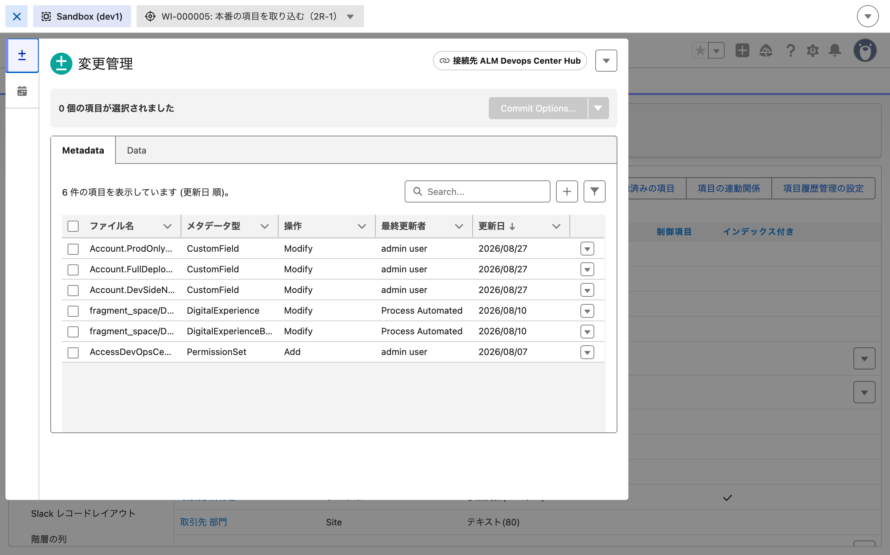
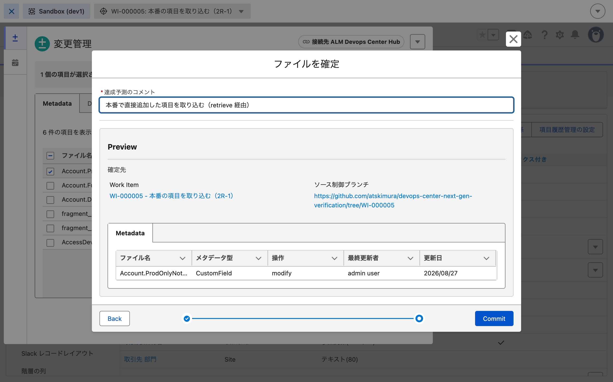

# 2026-08-27 本番の項目を git に取り込む（R-1 / retrieve 経由）

**目的**: 本番で直接追加した項目 `Account.ProdOnlyNote__c` を、
**公式推奨（「開発環境で作り直して作業項目で通す」）の代替として、retrieveを使う経路**で1本通す。

前提: この項目は B-2b で既に昇格でレイアウトから消えている。
項目定義は本番に残っているが配置は失われた状態から始める。

先に立てた予測（やる前に書いた）:

| | 予測 |
|---|---|
| ① retrieve したものが `SourceMember` に載るか | 載る |
| ② 本番の FLS 15件 | 残る |
| ② 本番のレイアウト | `ProdOnlyNote__c` は戻らない |
| ③ 手数 | retrieve 側は数秒。**画面操作が支配的** |

---

## 結果: 予測は4つすべて当たった

| | 予測 | 実測 |
|---|---|---|
| ① `SourceMember` | 載る | **載った**（`RevisionCounter` 88） |
| ② FLS | 15件のまま | **15件のまま** |
| ② レイアウト | 戻らない | **戻らなかった** |
| ③ 手数 | 画面操作が支配的 | **CLI 8秒 / 画面 約12分** |

**通しで 12分28秒。約30手。**

---

## 1. 所要時間の記録

| 時刻 | 操作 | 所要 |
|---|---|---|
| 14:05:23 | 開始 | |
| 14:05:31〜36 | **`sf project retrieve start`**（本番から項目1つ） | 5秒 |
| 14:05:51〜54 | **`sf project deploy start -o dcng-dev1`** | 3秒 |
| 14:05:59 | `SourceMember` を確認（分岐点） | |
| 14:09:46 | 作業項目 `WI-000005` を作成 | 約4分 |
| 14:10:20 | `[進行中] とマーク` → ブランチ `WI-000005` | 34秒 |
| 14:14:33 | DX Inspector でコミット（`<RECORD_ID>`） | 約4分 |
| 14:15:22 | `Create Review` → **PR #7** | 49秒 |
| 14:15:57 | `[昇格準備完了] とマーク` | 35秒 |
| 14:16:56 | **staging へ昇格**（`<RECORD_ID>`） | 59秒 |
| 14:17:51 | **prod へ昇格**（`<RECORD_ID>`） | 55秒 |

**合計 12分28秒。** そのうち CLI は8秒（retrieve 5秒 + deploy 3秒）。
**残り約12分がすべて画面操作。**

### 手数（画面の操作回数）

約30手。内訳:

| 段 | 手数 |
|---|---|
| 作業項目の作成（一覧 → 新規 → プロジェクト → 件名 → 開発環境 → 保存） | 8 |
| 進行中にする（レコードを開く → ボタン） | 2 |
| DX Inspector で作業項目を切り替える（設定画面 → メニュー → 選択 → ラジオ → 確定） | 5 |
| コミット（パネルを開く → 選択 → Commit Options → ラジオ → Next → メッセージ → Commit） | 7 |
| レビュー作成 | 1 |
| 昇格準備完了（レコードを開く → ボタン） | 2 |
| staging へ昇格（パイプライン → 選択 → 昇格 → 確定） | 4 |
| prod へ昇格（リロード → フェーズを昇格 → 確定） | 3 |

---

## 2. retrieve → deploy したものは追跡される（分岐点をクリア）

`sf project deploy start` で dev1 に入れた直後の `SourceMember`。

```
MemberType   MemberName                     RevisionCounter  LastModifiedDate
CustomField  Account.ProdOnlyNote__c        88               2026-08-27T05:05:54Z  ← 入った
NamedCredential  ALMDevOpsCenterHub         87               2026-08-26T16:50:20Z
CustomField  Account.FullDeployVehicle__c   71               2026-08-26T16:03:09Z
CustomField  Account.DevSideNote__c         58               2026-08-26T15:45:41Z
Profile      Admin                          44               2026-08-26T14:47:09Z
Profile      Read Only                      43               2026-08-26T14:47:09Z
```

- **確認したこと**: API（CLI）経由で入れた `CustomField` は `SourceMember` に載る。
  デプロイの完了から**5秒以内**に反映されていた
- 確認したこと: プロファイルは動いていない（`Admin` は 44 のまま）。
  デプロイしたファイルに `fieldPermissions` が無いので当然だが、
  「項目を入れても FLS は付かない」ことの裏返し
- → B-0（FLS は追跡されない）と矛盾しない。
  型そのものは追跡され、型の中の一部の属性が追跡されないという構図が固まった

---

## 3. 変更管理に6件出た。うち5件は自分が触っていないもの

`WI-000005` に切り替えて変更管理を開いたら**6件**並んだ。



| ファイル名 | 型 | 操作 | 最終更新者 | 更新日 |
|---|---|---|---|---|
| **`Account.ProdOnlyNote__c`** | CustomField | Modify | admin user | 2026/08/27 |
| `Account.FullDeployVehicle__c` | CustomField | Modify | admin user | 2026/08/27 |
| `Account.DevSideNote__c` | CustomField | Modify | admin user | 2026/08/27 |
| `fragment_space/DefaultWidgetSpace.sfdc_cms__languageSettings/languages` | DigitalExperience | Modify | **Process Automated** | 2026/08/10 |
| `fragment_space/DefaultWidgetSpace` | DigitalExperienceBundle | Modify | **Process Automated** | 2026/08/10 |
| `AccessDevOpsCenterNamedCredentials` | PermissionSet | Add | admin user | 2026/08/07 |

**今回の作業に関係するのは1件だけ。** 残る5件から選り分けてチェックを入れた。

- 確認したこと: `ProdOnlyNote__c` の「操作」は `Modify`。
  dev1 には新規で入れたのに `Add` ではない
- 確認したこと: 前回コミット済みの `FullDeployVehicle__c` と `DevSideNote__c` が再度出ている
  （どちらも `WI-000004` 以前でコミットした）
- 未確認: なぜコミット済みのものが再度出るのか。
  08-26 の時点では7件で内訳が違った（プロファイル2件とレイアウトが出ていた）。
  「前回コミット分は消え、その後動いたものが出る」と読めるが確証はない
- → 日常運用に関する検証 の 6-4（変更リストのノイズ）の実例。
  毎回この選り分けが要る

### 08-27 朝の 400 エラーは再発しなかった

External Merge の検証の18章で
`GET_CHANGES_UNKNOWN_ERROR`（400）が出て変更リストが取れなくなったが、
**今回は5秒で6件出た。**

- **未確認**: 400 が出る条件。今回との違いは「作業項目が `IN_PROGRESS` でブランチがあり、
  かつ `SourceMember` に未コミットの変更がある」状態だったこと

---

## 4. コミットから昇格まで

| | |
|---|---|
| コミット | `<RECORD_ID>` / git コミット `<COMMIT_SHA>`（14:14:42） |
| コミットのメッセージ | 「本番で直接追加した項目を取り込む（retrieve 経由）」 |
| Preview の表示 | `Account.ProdOnlyNot… / CustomField / modify / admin user / 2026/08/27` の1件 |
| レビュー | `IN_REVIEW` / `ReviewRemoteReference = 7` / **PR #7** |
| staging 昇格 | `<RECORD_ID>` / `IsFullDeploy = false` / `SUCCESS` |
| prod 昇格 | `<RECORD_ID>` / `IsFullDeploy = false` / `SUCCESS` |



**両方の昇格で運ばれたのは1件だけ。**

```
MemberName                MemberType   ChangeType
Account.ProdOnlyNote__c   CustomField  CHANGE
```

- **確認したこと**: `ChangeType` は `CHANGE`（`NEW` ではない）。
  本番には既に項目があるので「変更」扱いになる
- → 08-26 の `DevSideNote__c` は `NEW` だった（本番に無かったので）。対照が取れた

---

## 5. 本番の状態: 何も壊れなかった。ただしレイアウトも戻らない

| | 昇格前 | 昇格後 |
|---|---|---|
| `ProdOnlyNote__c`（項目） | あり | **あり** |
| `ProdOnlyNote__c` の FLS | **15件** | 15件（変わらず） |
| `VerificationNote__c` の FLS | 2件 | 2件 |
| `DevSideNote__c` の FLS | 2件 | 2件 |
| レイアウトのカスタム項目 | `VerificationNote__c` / `DevSideNote__c` | **同じ** |

**FLS 15件は残った。** 予測どおり、プロファイルは「書かれた項目だけ更新」なので、
git 側に `ProdOnlyNote__c` の `fieldPermissions` が無くても既存の15件は触られない。

**レイアウトの配置は戻らなかった。** 取り込んだのは項目定義だけなので当然だが、
「取り込んだのに画面に出ない」状態が残る。

- 確認したこと: 公式推奨の手順で本番は壊れない（FLS も他の項目も無傷）
- 確認したこと: 項目を取り込んでもレイアウトの配置は戻らない。
  使う側から見ればまだ「消えたまま」
- → レイアウトを戻す手順が別に要る（→ R-2）

---

---

## 6. 配った先では「項目はあるが誰にも見えない」

**取り込みが終わった後、3つの org を並べて見た。**

| org | 項目 | **FLS**（内部プロファイル） | レイアウトの配置 |
|---|---|---|---|
| `prod`（元の org） | あり | **15件** | 無い（B-2b で落ちた） |
| `stg` | **入った** | 0件 | 無い |
| `dev1` | **入った** | 0件 | 無い |

**配った先の FLS が 0件。** つまり:

- 項目はオブジェクトマネージャーに存在する
- どのプロファイルにも権限が無いので、誰も見られない
- レイアウトにも載っていない

→ **「取り込めた」と言えるのは git と項目定義まで。
使える状態にはなっていない。**

### なぜ 0 件なのか

取り込んだファイルは項目定義だけで、`fieldPermissions` を含まない。
[B-0](2026-08-26-fls-tracking.md) で確認したとおり **FLS は `SourceMember` に載らない**ので、
そもそも運ぶ手段が無い。

**本番の15件は、本番の作成ウィザードが付けたもの。** 取り込みとは無関係に残っているだけ。

- 確認したこと: 項目を取り込んでも、配った先では FLS が 0 件でレイアウトにも載らない。
  「復旧」として完結しない
- → 使える状態にするには、配った先で FLS とレイアウトを手作業で設定する必要がある（未確認）
- → この手数は 本番との差分に関する検証 の判断フローチャートに要る

### git は揃った

| ブランチ | `ProdOnlyNote__c` |
|---|---|
| `WI-000005` | あり |
| `staging` | あり |
| **`main`** | あり |

PR は自動でマージされた（**#7** `WI-000005` → `staging` / #8 `staging` → `main`、どちらも MERGED）。

→ **git を正にする目的は達成できた。** 次の昇格でこの項目が消えることはなくなった。

---

## この時点で確定していること

- **retrieve → deploy → 作業項目 → 昇格 の手順は通る。** 実測 12分28秒 / 約30手
- **CLI 部分は8秒。残り12分は画面操作。** 手を動かす量はほぼ画面側にある
- API 経由で入れた `CustomField` は `SourceMember` に載る（5秒以内）
- 公式推奨の手順で本番は壊れない（FLS 15件も他の項目も無傷）
- 項目を取り込んでもレイアウトの配置は戻らない
- 本番に既にあるものを昇格すると `ChangeType` は `CHANGE`
- 変更管理に6件出て、関係するのは1件だけ。毎回選り分けが要る
- コミット済みのものが再度変更管理に出る（理由は未確認）
- 08-27 朝の 400 エラーは再発しなかった（条件は未確認）
- 配った先（stg / dev1）では FLS が 0件でレイアウトにも載らない。
  項目は存在するが誰にも見えない。「取り込めた」のは git と項目定義まで
- git は揃った。 `main` に入ったので、次の昇格でこの項目が消えることはなくなった
- PR は自動でマージされる（#7 `WI-000005` → `staging` / #8 `staging` → `main`）

## 未確認のまま残っていること

- **レイアウトの配置をどう戻すか / 何手かかるか**（→ R-2）
- コミット済みのものが変更管理に再度出る理由
- 400 エラーが出る条件
- **手で作り直した場合との手数の差**（今回は retrieve 経由だけを測った）
- 配った先で FLS とレイアウトを設定する手数（使える状態にするまで何手か）

## 現在の状態（次に触る人向け）

| | |
|---|---|
| `main` / `staging` / `WI-000005` ブランチ | **`ProdOnlyNote__c` が入った** |
| `prod` org | 項目あり / FLS 15件 / **レイアウトからは消えたまま** |
| `stg` org | **`ProdOnlyNote__c` が入った**（FLS 0件 / レイアウトにも無い） |
| `dev1` org | **`ProdOnlyNote__c` が入った**（FLS 0件 / レイアウトにも無い） |
| `WI-000005` | 昇格済み |
| PR | #7 マージ済み。#8（staging → main）も自動で作られマージされたはず |

**後片付けの対象が増えた**: `ProdOnlyNote__c` が prod / stg / dev1 の3つに存在する。
