# 2026-08-27 Run Back Sync で編集中のメタデータが上書きされるか（3-7）

- 目的: 公式が警告している「未昇格の作業を上書きする」が実際に起きるか。

> "Back sync overwrites unpromoted work items with In Progress, In Review, or Approved statuses"

- 使った org: `dcng-prod`（Hub）/ `dcng-dev2`
- **予測を先に書いてから実行した。**

---

## 1. 押す前の状態

dev2 で `AdminNote__c` の表示ラベルを変えて、**git にはコミットしなかった。**

```
sed -i '' 's|<label>管理者メモ</label>|<label>管理者メモ（dev2 で変更）</label>|' ...
sf project deploy start -o dcng-dev2 -d .../AdminNote__c.field-meta.xml
→ Changed / Succeeded / 2.05s
```

| 何 | 状態 | staging にあるか |
|---|---|---|
| `AdminNote__c` の表示ラベル | **管理者メモ（dev2 で変更）** | ある（WI-000006 で配られた） |
| `HybridTestReader`（Apex） | Active | **無い**（CLI で dev2 に直接入れた） |
| `EngineerNote__c` | 無い | ある（WI-000007） |
| `ReviewerNote__c` | 無い | ある（WI-000008） |

`SourceMember` には両方載っていた（`AdminNote__c` が 13、`HybridTestReader` が 12）。

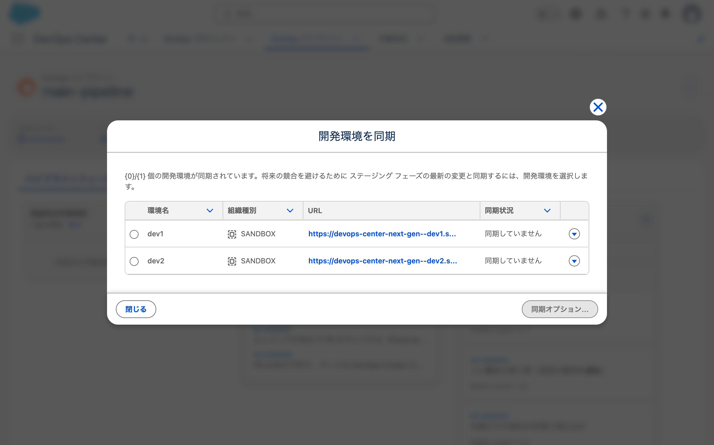

dev2 は「同期していません」に戻っていた（staging に WI-000007 と WI-000008 が入ったため）。

## 2. 実行した内容

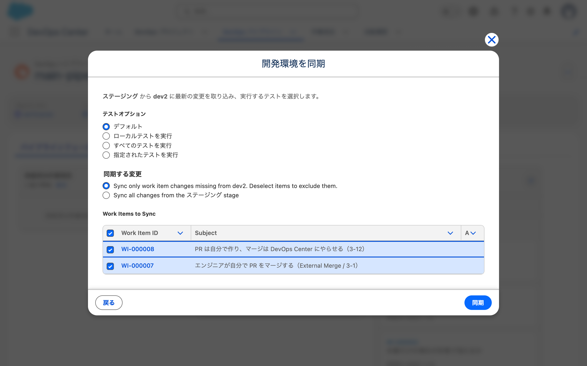

**既定のまま押した。**

| 区分 | 選んだもの |
|---|---|
| テストオプション | デフォルト |
| 同期する変更 | `Sync only work item changes missing from dev2. Deselect items to exclude them.` |
| Work Items to Sync | WI-000008 / WI-000007 の2件（どちらもチェック済み） |

**Work Items to Sync が2件だった。**
2026-08-27 の初回同期のときは過去の全5件が並んでいたが、
今回は **dev2 に無い分だけ**に絞られていた。

実行中の表示（原文）:

> dev2 の後方同期が進行中

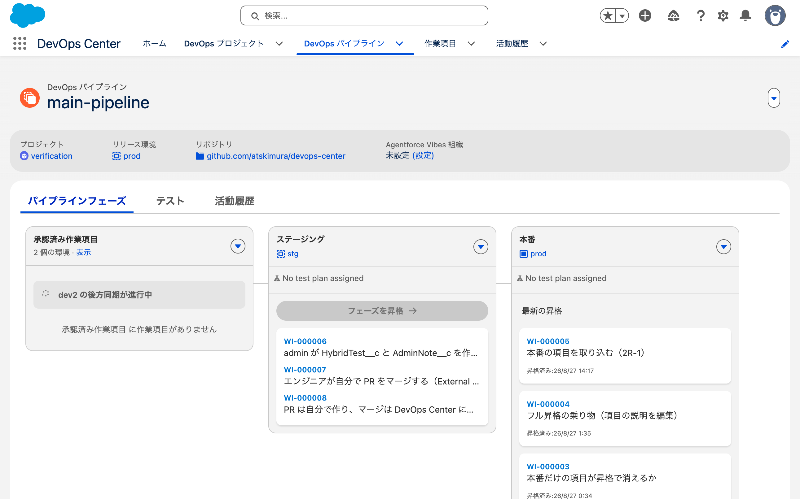

**同期中は「フェーズを昇格」がグレーアウトする。**

22:18:36 に押して 22:19:34 に完了。**58秒。**

---

## 3. 結果: 予測が外れた

| 対象 | 予測 | 結果 |
|---|---|---|
| `AdminNote__c` の表示ラベル | **上書きされる**（「管理者メモ」に戻る） | **「管理者メモ（dev2 で変更）」のまま** |
| `HybridTestReader` | 消えない | 消えなかった |
| `EngineerNote__c` / `ReviewerNote__c` | 来る | 来た |

```
--- AdminNote__c の表示ラベル ---
  label: 管理者メモ（dev2 で変更）      ← 変わっていない

--- HybridTestReader ---
  HybridTestReader / Active            ← 消えていない

--- staging から来たか ---
  EngineerNote / ReviewerNote          ← 2件とも来た

--- SourceMember ---
  CustomField  HybridTest__c.ReviewerNote__c  15
  CustomField  HybridTest__c.EngineerNote__c  14
  CustomField  HybridTest__c.AdminNote__c     13   ← 更新されていない
  ApexClass    HybridTestReader               12
```

### 外れた理由は「同期する変更」の既定値

既定は `Sync only work item changes missing from dev2`。
**「dev2 に無い作業項目の変更だけ」を配る。**

| 作業項目 | 中身 | dev2 に既にあるか | 配られたか |
|---|---|---|---|
| WI-000006 | `AdminNote__c` | **ある** | **配られなかった** |
| WI-000007 | `EngineerNote__c` | 無い | 配られた |
| WI-000008 | `ReviewerNote__c` | 無い | 配られた |

**`AdminNote__c` は同期の対象に入っていなかった。**
Work Items to Sync に WI-000006 が並んでいなかったのがその証拠である。

- **確認したこと**: 差分同期（既定）では、**dev2 に既にあるメタデータは触られない。**
  編集していても上書きされない
- **確認したこと**: staging に無いもの（`HybridTestReader`）は消えない。
  Metadata API は削除の指示なしに消さない（[B-2b](2026-08-26-fls-tracking.md) と同じ）
- **確認したこと**: 同期中は「フェーズを昇格」が押せない

---

## 4. そもそも衝突していなかった（検証中の指摘）

> dev2 で変更したメタデータと同じメタデータが staging で変更されていた場合のほうが気になる

**条件の設計が足りていなかった。**

| ケース | dev2 | staging | 配られるか |
|---|---|---|---|
| 今日やった | `AdminNote__c` を変更 | **変更なし** | 配られない（対象外） |
| **本来のシナリオ** | `AdminNote__c` を変更 | **`AdminNote__c` も変更された** | **配られる** → 上書きされるはず |

**今日は衝突を作れていなかった。**
dev2 で触ったものが staging にもあるだけで、staging 側は変わっていない。
差分同期の対象計算から外れるのは当然だった。

### 残っている条件

| # | 条件 | なぜ効きそうか |
|---|---|---|
| **3-7c** | **staging 側でも同じメタデータが変更されている** | 確実に配られるので衝突する。**これが本来のシナリオ** |
| 3-7d | フル同期 | ステージブランチの全メタデータを配る |
| 3-7e | 作業項目に紐付けた状態 | 公式の警告文は "unpromoted work items" |

**3-7e は論理的に変**（検証中の指摘）。
作業項目に入れる = git にコミットする = 保護される方向なのに、
入れたから上書きされるのはおかしい。

**ただし公式の文は「上書きする」対象を書いていない。**
対象が**作業項目のブランチ**なら筋が通る。
Run Back Sync が「ブランチを staging に合わせる」動作なら、
作業項目ブランチにコミットした内容が staging の内容で潰される。
**org の変更ではなく git の作業が消える**という話になる。推測。

### 次にやること: 3-7c

1. staging に `AdminNote__c` を変更する作業項目を通す（別の人が変えた状況を作る）
2. dev2 でも `AdminNote__c` を別の値に変える
3. Run Back Sync する
4. dev2 の値がどうなるか見る

**dev2 の現在の表示ラベルは「管理者メモ（dev2 で変更）」のまま。**
これをそのまま入力に使える。

---

## 5. 3-7c の途中で昇格が失敗した（障害時の対応に関する検証 の材料になった）

**衝突を作る途中で止まった。** 狙っていない失敗なので、そのまま
障害時の対応に関する検証（失敗したとき）の材料として記録する。

### やったこと

| 順 | 何 | 結果 |
|---|---|---|
| 1 | `WI-000009` を作り、開発環境に dev2 を設定（`sf data update record`） | 成功 |
| 2 | 「進行中」→ ブランチ作成 | 成功 |
| 3 | dev2 の変更（`AdminNote__c` を「管理者メモ（dev2 で変更）」）を MCP でコミット・push | 成功。**昇格しないので未昇格の作業項目ができた** |
| 4 | `WI-000010` を作り、開発環境に dev1 を設定 | 成功 |
| 5 | dev1 で `AdminNote__c` を「管理者メモ（dev1 で変更）」にしてデプロイ | 成功 |
| 6 | MCP でコミット・push・PR 作成・昇格準備完了 | 成功 |
| 7 | **MCP で昇格** | **ERROR** |

**3で `HybridTestReader` も一緒にコミットされた**（未追跡だったので拾われた）。
`.sf/` は入っていない（`.gitignore` が効いた）。

### 画面のエラー

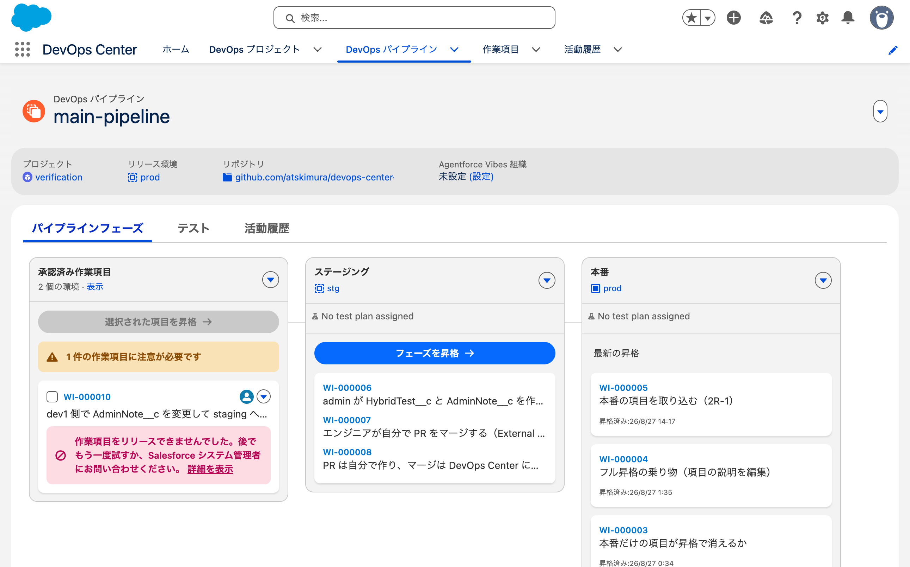

承認済み作業項目の列（原文）:

> ⚠ 1 件の作業項目に注意が必要です
>
> 🚫 作業項目をリリースできませんでした。後でもう一度試すか、
> Salesforce システム管理者にお問い合わせください。 [詳細を表示]

**列に出るのはここまでで、原因は書いていない。**

### 「詳細を表示」でエラーの本文が出る

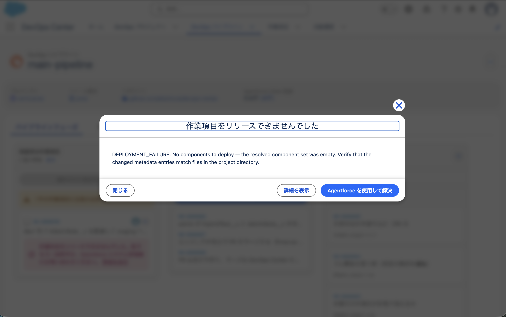

モーダルの中身（原文）:

> **作業項目をリリースできませんでした**
>
> DEPLOYMENT_FAILURE: No components to deploy — the resolved component set was empty.
> Verify that the changed metadata entries match files in the project directory.
>
> [閉じる] [詳細を表示] [**Agentforce を使用して解決**]

**エラーの本文は画面で読める。** SOQL で取れる内容と同じものが出ている。

**さらに2つある。**

- もう一段深い「詳細を表示」ボタン → **活動履歴のレコードページに遷移する**（下記）
- **「Agentforce を使用して解決」ボタン** ← MCPに関する検証 の 9-3 の画面版

### モーダルの「詳細を表示」は活動履歴のレコードページに飛ぶ

`<ACTIVITY_LOG_ID>` のレコードページ。

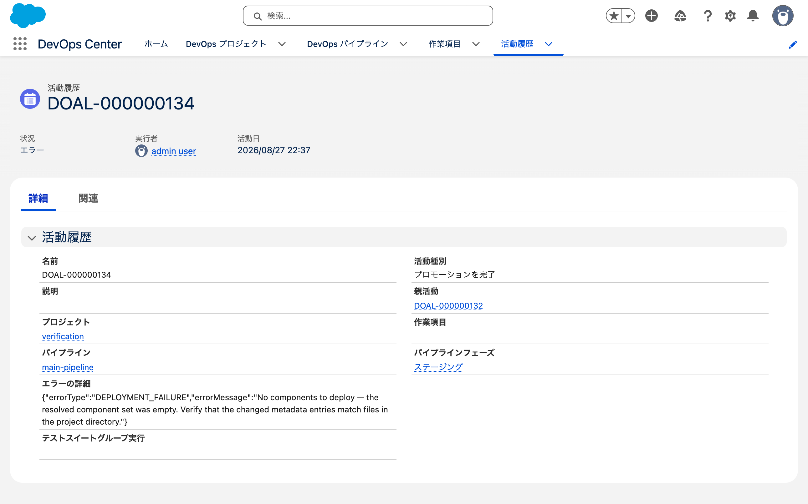

| 項目 | 値 |
|---|---|
| 状況 | エラー |
| 実行者 | admin user |
| 活動日 | 2026/08/27 22:37 |
| **活動種別** | **プロモーションを完了** |
| 親活動 | `<ACTIVITY_LOG_ID>` |
| パイプラインフェーズ | ステージング |
| **エラーの詳細** | `{"errorType":"DEPLOYMENT_FAILURE","errorMessage":"No components to deploy — the resolved component set was empty. Verify that the changed metadata entries match files in the project directory."}` |
| **作業項目** | **空欄** |
| テストスイートグループ実行 | 空欄 |

**エラーの詳細は活動履歴のレコードにも項目として持っている。**

気になる点が2つ。

- **活動種別が「プロモーションを完了」。**
  MCP の `promote_devops_center_work_item` を呼んだのに、
  External Merge のときに画面で押したボタンと同じ名前が記録されている
- **「作業項目」欄が空。**
  これがコンポーネントを解決できなかった原因かもしれない

> ⚠ この節は 2026-08-27 に一度「画面から原因は分からない」と書いて訂正した。
> クリック後に a11y スナップショットとスクショを見て「何も出ない」と判断したが、
> **モーダルは a11y ツリーに出ず、スクショのタイミングも早すぎた。**
> 検証中に画面を再確認して分かった。
> a11yスナップショットだけでは、モーダルの有無を判断できない。

### SOQL でも同じ内容が取れる

```sql
SELECT FIELDS(ALL) FROM DevopsRequestInfo WHERE Id = '<DEVOPS_RECORD_ID>' LIMIT 1
```

```
Name: <RECORD_ID>
Status: ERROR
Message: Promotion failed
ErrorDetails: {"errorType":"DEPLOYMENT_FAILURE",
  "errorMessage":"No components to deploy — the resolved component set was empty.
   Verify that the changed metadata entries match files in the project directory."}
OperationType: PROMOTE
```

`DevopsEnvDeployment`（`<RECORD_ID>`）は `Status: ERROR` / `DeployStatus: NEW` で、
**エラーの本文を持っていない。** `DeployRequestInfoId` を辿って
`DevopsRequestInfo` に行き着く必要がある。

| どこ | エラーの内容 |
|---|---|
| パイプライン画面の列 | 「リリースできませんでした。管理者に問い合わせろ」。原因なし |
| **「詳細を表示」のモーダル** | **`DEPLOYMENT_FAILURE: No components to deploy ...`** |
| `DevopsEnvDeployment` | `Status: ERROR` だけ |
| `DevopsRequestInfo.ErrorDetails` | モーダルと同じ内容 |

- **確認したこと**: **エラーの本文は画面で読める。** 1クリック余分に必要
- **確認したこと**: **「Agentforce を使用して解決」ボタンがある。**
  失敗の解決に AI を使う導線が画面にある
- **確認したこと**: エラーの本文は `DevopsEnvDeployment` ではなく
  `DevopsRequestInfo` にある

### 「Agentforce を使用して解決」の先は Agentforce Vibes の設定だった

モーダルのボタンを押した（22:53:52）。

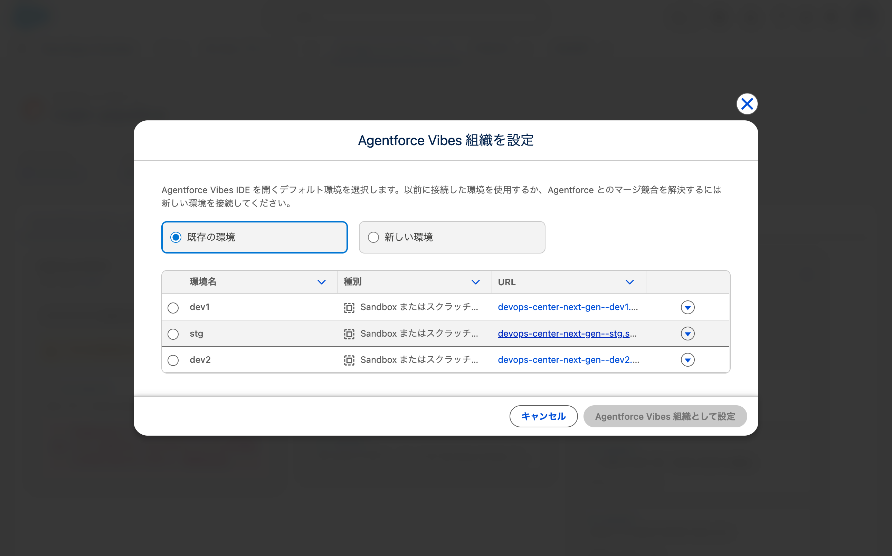

出てきたのは **「Agentforce Vibes 組織を設定」** ダイアログ（原文）。

> Agentforce Vibes IDE を開くデフォルト環境を選択します。
> 以前に接続した環境を使用するか、Agentforce とのマージ競合を解決するには
> 新しい環境を接続してください。

| 区分 | 内容 |
|---|---|
| 選択 | 既存の環境（既定）/ 新しい環境 |
| 環境の一覧 | dev1 / stg / dev2（種別はすべて「Sandbox またはスクラッチ...」） |
| ボタン | キャンセル / **Agentforce Vibes 組織として設定**（環境を選ぶまで `disabled`） |

パイプライン画面のヘッダーに出ていた「Agentforce Vibes 組織: 未設定 (設定)」がこれ。

- **確認したこと**: エラー解決に AI を使う導線は画面にある
- **確認したこと**: **事前に Agentforce Vibes 組織を設定する必要がある。**
  未設定だとこの設定ダイアログに飛ばされる
- **確認したこと**: 画面内で解決するのではなく、**Agentforce Vibes IDE を開く**設計
- **未確認**: 設定して IDE を開くと何が起きるか。
  org に設定を書き込むので、判断を保留した（2026-08-27 時点）

### 再昇格したら通った

**`WI-000009` を片付けずに、`WI-000010` をそのまま再昇格した**（23:03）。

```
promote_devops_center_work_item(dcng-prod, ["WI-000010"])
→ <RECORD_ID>: SUCCESS / Promotion completed successfully
→ <RECORD_ID>: SUCCESS
→ PR #14 が MERGED（14:03:42 UTC）
```

**1回目の失敗は一時的なものだった。**
画面の「後でもう一度試すか、Salesforce システム管理者にお問い合わせください」という
案内のうち、**「後でもう一度試す」で通った。**

- **確認したこと**: `No components to deploy` はリトライで通ることがある
- **確認したこと**: **「同じ項目を2つの開発環境で触ると昇格できない」は誤り。**
  `WI-000009`（同じ項目を変更した未昇格の作業項目）が存在したままでも昇格できた
- **未確認**: 1回目が失敗した理由。**リトライで通ったので原因は追えていない**

> 08-28 に原因が特定できた。変更リスト（`WorkItemComponentList`）が作られていないと出る。作るのは画面の変更リストタブを開いたときに走る `INSPECT`（→ [5-2 のログ](2026-08-28-ci-branch-protection.md) 3章）

> ⚠ 「さすがにそんなわけなさそうだな」と言われて再昇格を試した。
> それまで私は「同じメタデータを触る未昇格の作業項目が2つあると昇格できない」
> という仮説を立てていたが、**1手で否定できる仮説を検証せずに書いていた。**

### 1回目の失敗の原因は未解明

変更リストは作られていた。

```
<RECORD_ID> / <COMMIT_SHA>... / CustomField HybridTest__c.AdminNote__c / CHANGE
```

git 側も揃っていた。

| ブランチ | `AdminNote__c` の表示ラベル |
|---|---|
| `staging` | 管理者メモ |
| `WI-000010` | **管理者メモ（dev1 で変更）** |
| `WI-000009` | 管理者メモ（dev2 で変更）（未昇格） |

dev1 の org でも追跡されていた（`SourceMember` の `RevisionCounter` 106）。

**なぜ「コンポーネントが空」になったのかは分かっていない。**

考えられる筋:

- **`WI-000009` が同じメタデータを変更した未昇格の作業項目として存在する。**
  これが対象計算に影響した可能性
- `DeployStatus: NEW` なので、org へのデプロイが始まる前に止まっている。
  マージの段階かコンポーネント解決の段階
- PR #14 は `OPEN` / `MERGEABLE` のままで、マージもされていない

**次にやること**: 同じ手順を `WI-000009` が無い状態で再現して、
`WI-000009` の存在が原因かを切り分ける。

---

## 6. 3-7c の答え: 未昇格の作業項目があると Run Back Sync はブロックされる

### 押す前の状態（衝突が成立した）

| どこ | `AdminNote__c` の表示ラベル |
|---|---|
| staging（org と git） | 管理者メモ（**dev1** で変更） |
| dev2 の org | 管理者メモ（**dev2** で変更） |
| `WI-000009` のブランチ | 管理者メモ（**dev2** で変更） |
| `WI-000009` の状態 | **`IN_PROGRESS`（未昇格）** |

同期オプションの「Work Items to Sync」は **`WI-000010` の1件**だった
（前回は対象0件だったので、今回は確実に配られる条件）。

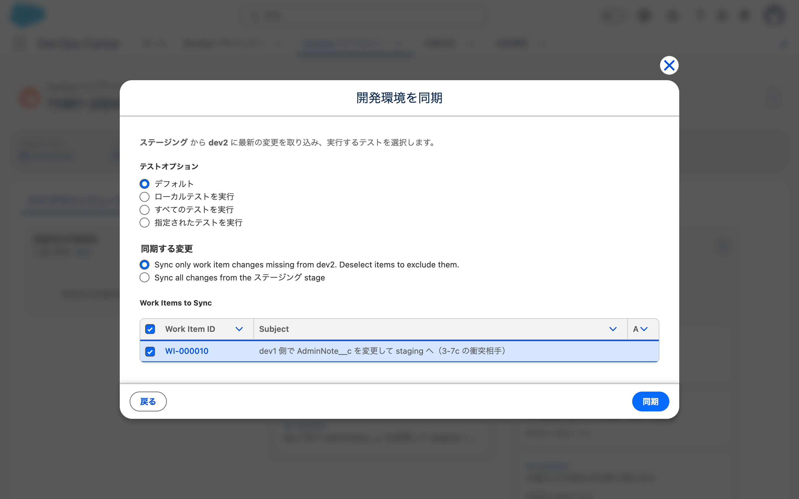

### 押したらブロックされた

23:08:39 に「同期」を押した結果（原文）:

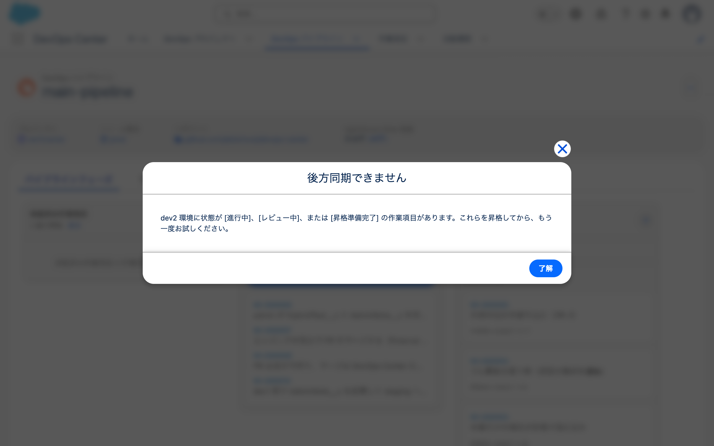

> **後方同期できません**
>
> dev2 環境に状態が [進行中]、[レビュー中]、または [昇格準備完了] の作業項目があります。
> これらを昇格してから、もう一度お試しください。
>
> [了解]

**同期は実行されなかった。**

| 何 | 押す前 | 押した後 |
|---|---|---|
| dev2 の org の `AdminNote__c` | 管理者メモ（dev2 で変更） | **変わらず** |
| `WI-000009` の状態 | `IN_PROGRESS` | **変わらず** |
| `WI-000009` ブランチのコミット | `<COMMIT_SHA>` | **残っている** |
| dev2 の `SourceMember` | RevisionCounter 13 | **変わらず** |
| `DevopsEnvDeployment` | — | **同期の記録が作られていない** |

### 公式の記述と実装が食い違っている

| 出所 | 何と言っているか |
|---|---|
| 公式ドキュメント | "Back sync **overwrites** unpromoted work items with In Progress, In Review, or Approved statuses" |
| 実機のダイアログ | 「状態が [進行中]、[レビュー中]、または [昇格準備完了] の作業項目があります。これらを昇格してから、もう一度お試しください」 |

**状態のリストが完全に一致している。**
`In Progress` / `In Review` / `Approved` = 進行中 / レビュー中 / 昇格準備完了。

**同じ条件を、公式は「上書きする」と書き、実装は「ブロックする」。**

- **確認したこと**: **未昇格の作業項目がある開発環境は Run Back Sync できない。**
  製品が事前に止める
- **確認したこと**: ブロックされたときは何も起きない。org も git も変わらない
- **未確認**: 公式の記述が旧版の挙動なのか、次世代で変わったのか。
  ドキュメントの版が確認できていない
- **未確認**: フル同期（`Sync all changes from the ステージング stage`）でも
  同じようにブロックされるか

### 3-7 の結論

**「Run Back Sync で自分の作業が消える」という事故は、この経路では起きない。**

| 条件 | 結果 |
|---|---|
| 作業項目に紐付いていない org の変更がある | **同期は通る。変更は触られない**（3章） |
| 未昇格の作業項目がある | **同期がブロックされる**（この章） |

→ **消える経路が見つからない。**
公式が原文で警告している事故は、少なくとも既定の差分同期では再現しなかった。

→ **共同開発に関する検証 のヤマ場が変わる。**
「順序を間違えると作業が消える」ではなく、
**「製品が止めるので消えない。ただし止まると先に進めない」**という話になる。

---

## 7. ブロックされたあと、開発環境が取り込む方法は2つしかない

検証中の問い（2026-08-27）:

> しかし、これは dev2 はどうやって staging の変更を取り込めばいいんだ？
> 00009 を取り消すとかできるのか？

`WI-000009`（`IN_PROGRESS`）の画面で「その他のアクション」を開いた。

**選択肢は1つだけだった。**

```
menu "その他のアクション"
  menuitem "状況を [対象外] に変更"
```

状況バーの案内は「開発環境の変更を確定し、レビューを作成します。」で、
**進める道は昇格に向かう1本だけ。**

| やり方 | 何が起きるか |
|---|---|
| `WI-000009` を昇格まで進める | **未完成の作業を staging に出す。** しかも staging は既に「管理者メモ（dev1 で変更）」なのでコンフリクトの可能性 |
| 「状況を [対象外] に変更」 | 2026-08-26 に `NEVERED` は不可逆と確認済み。**作業項目は死ぬ** |

**「作業中のまま取り込む」導線が無い。**

### git のブランチは残る

「対象外」にしても `WI-000009` ブランチは GitHub に残る（コミット `<COMMIT_SHA>`）。
**作業内容は失われないので、新しい作業項目を作って cherry-pick で拾える。**

**ただしそれは DevOps Center の外での操作で、製品は手順を案内していない。**

### 実務での意味

engineer が dev2 で開発中に admin が項目を追加して staging に入れた場合、
engineer の選択肢は3つ。

1. 自分の作業を（未完成でも）昇格する
2. 作業項目を捨てて git から拾い直す
3. **取り込まずに開発を続ける**（admin の項目が使えない）

→ **「取り込みは作業を始める前に」が製品によって強制されている。**
公式が推奨として書いていた運用が、実装上の制約になっている。

→ これは 3-8（A を staging に出さずに B を開発しようとする）
と地続きの話になる。

- **確認したこと**: `IN_PROGRESS` の作業項目で選べるのは
  「状況を [対象外] に変更」の1つだけ
- **確認したこと**: 「作業中のまま取り込む」導線は無い
- **未確認**: 「対象外」にした後で Run Back Sync が通るか（不可逆なので実行していない）
- **確認したこと**: 昇格するとコンフリクトが起きる（→ 8章で実際に昇格した。
  `MERGE_CONFLICT` / `CONFLICTS: ...AdminNote__c.field-meta.xml:content`）

### 4つの org の `AdminNote__c` の状態（2026-08-27 の作業終了時点）

| org | 表示ラベル |
|---|---|
| dev1 | 管理者メモ（dev1 で変更） |
| **staging** | 管理者メモ（dev1 で変更）**（dev1 と一致。昇格したので当然）** |
| dev2 | 管理者メモ（dev2 で変更） |
| prod | **項目が無い**（`HybridTest__c` ごと届いていない） |

**値は2つに分かれている**（dev1 = staging と、dev2）。
`HybridTest__c` は staging までしか昇格していないので prod には無い。

---

## 8. WI-000009 を昇格したらコンフリクトが起きた（9-2 / 3-11 の前倒し）

検証中の提案（2026-08-27）:

> 09 を昇格したらどうなるか試してみたい気持ちがあるな。

**支障はなく、順番1（`git merge` 経路 + コンフリクト解消）の前倒しになった。**

### コンフリクトの条件

| ブランチ | `AdminNote__c` の表示ラベル |
|---|---|
| 共通祖先（`<COMMIT_SHA>`） | 管理者メモ |
| `staging` | 管理者メモ（**dev1** で変更） |
| `WI-000009` | 管理者メモ（**dev2** で変更） |

**同じ行を両方が別の値に変更している。**

### 画面はコンフリクトを表示しない

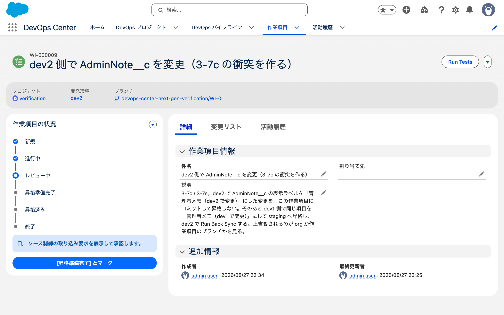

`WI-000009` の画面は「レビュー中」で、案内は通常どおり
「ソース制御の取り込み要求を表示して承認します。」だった。
**コンフリクトの警告は出ていない。**

一方 GitHub 側は既に判定していた。

```
gh pr view 15 → mergeable: CONFLICTING / mergeStateStatus: DIRTY
```

- **確認したこと**: DevOps Center の作業項目の画面はコンフリクトを予告しない。
  **昇格するまで分からない**

### 昇格すると正確なエラーが出た

```
promote_devops_center_work_item(dcng-prod, ["WI-000009"])
→ <RECORD_ID>: ERROR / Promotion failed
  {"errorType":"MERGE_CONFLICT",
   "errorMessage":"CONFLICTS: force-app/main/default/objects/HybridTest__c/fields/AdminNote__c.field-meta.xml:content"}
```

**ファイル名まで出ている。** 5章の `No components to deploy` と違い、原因が明確。

### MCP の detect / resolve は「AI が解決する」ものではない

**どちらも git を実行せず、手順書を返す**（`checkout` ツールと同じ設計）。

`detect_devops_center_merge_conflict` の指示:

```
git fetch --all --prune
git checkout WI-000009
git merge --no-ff --no-edit origin/staging   ← staging を作業項目ブランチに取り込む
git --no-pager diff --name-only --diff-filter=U
```

指示どおり実行したら検知できた。

```
CONFLICT (content): Merge conflict in .../AdminNote__c.field-meta.xml
UU force-app/main/default/objects/HybridTest__c/fields/AdminNote__c.field-meta.xml

<<<<<<< HEAD
    <label>管理者メモ（dev2 で変更）</label>
=======
    <label>管理者メモ（dev1 で変更）</label>
>>>>>>> origin/staging
```

`resolve_devops_center_merge_conflict` の指示（原文の要点）:

> **NEVER resolve any conflict automatically.** You must always ask the user for each conflicted file.
>
> For each file: ask the user: "For <file>, do you want to keep (1) current (WI-000009) or (2) incoming (staging)?"
>
> - If user chose current: `git checkout --ours -- "<file>"`
> - If user chose incoming: `git checkout --theirs -- "<file>"`
>
> Do NOT attempt a **'keep both'** manual merge in this tool; only the two options above are supported.
>
> Do NOT push changes. Keep all operations local.

**できるのはファイル単位で片側を選ぶことだけ。**
行単位のマージも「両方を活かす」もできない。

- **確認したこと**: MCP の detect / resolve は git コマンドの手順書を返すツールで、
  **解決そのものはしない。** AI が判断することを明示的に禁じている
- **確認したこと**: 選べるのは `--ours` か `--theirs` の2択。**片側を捨てる**
- **確認したこと**: push はしない。**昇格するには自分で push する必要がある**
- → **次世代の売りである「マージ競合を自然言語で解決」とは別物。**
  そちらは画面の「Agentforce を使用して解決」の側にある（Agentforce Vibes の設定が必要）

**画面の Agentforce 版は追わないことにした**（2026-08-27 に人と決めた）。

> Agentforce Vibes がやるなら君がやるのと同じよ。

Agentforce Vibes も Claude Code も汎用のコーディングエージェントで、
org と git を見て判断するだけである。**検証しても新しいことが分からない。**

### 解決してから昇格したら通った

人と相談して **current（`WI-000009` = dev2 の値）** を採用した。

```
git checkout --ours -- .../AdminNote__c.field-meta.xml
git add -- .../AdminNote__c.field-meta.xml
git commit -m "Resolve merge conflicts between WI-000009 and staging"   → <COMMIT_SHA>
git push origin WI-000009
→ PR #15 が MERGEABLE / CLEAN に変わった
```

再昇格した結果:

| | 結果 |
|---|---|
| `<RECORD_ID>` | SUCCESS / "Promotion completed successfully" |
| `WI-000009` | `PROMOTED` |
| PR #15 | MERGED（14:33:13 UTC） |
| staging org | **管理者メモ（dev2 で変更）** |

**あとから昇格した方が勝った。**

### 昇格したら dev2 のブロックが解けた

```sql
SELECT Name, Status FROM WorkItem
WHERE DevelopmentEnvironmentId = '<DEVOPS_RECORD_ID>'
  AND Status IN ('NEW','IN_PROGRESS','IN_REVIEW','READY_TO_PROMOTE')
→ 0 件
```

**ダイアログの案内（「これらを昇格してから、もう一度お試しください」）は正しかった。**

### 4つの org の状態（この作業のあと）

| org | `AdminNote__c` |
|---|---|
| dev1 | 管理者メモ（dev1 で変更）**← staging とずれた** |
| dev2 | 管理者メモ（dev2 で変更）（staging と一致） |
| staging | 管理者メモ（dev2 で変更） |
| prod | 項目が無い |

**コンフリクトを片側で解決したので、負けた側の環境（dev1）がずれた。**
dev1 は次に Run Back Sync すると staging の値で上書きされるはず（未確認）。

---

## 9. 3-11: `git merge` → `deploy` で揃えても「同期していません」のまま

**Run Back Sync を使わない経路を dev1 で試した。**

### 1段目の `git merge` は不要だった

`WI-000011` を作って（開発環境 dev1）ブランチをチェックアウトし、マージを試みた。

```
git merge --no-ff --no-edit origin/staging
→ Already up to date.
```

**ブランチを作った直後なので取り込むものが無い。**
作業項目ブランチは staging の先端から切られるため、
**マージが必要なのはブランチ作成から時間が経って staging が進んだ場合だけ。**

### 2段目の `deploy` で org が揃った

git（ブランチ）と dev1 の org がずれていた。

| | `AdminNote__c` |
|---|---|
| `WI-000011` ブランチ | 管理者メモ（dev2 で変更） |
| dev1 の org | 管理者メモ（**dev1** で変更） |

```
sf project deploy start -o dcng-dev1 -d force-app/main/default/objects/HybridTest__c
→ Status: Succeeded / Elapsed Time: 4.86s
```

| 何 | 状態 |
|---|---|
| `AdminNote__c` | **Changed**（dev1 で変更 → dev2 で変更） |
| `EngineerNote__c` | **Created**（dev1 に無かった） |
| `ReviewerNote__c` | **Created**（同上） |
| `HybridTest__c` | Changed |

**4.86秒 / CLI 1回。** Run Back Sync（44秒・画面4手）より速い。

dev1 の org は staging と揃った（`AdminNote__c` = 「管理者メモ（dev2 で変更）」）。

### DevOps Center の表示は変わらなかった

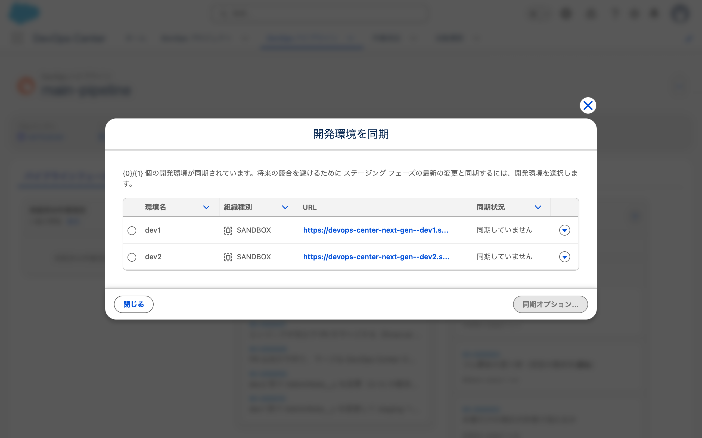

| 環境名 | 同期状況 |
|---|---|
| dev1 | **同期していません** |
| dev2 | 同期していません |

**dev1 の org は staging と揃っているのに「同期していません」と表示される。**

- **確認したこと**: **同期状況の判定は「Run Back Sync を実行したか」で決まっている。**
  org と git を自分で揃えても表示は変わらない
- **確認したこと**: `DevopsEnvironment` の `LastRevisionCounter` と `Status` は
  両方 `null` で、SOQL では同期状況が取れない。**画面が動的に計算している**
- **確認したこと**: `deploy` は Run Back Sync より速い（4.86秒 / CLI 1回 対 44秒 / 画面4手）

### 3-11 の答え

**`git merge` → `deploy` の経路は成立する。ただし DevOps Center 側の表示は永久に未同期のままになる。**

| | Run Back Sync | `git merge` → `deploy` |
|---|---|---|
| 手数 | 画面4手 | **CLI 1〜2回** |
| 所要 | 44秒 | **4.86秒** |
| git が揃うか | **揃わない**（org だけ） | **揃う** |
| DevOps Center の表示 | 「同期済み」になる | **「同期していません」のまま** |
| 未昇格の作業項目があるとき | **ブロックされる** | **できる** |

**最後の行が実務で効く。**
Run Back Sync がブロックされる状況（未昇格の作業項目がある）でも、
`git merge` → `deploy` なら取り込める。

→ **コードで開発する人にはこちらのほうが速く、制約も無い。**
代わりに画面の同期状況が信用できなくなる。
