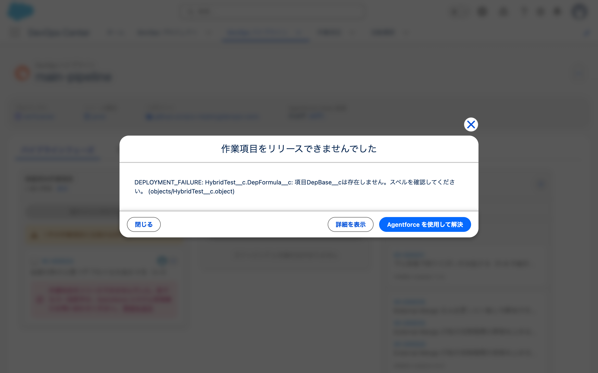

# 2026-08-28 わざとデプロイを失敗させる（4-1）

- 目的: **エラーが読めるか。** どこに何が出るかを確かめる。
- 使った org: `dcng-prod`（Hub）/ `dcng-dev1`
- **予測を先に書いてから実行した。**

---

## 1. 依存関係の欠落を作る

数式項目を使った。依存が1対1なので、何が原因で落ちたかが読みやすい。

| # | やったこと |
|---|---|
| 1 | dev1 にテキスト項目 `DepBase__c` を作る |
| 2 | dev1 にそれを参照する数式項目 `DepFormula__c` を作る（`DepBase__c & '（数式）'`） |
| 3 | **`DepFormula__c` だけ**をコミットして push（`DepBase__c` は未追跡のまま残す） |
| 4 | staging org に `DepBase__c` が無いことを確認（retrieve で0件） |

**08-28 に決めた手順（deploy の直後に retrieve）を守った。**
retrieve すると `<formulaTreatBlanksAs>` が消えて org が返す形になった。

```
sf project retrieve start -o dcng-dev1 -m "CustomField:HybridTest__c.DepFormula__c" --ignore-conflicts
→ Changed
```

変更リストには `DepFormula__c` の1件だけが入った（`DepBase__c` は入らない）。

## 2. 昇格は失敗した

`isFullDeploy: false`（差分）で昇格した。

| 何 | 結果 |
|---|---|
| `WorkItem.Status` | `READY_TO_PROMOTE` のまま |
| `DevopsRequestInfo` | `PROMOTE` / **`ERROR`** |

`ErrorDetails` の中身。

```json
{"errorType":"DEPLOYMENT_FAILURE",
 "errorMessage":"HybridTest__c.DepFormula__c: 項目DepBase__cは存在しません。スペルを確認してください。 (objects/HybridTest__c.object)"}
```

**Metadata API のエラーがほぼ素通しで出ている。**

| 読み取れるもの | 内容 |
|---|---|
| どのコンポーネントが | `HybridTest__c.DepFormula__c` |
| 何が問題か | `項目DepBase__cは存在しません。スペルを確認してください。` |
| ファイル | `objects/HybridTest__c.object` |
| 言語 | **org のロケール（日本語）で返る** |

## 3. 作業項目の画面には出ない

状況が「レビュー中」に見えるだけで、エラーの表示は無い。


→ [失敗後の作業項目](screenshots/2026-08-28-30-4-1-失敗後の作業項目.png)

## 4. パイプラインの画面には警告が出る（原因は書かれていない）

承認済み作業項目の列に出た（原文）。

> ⚠ 1 件の作業項目に注意が必要です
>
> WI-000022 依存関係の欠落でデプロイを失敗させる（4-1）
>
> 🚫 作業項目をリリースできませんでした。後でもう一度試すか、
> Salesforce システム管理者にお問い合わせください。 [詳細を表示]

08-27 の 3-7 と同じ文言で、**原因は書かれていない。**


→ [パイプラインの警告](screenshots/2026-08-28-31-4-1-パイプラインの警告.png)

## 5. モーダルは昇格を実行した直後に出る

**エラーの見え方が2通りある。誰が見るかで変わる。**

### 昇格を実行した人にはモーダルが出る



モーダルの中身（原文）。

> **作業項目をリリースできませんでした**
>
> DEPLOYMENT_FAILURE: HybridTest__c.DepFormula__c: 項目DepBase__cは存在しません。スペルを確認してください。 （objects/HybridTest__c.object）
>
> [閉じる] [詳細を表示] [**Agentforce を使用して解決**]

**原因が全文出て、「Agentforce を使用して解決」ボタンもある。**
`DevopsRequestInfo.ErrorDetails` と同じ内容である。

ボタンは3つある。

| ボタン | 何が起きるか |
|---|---|
| 閉じる | 閉じる |
| 詳細を表示 | 活動履歴のレコードに遷移する |
| **Agentforce を使用して解決** | 08-27 は Agentforce Vibes の設定ダイアログに着いた |

### 後から見る人は活動履歴に飛ぶ

モーダルを閉じたあと、パイプラインの列には警告が残る。
そこの「詳細を表示」を押すと**モーダルは出ず、活動履歴のレコードに直接遷移する。**

| 誰が見るか | 導線 |
|---|---|
| **昇格を実行した人** | その場でモーダル。原因が全文。**Agentforce の導線がある** |
| **後から見る人** | 列の警告 → 「詳細を表示」→ 活動履歴（全文）。**Agentforce の導線が無い** |

活動履歴には**どちらの経路からも行ける**（モーダルの「詳細を表示」と、列の「詳細を表示」）。
違うのは **Agentforce の導線があるかどうか**である。

`<ACTIVITY_LOG_ID>` の「エラーの詳細」項目に、
`DevopsRequestInfo.ErrorDetails` と**完全に同じ内容**が入っていた。

| 項目 | 値 |
|---|---|
| 状況 | エラー |
| 活動種別 | プロモーションを完了 |
| パイプラインフェーズ | ステージング |
| 作業項目 | **空欄** |
| エラーの詳細 | `{"errorType":"DEPLOYMENT_FAILURE","errorMessage":"HybridTest__c.DepFormula__c: 項目DepBase__cは存在しません。スペルを確認してください。 (objects/HybridTest__c.object)"}` |


→ [活動履歴のエラー詳細](screenshots/2026-08-28-33-4-1-活動履歴のエラー詳細.png)

**「作業項目」欄が空**なのは 08-27 の 3-7 と同じ。
どの作業項目で失敗したかは、この画面からは分からない。

## 6. 08-27 の記録との関係

08-27 の 3-7（`No components to deploy`）でもモーダルが出て、
そこから「詳細を表示」で活動履歴に遷移した。
**あのモーダルも昇格の直後に出たものだった**と読める。

**エラーの種類が違っても表示は変わらない。**

## 7. 予測との照合

| 何 | 予測 | 結果 |
|---|---|---|
| 昇格 | 失敗する | **当たり** |
| 作業項目の画面 | エラーは出ない | **当たり** |
| 活動履歴 | Metadata API のエラー本文が入る | **当たり** |
| 原因の粒度 | 項目名まで出る | **当たり**（`項目DepBase__cは存在しません`） |
| 「Agentforce を使用して解決」 | 出る | **当たり** |

## 8. 分かったこと

- **エラーは読める。** 原因が項目名まで出る。実務で特定できる粒度である
- **`DevopsRequestInfo.ErrorDetails` と活動履歴の「エラーの詳細」は同じ内容。**
  SOQL でも画面でも同じものが読める
- **昇格した本人はその場のモーダルで原因が分かる。**
  「Agentforce を使用して解決」の導線もそこにある
- **後から見る人は活動履歴まで1クリック。** 列に出るのは「管理者に問い合わせてください」だけで、
  **解決の導線は無い**
- パイプラインの列に出るのは「管理者に問い合わせてください」だけで原因が無い
- 活動履歴の「作業項目」欄が空なので、**どの作業項目で失敗したかはその画面から分からない**

## 9. 作業の記録に残る誤り

**モーダルの出方について3回書き直した。**

| 何を書いたか | 実際 |
|---|---|
| 「モーダルは出ない。1クリックで活動履歴に遷移する」 | 列の「詳細を表示」については**正しかった** |
| 「モーダルは出る。3回クリックで開いて閉じていた」 | **誤り。** 列からはモーダルが出ない |
| 「昇格の直後に出る。列からは活動履歴」 | これが正しい |

`click` を3回押して活動履歴のタブが3つ開いたのは、
**毎回1クリックで活動履歴に飛んでいた**からである（動きとしては正常）。
3回目のあとページが `CSS Error` で壊れた。

モーダルは昇格の直後に出た。
**モーダルはa11yツリーに現れない**ため、`take_snapshot`では見えない。

共有された画面の「詳細を表示」の位置を、モーダルを開く導線だと誤読していた。

## 10. 未確認として残したもの
- エラーが複数あるとき全部出るか。今回は1件だけ
- テストの失敗（4-2）でも同じ形か
- 「Agentforce を使用して解決」の先。08-27 は Agentforce Vibes の設定ダイアログに着いた
  （→ [3-7 のログ](2026-08-27-run-back-sync-3-7.md)）。設定は追わないと決めている
