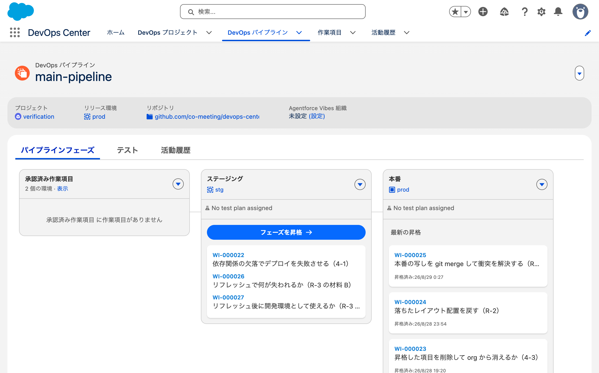

# 2026-08-29 作業項目を作らずにステージブランチへマージした

- 目的: 作業項目に紐づかないブランチを `staging` にマージしたとき、
  DevOps Center が External Merge として検出するか
- 使った org: `dcng-prod`（Hub）/ `dcng-stg`
- きっかけ: 検証中の問い（「作業項目を作らずにローカルで staging からブランチを作ったらどうなるの？」）

---

## 1. 分かっていたこと

[3-1](2026-08-27-external-merge-3-1.md) で、**作業項目のブランチ**を自分でマージすると
「外部マージが検出されました」が出て、そのステージから先の昇格が止まることを確認している。

**作業項目に紐づかないブランチでも同じか**は未確認だった。

## 2. やったこと

```
git checkout staging
git checkout -b rogue-branch-no-workitem
（RogueNote__c を1つ足す）
git push origin rogue-branch-no-workitem
gh pr create --base staging --head rogue-branch-no-workitem   → PR #38（15:03:08）
gh pr merge 38 --merge                                        → 15:04:23
```

**作業項目は作っていない。** DevOps Center の画面には一度も触れていない。

実行前の状態。

| 何 | 状態 |
|---|---|
| 未完了の作業項目 | `WI-000022` / `WI-000026` / `WI-000027` がステージングに（すべて `PROMOTED`） |
| 未解消の External Merge | 無し |

## 3. PR を作った時点では何も起きない

45秒待って確認した。

| 見たもの | 結果 |
|---|---|
| `WorkItem` | 増えていない |
| `DevopsRequestInfo` | 0件 |
| `SourceCodeRepositoryBranch` | `rogue-branch-no-workitem` は登録されていない |

3-1 では PR を作った時点で「外部更新が検出されました」がダイアログで出ていた。
**作業項目が無いと、そこが起きない。**

## 4. マージしても DevOps Center は反応しない

60秒待って確認した。

| 見たもの | 結果 |
|---|---|
| `WorkItem` | 増えていない |
| `DevopsRequestInfo` | 0件 |
| `staging` ブランチ | **`RogueNote__c` が入った**（17項目） |
| stg の org | **`RogueNote__c` は無い**（16項目） |

### 画面も3つとも反応しない

| 画面 | 3-1（作業項目つき） | 今回（作業項目なし） |
|---|---|---|
| 作業項目 | 「この作業項目の外部マージが検出されました。」 | **作業項目が存在しない** |
| パイプライン | 「⚠ 環境が同期されていません」/ 昇格ボタンが `disabled` | **警告なし。「フェーズを昇格」は有効** |
| 活動履歴 | 記録あり | **記録なし**（最新は 14:46 の `WI-000027` の昇格） |



## 5. 結果

**作業項目に紐づかないマージは、DevOps Center に完全に無視される。**

External Merge の検出は作業項目を起点にしている。
PR のヘッドブランチが作業項目のブランチであることが条件で、
それ以外のブランチからのマージは検出の対象に入らない。

結果として、**git のステージブランチと org が食い違ったまま、画面には何の警告も出ない。**

| どこ | `RogueNote__c` |
|---|---|
| `staging` ブランチ | ある |
| stg の org | 無い |
| DevOps Center のレコード | 痕跡なし |

3-1 で確認した "partially promoted state"（マージ済みで未デプロイ）と同じ状態だが、
**それを知らせる仕組みが働かない。**

### 次の昇格で何が起きるかは未確認

この状態で別の作業項目を昇格したときに `RogueNote__c` が一緒に配られるのか、
それとも取り残されるのかは確かめていない。
差分デプロイの範囲がどう決まるか次第で、**取り残される可能性がある。**

## 6. 後から作業項目に載せられるか

**載せられない。** 画面で確かめた。

| 見たもの | 内容 |
|---|---|
| 新規作業項目のダイアログ | プロジェクト / 件名 / 説明 / 割り当て先 / 開発環境。**ブランチの欄は無い** |
| 既存の作業項目で編集できる項目 | 件名 / 割り当て先 / 説明 |
| 「その他のアクション」 | 「リリース環境を変更」のみ |

ブランチは「進行中」にしたときに DevOps Center が作るもので、
**既存のブランチを後から結びつける導線が画面に無い。**

External Merge として認識させることもできない。
検出は「作業項目のブランチがマージされた」ことを起点にしているが、
`RogueNote__c` は**既にマージ済み**なので、これから起こすイベントが無い。

開発環境に同じ項目を作って作業項目でコミットする案も成立しない。
**作業項目のブランチは `staging` から切られるので、最初から `RogueNote__c` が入っている。**
同じ内容をコミットしようとしても差分がゼロになる。

（データモデル上は `SourceCodeRepositoryBranch` が `createable=True`、
`WorkItem.SourceCodeRepositoryBranchId` が `updateable=True` なので DML では触れる。
**ただし非公式なので試していない。**）

### 残る対処は org を追いつかせることだけ

git は既に正しい状態で、遅れているのは stg の org。
フル昇格（`isFullDeploy: true`）でブランチ全体を配れば揃うはずだが、**未実測。**

**その変更が誰の作業だったかという記録は DevOps Center に残らない**（git には残る）。

## 7. ブランチ名を変えれば避けられるか

**変えられない。** 公式の原文（[Create a Work Item](https://help.salesforce.com/s/articleView?id=platform.devops_center_work_item_create.htm&language=en_US&type=5)）。

> **ID**: An automatically generated unique identifier that has a WI- prefix (for example, WI-12345).
> … **It's also used in the project repository to identify the feature branch where changes for
> this work item are stored.**

`DevopsProject` にも命名の設定項目は無い（`Name` / `Description` / `IsActive` / `ExternalId` のみ）。

**issue 番号でブランチを切る運用（`fix/999` など）は成立しない。**
普段の癖でブランチを切ると、この検証と同じ状態になる。

→ 詳細は 共同開発に関する検証 の「既存の開発フローに載せられるか」。

## 8. 後始末

検証で作ったずれを解消した。**git から消す方向で戻した。**

```
git checkout staging
git rm force-app/main/default/objects/HybridTest__c/fields/RogueNote__c.field-meta.xml
git commit / git push origin staging
git push origin --delete rogue-branch-no-workitem
```

これも作業項目を経由しないコミットなので DevOps Center は検知しないが、
消す方向なので結果として git と org が一致する。

| 何 | 後 |
|---|---|
| `staging` ブランチ | 16項目（`RogueNote__c` を削除） |
| stg の org | 16項目。**git と一致** |
| `main` / prod | 元から影響なし |
| パイプライン画面 | 警告なし |

## 9. 観点との関係

- **R-6**（本番と git のずれを検知する仕組み）は、org 側の直接変更を対象にしていた。
  **git 側が先行するずれ**も同じ仕組みで見えるはずだが、確かめていない
- 共同開発に関する検証 の 3-2（画面と git を混ぜる）とは別の話。
  こちらは作業項目そのものが存在しない
