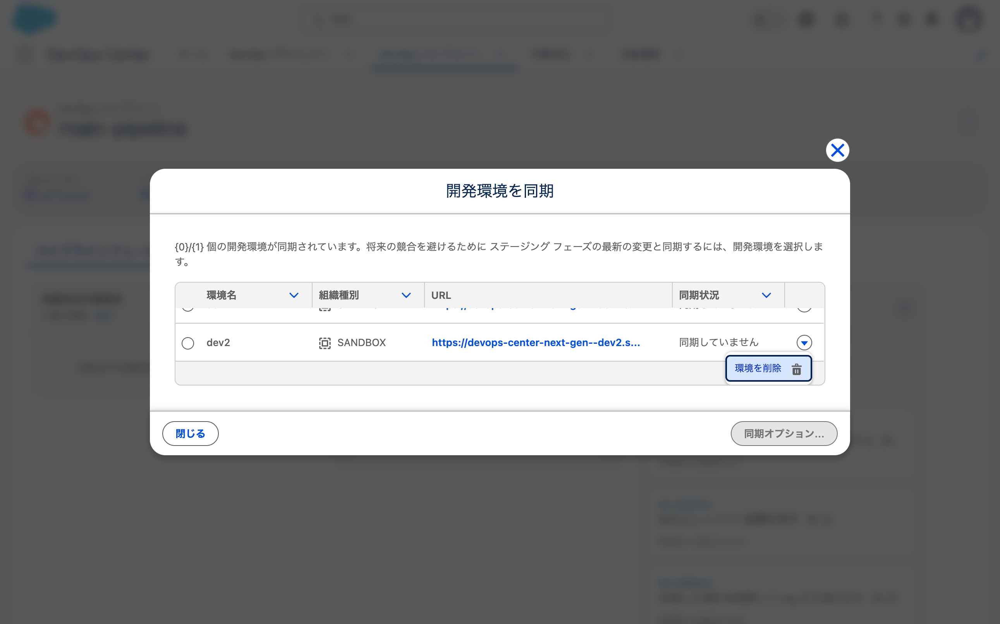
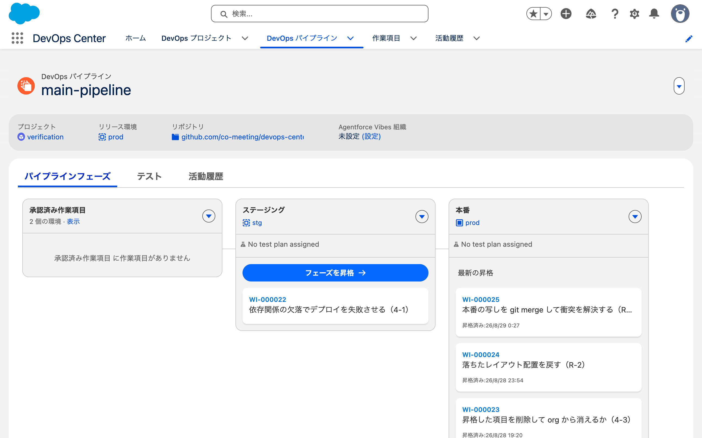
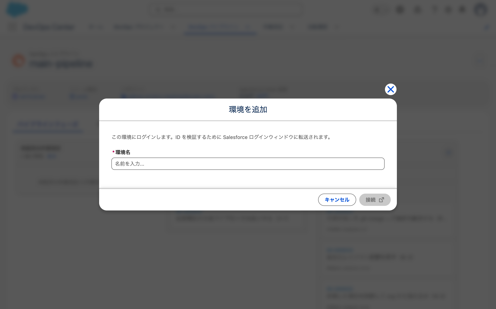
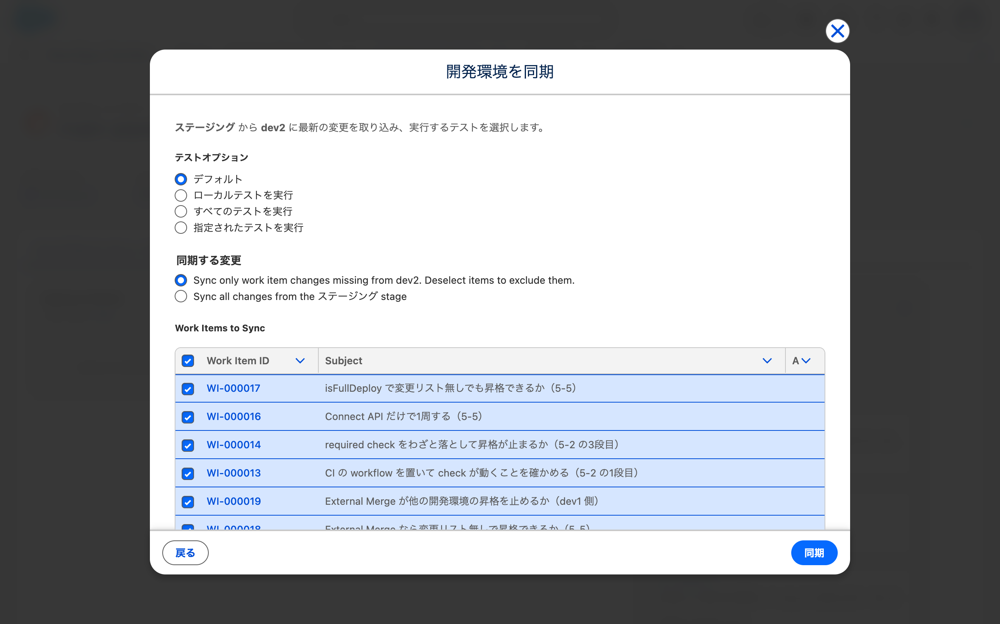
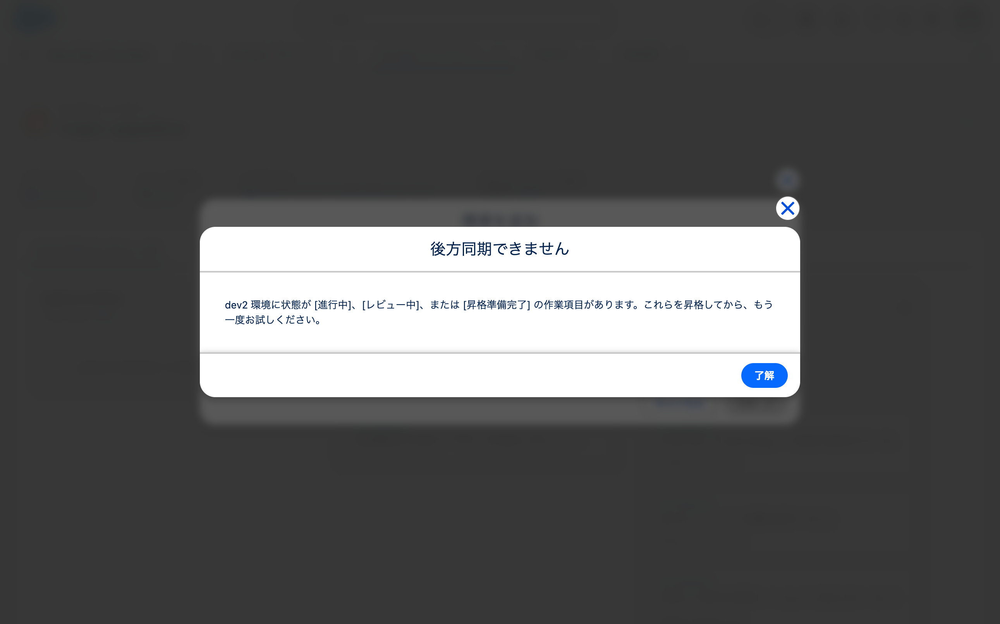
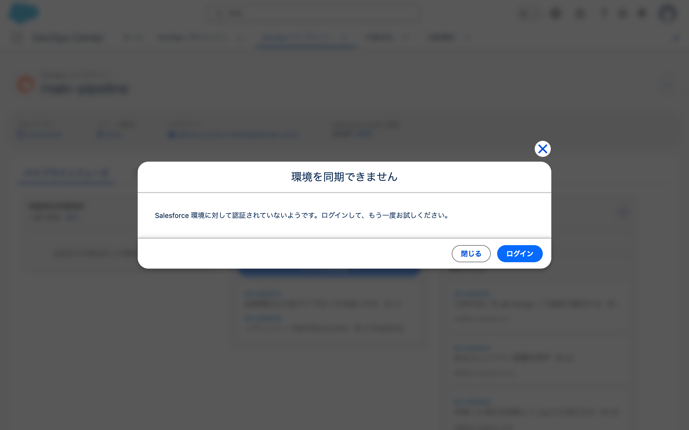
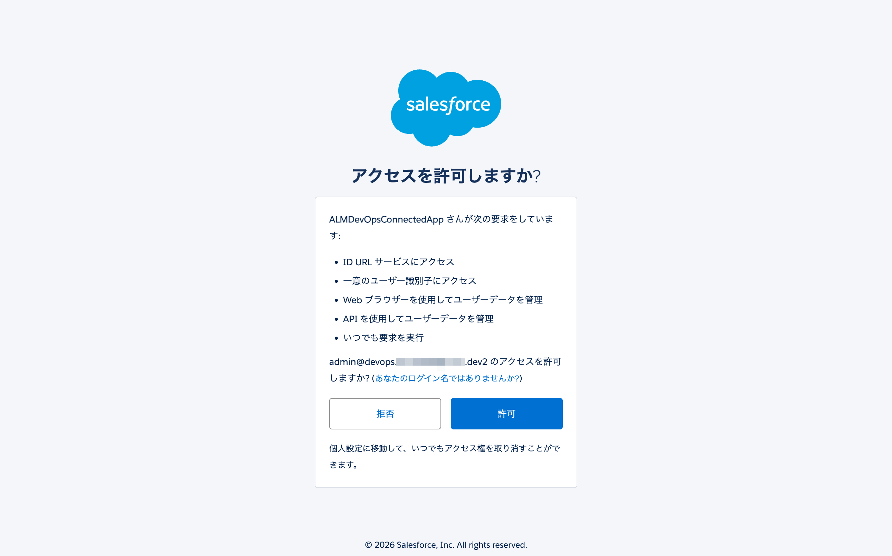
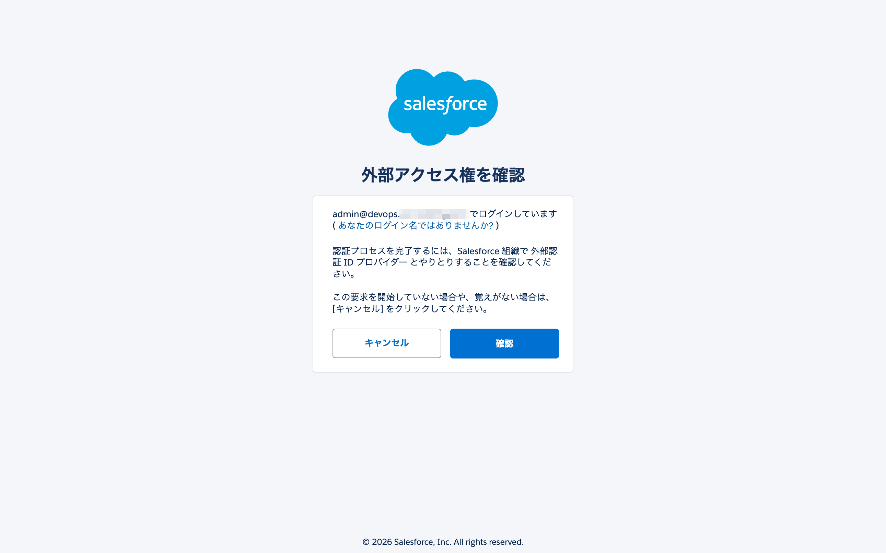
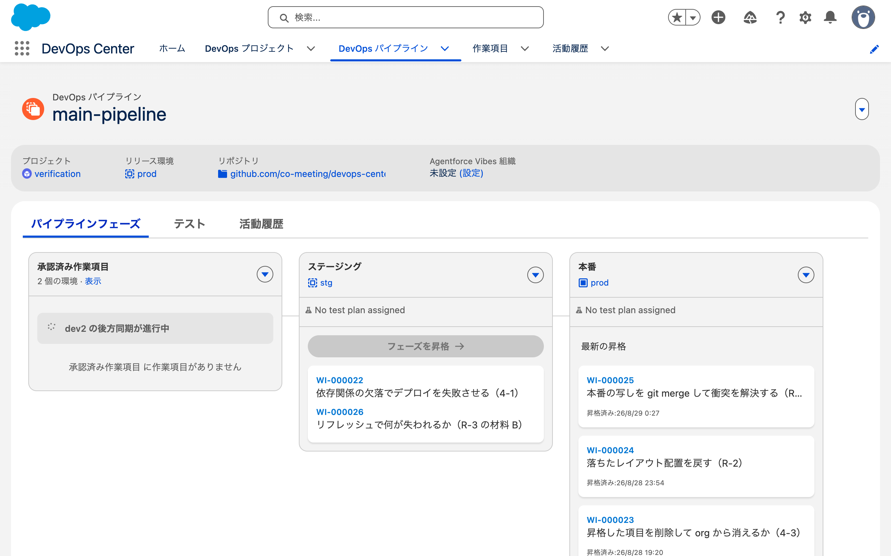
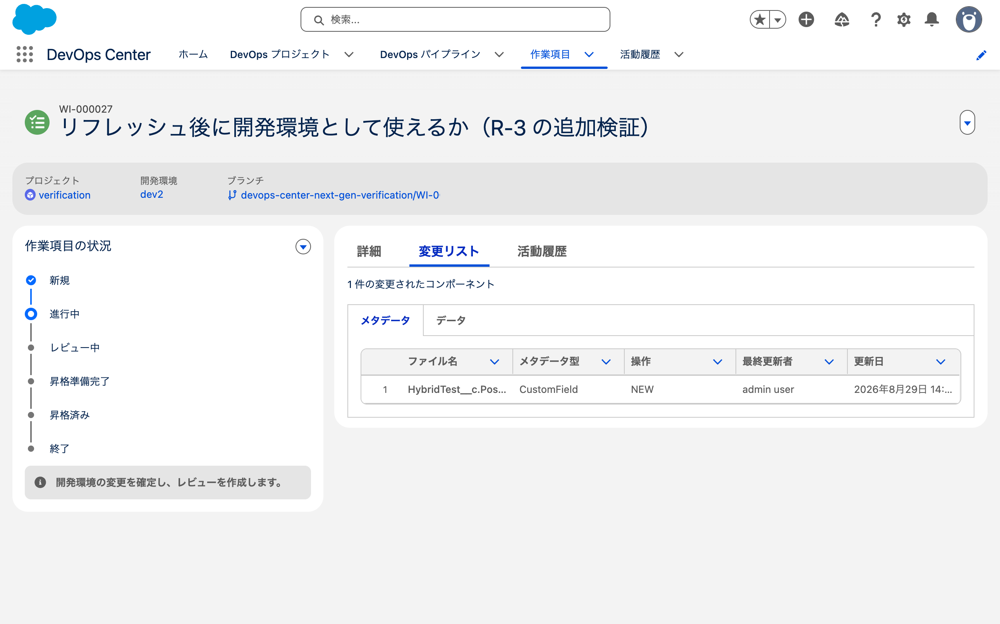

# 2026-08-29 サンドボックスのリフレッシュと Replace Environment（R-3）

- 目的: **Replace Environmentでパイプラインを再開するまでに何分かかり、本番から複製された差分がどう扱われるか**を確かめる。
- 使った org: `dcng-prod`（Hub）/ `dcng-dev2`
- **予測を先に書いてから実行した。**

---

## 1. 公式が「失われる」と書いていること

Replace Environment のページに考慮事項がある（原文）。

> - When you refresh the sandbox, **you lose changes in the development environment that
>   weren't pulled and committed to work item feature branches.**
> - Committed but unpromoted changes remain in the feature branch but **don't appear in the new
>   sandbox.** To see them, promote the work items and then sync from the first pipeline stage
>   branch back to the sandbox.
> - DevOps Center pauses the pipeline stage activities during the replacement to prevent
>   conflicts. **You can't promote or run back sync until the new environment is fully deployed
>   and verified.**

**この3つが実機で成り立つかを確かめる。**

## 2. 3種類の変更を仕込んだ

| # | 何 | どこに作ったか | 公式の記述 |
|---|---|---|---|
| **A** | `UncommittedNote__c` | dev2 の org だけ（コミットしていない） | 「失われる」 |
| **B** | `UnpromotedNote__c` | dev2 の org + 作業項目ブランチ `WI-000026`（昇格しない） | 「ブランチには残るが新しいサンドボックスには現れない」 |
| **C** | `ProdMarkerNote__c` | **prod の org だけ**（本番の直接変更） | 記述が無い。**焦点** |

C は「リフレッシュで dev2 に複製される。Replace 後に残るか」を見る。

## 3. リフレッシュ前の状態（実測）

| どこ | `HybridTest__c` の項目 |
|---|---|
| **dev2** | 6個: `AdminNote__c` / `BlockBNote__c` / `EngineerNote__c` / `ReviewerNote__c` / **`UncommittedNote__c`（A）** / **`UnpromotedNote__c`（B）** |
| **prod** | 13個: `AdminNote__c` / `ApiNote__c` / `BlockANote__c` / `BlockBNote__c` / `CiFailNote__c` / `CiNote__c` / `EngineerNote__c` / `ExtMergeNote__c` / `FullNote__c` / **`ProdMarkerNote__c`（C）** / `ReviewerNote__c` / `TransferNote__c` / `VehicleNote__c` |
| git（`main` / `staging`） | 12個（`ProdMarkerNote__c` は無い） |

**dev2 は staging より遅れている。** リフレッシュすると本番の13個になるはずなので、
**Replace がブランチの状態（12個）で置き換えるなら、その差が見える。**

作業項目の状態。

| 作業項目 | 状況 | 開発環境 |
|---|---|---|
| `WI-000026` | `IN_PROGRESS`（コミット済み・未昇格） | dev2 |
| 他 | すべて `CLOSED` か `NEVERED` | |

## 4. リフレッシュ

```
sf org refresh sandbox -o dcng-prod --name dev2 --no-prompt --async
→ Status: 待機中 / Copy progress: 0%
  Job ID: <SALESFORCE_ID>
```

**開始 00:49:50。**

`SandboxProcess` で進捗を見られる。

```
sf data query -o dcng-prod --use-tooling-api \
  -q "SELECT SandboxName, Status, CopyProgress FROM SandboxProcess WHERE SandboxName='dev2' ORDER BY CreatedDate DESC LIMIT 1"
→ dev2 / 待機中 / 0
```

完了まで **22分8秒**（00:49:53 → 01:12:01）。

```
SandboxName,Status,CopyProgress,StartDate,EndDate
dev2,完了,100,2026-08-28T15:49:53.000+0000,2026-08-28T16:12:01.000+0000
```

## 5. リフレッシュで CLI のトークンが失効した

完了後、`sf` が dev2 を掴めなくなった。

```
This organization is no longer active. (inactive organization)
```

再認証が要る。

```
sf org login web -a dcng-dev2 -r https://test.salesforce.com
```

## 6. 3種類の変更がどうなったか

| # | 何 | 予測 | リフレッシュ直後 |
|---|---|---|---|
| A | `UncommittedNote__c`（dev2 の org だけ・未コミット） | 消える | 消えた |
| B | `UnpromotedNote__c`（コミット済み・未昇格。`WI-000026`） | 現れない | 無い |
| C | `ProdMarkerNote__c`（prod だけ） | 来る | 来た |

**リフレッシュ直後の dev2 は本番の写し**（13項目）。git は12項目。
公式の考慮事項3つのうち、A と B の2つはここで確認できた。

C が Replace でどうなるかが焦点なので、Replace を実行する必要がある。

## 7. リフレッシュで org そのものが別物になった

`DevopsEnvironment` が持つ `OrgIdentifier` と、実際の org の `Organization.Id` を突き合わせた。

| 環境 | DevOps Center の `OrgIdentifier` | 実際の org Id | インスタンス |
|---|---|---|---|
| dev1（リフレッシュしていない） | `<SALESFORCE_ID>` | `<SALESFORCE_ID>` | JPN10S |
| dev2（リフレッシュした） | `<SALESFORCE_ID>` | `<SALESFORCE_ID>` | JPN4S |

**dev2 は Id もインスタンスも変わった。** DevOps Center が握っている Id は古いまま。
公式が Replace を求める前提（"the connection to DevOps Center becomes unusable"）は、
データの上では成立している。

org Id と `OrgIdentifier` を突き合わせた。
**リフレッシュでずれた記録は今回が初めて。**

## 8. 画面は接続の破損を認識していない

`DevopsEnvironment` の状態を示す項目は、dev1 と dev2 で差が無い。

| 項目 | dev1 | dev2 |
|---|---|---|
| `Status`（picklist は `SWAP_ERROR` のみ） | 空 | 空 |
| `CanTrackChanges` | `false` | `false` |
| `IsExpired` | `false` | `false` |
| `RefreshDate` | 空 | **空** |
| `ReplacesId` | 空 | 空 |
| `LastModifiedDate` | | `2026-08-04T08:53:40Z`（リフレッシュ前のまま） |

`RefreshDate` という項目があるのに、リフレッシュしても書かれない。

画面（パイプライン → 「2 個の環境 · 表示」→ 「開発環境を同期」）の同期状況も、
**dev1 と dev2 がどちらも「同期していません」**で同じ表示になる。



Connect API で dev2 の作業項目に同期を投げても成功が返る。

```
POST /services/data/v65.0/connect/devops/projects/{projectId}/workitem/<DEVOPS_RECORD_ID>/sync
→ {"hasUpdates": false, "success": "true"}
```

`hasUpdates` が `false` なので、org に実際に触らずに返っている可能性がある。

## 9. Replace Environment の導線が見つからない

公式の手順（原文）。

> Go to the DevOps Pipelines tab, and select your pipeline.
> Click the down arrow icon under Approved Work Items, and then select Replace Environment.

探していた時点のパイプライン画面。ステージングには `WI-000022` しかなく、
`WI-000026`（材料 B）はまだ昇格していない。



「承認済み作業項目」の右にある下矢印を押した結果、**項目は「開発環境を追加」1つだけ**。



「開発環境を追加」を選ぶと出るのは新規追加のダイアログで、置き換えの選択肢は無い（原文）。

> この環境にログインします。ID を検証するために Salesforce ログインウィンドウに転送されます。
> \* 環境名（名前を入力...）
> キャンセル / 接続

公式の Replace は「環境を**選択**して Log In」だが、これは環境名を**入力**する。

環境の行のアクションメニューも1つだけだった（a11y スナップショット）。

```
uid=117_77 menu "アクションを表示"
  uid=117_78 menuitem "環境を削除"
```

### この画面のメニューを全部開いて項目を列挙した

パイプライン画面にはメニューの起点が4つある。すべて開いて項目を取った。

| メニュー | 項目 |
|---|---|
| その他のアクションを表示（ヘッダー） | パイプラインを無効化 / プロジェクト接続を編集 / Agentforce Vibes 組織を設定 / 開発環境を追加 |
| 承認済み作業項目の ▼ | 同上 |
| 各ステージの ▼（2つ） | 上記 + 環境を開く / ソース制御でブランチを表示 / 昇格する作業項目を選択 |

**全7項目に Replace Environment 相当は無い。**

> ⚠ 最初は DOM 全体を走査して「置換 / Replace が0件」と書いたが、この方法は無効だった。
> 対照実験で「環境を削除」（a11y スナップショットに存在した項目）も0件になった。
> **閉じたメニューの項目は DOM に生成されていない。** 根拠はメニューを開いての列挙に置き換えた。

## 10. 同期を実行したら、別の理由で止まった

Replace の導線が無いので、まず dev2 に触る操作をして接続の破損を検出させることにした。
「開発環境を同期」パネルで dev2 を選び、「同期オプション...」を押す。

ダイアログの中身（原文）。

> ステージング から dev2 に最新の変更を取り込み、実行するテストを選択します。
>
> テストオプション: デフォルト / ローカルテストを実行 / すべてのテストを実行 / 指定されたテストを実行
>
> 同期する変更:
> Sync only work item changes missing from dev2. Deselect items to exclude them.
> Sync all changes from the ステージング stage
>
> Work Items to Sync



同期対象として **14件**の作業項目が並んだ（`WI-000010` 〜 `WI-000025`）。
リフレッシュ直後の dev2 は本番の写しなので org の中身は最新のはずだが、
**DevOps Center は記録上の同期履歴で判断していて、org の実際の状態を見ていない。**

日本語 org だが、このダイアログには英語のまま残っている文言がある
（`Sync only work item changes missing from dev2.` / `Work Items to Sync` / `No test plan assigned`）。

「同期」を押した結果（04:20:57 に実行）。

> **後方同期できません**
>
> dev2 環境に状態が [進行中]、[レビュー中]、または [昇格準備完了] の作業項目があります。
> これらを昇格してから、もう一度お試しください。
>
> 了解



接続のエラーではない。`WI-000026`（材料 B。`IN_PROGRESS` のまま）が残っているため、
同期そのものが実行されなかった。**org には触れていない。**

公式の考慮事項の1つ目がこれに対応する。

> Promote all work items before you refresh the sandbox.

**守らなかった場合に何が起きるかが出た。** しかも同期するには `WI-000026` を昇格するしかないが、
その中身（`UnpromotedNote__c`）はリフレッシュで dev2 の org から消えている
（→ 6章）。git のブランチには残っている。

## 11. org から消えた変更を、git 経由で昇格できた

公式の考慮事項の2つ目が指示する手順を実行した。

> Committed but unpromoted changes remain in the feature branch but don't appear in the new
> sandbox. To see them, **promote the work items and then sync** from the first pipeline stage
> branch back to the sandbox.

Connect API で `WI-000026` を昇格した（手順は
[`2026-08-28-cli-promotion-5-5.md`](2026-08-28-cli-promotion-5-5.md) で確立したもの）。

| 手順 | 結果 |
|---|---|
| `POST /connect/devops/workItems/{id}/review` | PR #35。`IN_REVIEW` に |
| `PATCH /connect/devops/projects/{pid}/workitem/{id}` `{"status":"READY_TO_PROMOTE"}` | `READY_TO_PROMOTE` に |
| `POST /connect/devops/pipelines/{pid}/promote` | `SUBMITTED` → **33秒で `PROMOTED`** |

`staging` ブランチに `UnpromotedNote__c.field-meta.xml` が入った。

**org に存在しない変更でも、git のブランチに残っていれば昇格できる。**
昇格は git の操作（マージと push）なので、開発環境の org の状態を参照しない。

## 12. 接続の破損は、org に触る操作をして初めて表面化した

`WI-000026` が `PROMOTED` になったので、同期を再実行した（04:27:49）。

> **環境を同期できません**
>
> Salesforce 環境に対して認証されていないようです。ログインして、もう一度お試しください。
>
> 閉じる / ログイン



7章の `OrgIdentifier` のずれが、ここで画面に出た。
**リフレッシュから同期の実行までのあいだ、画面は何も警告しない。**

公式の Replace の手順は次の2行で始まるが、

> Select an environment, and then click Log In.
> Complete the login process.

このダイアログの「ログイン」も同じ形をしている。
**メニュー項目としての Replace Environment は無いが、この導線が同じ到達点に着く可能性がある。**
押して確かめる。

## 13. 項目の数え方を間違えて、あやうく「消えた」と書くところだった

「ログイン」を押す前の状態を記録しようとして、次の2つで項目を数えた。

```
SELECT QualifiedApiName FROM FieldDefinition WHERE EntityDefinition.QualifiedApiName='HybridTest__c'
sf sobject describe -s HybridTest__c
```

**どちらも標準項目（9個）しか返さなかった。** prod でも stg でも dev2 でも同じ。
そのまま書けば「全部の org からカスタム項目が消えた」になる。

`sf project retrieve start -m "CustomObject:HybridTest__c"` で取り直すと、**13項目あった。**

本番との差分に関する検証の FLS 検証で参照権限を剥奪したため、`describe` にも `FieldDefinition` にも出なくなっていた。
**項目の有無を数えるときは retrieve を使う。**
この結果だけで、カスタム項目が存在しないとは判断できない。

## 14. Replace を実行する前の4か所の状態

retrieve で数え直した結果。

| どこ | 項目数 | 特徴 |
|---|---|---|
| prod | 13 | `ProdMarkerNote__c`（C）あり |
| **dev2（リフレッシュ後・ログイン前）** | **13** | prod と同一 |
| stg | 15 | `DepBase__c` / `DepFormula__c` / `UnpromotedNote__c` あり。`ProdMarkerNote__c` 無し |
| git の `staging` ブランチ | 15 | stg と同一 |

**判定が数で切れる。**

| 実行後の dev2 | 意味 |
|---|---|
| **16項目** | 本番由来の `ProdMarkerNote__c` が**残る**（デプロイが追加しかしない） |
| **15項目** | **消える**（公式の "restore the complete branch state" どおり） |

## 15. 再認証は3画面。考慮事項の確認は出なかった

「環境を同期できません」の「ログイン」から先の画面。

| # | 画面 | 内容 |
|---|---|---|
| 1 | dev2 のログイン | 通常の Salesforce ログイン |
| 2 | dev2 の `RemoteAccessAuthorizationPage` | `ALMDevOpsConnectedApp` へのアクセス許可 |
| 3 | Hub org の `XdsUpdatePage` | 「外部アクセス権を確認」 |

2 の原文。



> ALMDevOpsConnectedApp さんが次の要求をしています:
> ID URL サービスにアクセス / 一意のユーザー識別子にアクセス /
> Web ブラウザーを使用してユーザーデータを管理 / API を使用してユーザーデータを管理 / いつでも要求を実行
>
> <EMAIL_REDACTED> のアクセスを許可しますか?

3 の原文。

> 認証プロセスを完了するには、Salesforce 組織で 外部認証 ID プロバイダー とやりとりすることを
> 確認してください。この要求を開始していない場合や、覚えがない場合は、[キャンセル] をクリックしてください。



**公式の Replace 手順にある「考慮事項を確認してチェックボックスを入れ、Continue を押す」段は出なかった。**

> Review the considerations, select the confirmation checkbox, and then click Continue.

認証後、画面は元のパイプラインに戻る。**同期は自動で再開しない。** 手で実行し直す。

## 16. 同期は通った。所要2秒、差分13コンポーネント

再実行（04:36:32）で「dev2 の後方同期が進行中」と表示され、**成功のトーストが一瞬出た**（人が目視）。



dev2 側の `DeployRequest`。

| 項目 | 値 |
|---|---|
| `Status` | `Succeeded` |
| 期間 | 04:36:46 → 04:36:48（**2秒**） |
| `NumberComponentsTotal` | **13**（差分。フルではない） |

## 17. 結果

`dev2` の項目は **13 → 15**。

| 材料 | 予測 | 結果 |
|---|---|---|
| A `UncommittedNote__c` | 消える | 消えた（リフレッシュ時点） |
| B `UnpromotedNote__c` | 現れない | 現れない。**同期後も来なかった** |
| **C `ProdMarkerNote__c`** | **不明（焦点）** | **残った** |

増えたのは `DepBase__c` と `DepFormula__c` の2つだけ。

**本番だけにあった項目は、復旧しても残る。** 加算的なデプロイであって、
公式の "restore the complete branch state" はこの経路では起きていない。

**B は昇格したのに来なかった。** 昇格後の同期は2回とも、エラーダイアログを閉じ、
パネルを「表示」から開き直してから実行している（13:27:49 と 13:36:32）。
**ダイアログの開き方の問題ではない。原因は確かめていない。**

（同期オプションのダイアログを最初に開いたとき、対象リストは14件で `WI-000026` は
入っていなかった。昇格後のリストは確認していない）

### 環境レコードは何も変わっていない

| 項目 | 同期の前後 |
|---|---|
| `OrgIdentifier` | `<SALESFORCE_ID>` のまま（実際の org は `<SALESFORCE_ID>`） |
| `ReplacesId` | 空のまま |
| `RefreshDate` | 空のまま |
| `LastModifiedDate` | `2026-08-04T08:53:40Z` のまま |

環境レコードは4件のままで、新しいレコードも作られていない。

**Replace Environment は実行されていない。** 起きたのは再認証と差分同期だけ。
`ReplacesId` は環境の置き換えを追跡するための項目だが、空のままだった。

そして **`OrgIdentifier` が実際の org と食い違ったままでも同期は成功する。**
DevOps Center はこの項目を照合しておらず、Named Credential のトークンだけで org に接続している。

## 18. 復旧までの実測

| # | 何 | 所要 |
|---|---|---|
| 1 | サンドボックスのリフレッシュ | **22分8秒** |
| 2 | CLI の再認証（`sf org login web`） | 人の操作 |
| 3 | 未昇格の作業項目を昇格（PR 作成 → 状況変更 → 昇格） | **33秒** + API 3回 |
| 4 | 同期を試す → 「後方同期できません」 | 即 |
| 5 | 同期を試す → 「認証されていないようです」 | 即 |
| 6 | 再認証（ログイン → 許可 → 確認の3画面） | 人の操作 |
| 7 | 同期を実行し直す | **約1分**（デプロイ本体は2秒） |

## 19. Replace の導線が無いのは権限不足だった可能性が高い

公式ページを最後まで読んだら、権限の要件が書いてあった（原文）。

> **USER PERMISSIONS NEEDED**
>
> To replace an environment: **DevOps Center Admin**
>
> To access the named credentials required to authenticate to the environment:
> Access DevOps Center Named Credentials

**9章の調査ではこの節を読んでいなかった。**
公式に書かれた前提条件を満たす必要がある。

ログインユーザー（`<EMAIL_REDACTED>`）の権限セットは1つだけだった。

```
AccessDevOpsCenterNamedCredentials
```

org には他に4つある。

| Name | Label |
|---|---|
| **`DevOpsCenterManager`** | **DevOps Center 管理者** |
| `DevOpsCenterReleaseManager` | DevOps センターリリースマネージャー |
| `DevOpsCenter` | DevOps Center ユーザー |
| `DevopsTestingManager` | DevOps Testing マネージャー |

公式の "DevOps Center Admin" は `DevOpsCenterManager` に当たる。**割り当てられていなかった。**

```
sf org assign permset --name DevOpsCenterManager -o dcng-prod
```

割り当ててページを読み込み直したが、**メニューは変わらなかった**（4つのメニューも
環境の行のメニューも同じ）。

**別ブラウザで再ログインしても変わらなかった**（人が実施）。
そもそも権限セットの割り当てに再ログインは要らない、という指摘も受けた。

> ⚠ 「セッションに反映されていないので再ログインで出る」という推論は外れた。

## 20. 版のずれでも説明がつかない

ドキュメントが実装に先行している可能性を見た。

親ページ [Replace and Connect a New Environment](https://help.salesforce.com/s/articleView?id=platform.devops_center_replace_connect_environment.htm&language=en_US&type=5) には、
Beta や Developer Preview の但し書きが無い。同じ目次の中で
`Get Started with Governance (Developer Preview)` のように明記されている項目があるので、
**表記が無いことは一般提供の建て付けを意味する。**

org の版も確認した。

| 何 | 版 |
|---|---|
| org が対応する最新 API | **v67.0（Summer '26）** |
| この検証で Connect API に使っていた版 | v65.0（Winter '26） |

org は Summer '26 で、ドキュメントも Summer '26 向け。**版のずれでは説明がつかない。**

（**Connect API を2世代前の版で叩いていた。** 動いてはいるが、
5-5 以降の記述で `v65.0` と書いている箇所はこの事実を含む）

## 21. Replace Environment についての結論

| 確かめたこと | 結果 |
|---|---|
| 「承認済み作業項目」の下矢印 | 「開発環境を追加」のみ |
| パイプライン画面の全メニュー（4か所） | 全7項目に Replace 相当は無い |
| 環境の行のアクションメニュー | 「環境を削除」のみ |
| `DevOpsCenterManager`（DevOps Center 管理者）を割り当てる | 変わらない |
| 別ブラウザで再ログイン | 変わらない |
| ドキュメントの提供状況の但し書き | 無い（一般提供の建て付け） |
| org の版 | Summer '26。ドキュメントと同じ |

**ドキュメントに手順があるが、この org の画面には導線が無い。** 理由は特定できていない。

> **2026-08-31 訂正:** 当初は「Replace Environment が無くても復旧できた」と結論づけたが、
> 再認証と後方同期は Replace Environment の代わりにはならない。

再認証後に後方同期を実行し、新しい変更を1周させることはできた（→ 15〜17章、22章）。
ただし、環境レコードの `OrgIdentifier` は古い org を指したままで、`ReplacesId` も空だった。
公式が説明する環境の置き換えと、パイプラインブランチの完全な状態の復元は確認できていない。

## 22. 再認証後の dev2 で新しい開発を1周できた

後方同期が通っただけでは、開発を続けられるかは分からない。
**新しい変更を追跡し、コミットし、昇格できるか**を確かめた。

| # | やったこと | 結果 |
|---|---|---|
| 1 | dev2 に `PostRefreshNote__c` を作る（14:41:32） | デプロイ成功 |
| 2 | 作業項目 `WI-000027` を作り、dev2 を割り当て、`IN_PROGRESS` にする | ブランチ `WI-000027` が作られた |
| 3 | 作業項目の画面で変更リストを見る | **0件**（コミット前は 0 件が正常） |
| 4 | ブランチを checkout し、dev2 から retrieve する | `PostRefreshNote__c` が取れた |
| 5 | MCP の `commit_devops_center_work_item` でコミット | `<COMMIT_SHA>` |
| 6 | push して、作業項目の画面を開き直す | **変更リストに1件出た** |
| 7 | PR を作る（PR #37）、`READY_TO_PROMOTE`、ステージングへ昇格 | **21秒で `PROMOTED`** |
| 8 | git と stg の org を確認 | **両方に届いた** |

変更リストの内容。

```
1 件の変更されたコンポーネント
HybridTest__c.PostRefreshNote__c   CustomField   NEW   admin user   2026年8月29日 14:45
```



昇格のデプロイ（stg 側の `DeployRequest`）。

| 項目 | 値 |
|---|---|
| `Status` | `Succeeded` |
| 期間 | 05:46:36 → 05:46:38（2秒） |
| `NumberComponentsTotal` | 1 |

**再認証後も、新しい変更の追跡、コミット、昇格は動いた。**
ただし、環境レコードは置き換わっていないため、開発環境が元の状態に戻ったことは示していない。

### 途中で踏んだもの

**作業項目の作成 API では開発環境を指定できない。** `devopsEnvironmentId` を body に入れると
`JSON_PARSER_ERROR` になる。作成したあとに `sf data update record` で
`DevelopmentEnvironmentId` を設定する（5-5 で確認済みの手順）。

**昇格 API に15桁の Id を渡すと失敗する。**

```
PROMOTION_SOURCE_CODE_REPOSITORY_BRANCH_NOT_FOUND:
No source code repository branch found for work item: <DEVOPS_RECORD_ID>
```

作成 API が返す `workItemId` は15桁。**18桁に直して渡すと通る。**

## 23. まとめ

| 問い | 答え |
|---|---|
| リフレッシュで何が失われるか | 未コミットは消える。コミット済み未昇格はブランチに残るが org には来ない |
| 本番だけにある変更は残るか | **残った**（この検証で扱ったのは、ブランチに含まれない独立したカスタム項目） |
| 未昇格の変更を救えるか | 昇格はできた。**ただし同期しても開発環境には戻らなかった**（原因は未確認） |
| 再認証と同期に何分か | リフレッシュ **22分8秒** + 再認証 + 同期約1分 |
| 開発を続けられるか | 新しい変更を追跡・コミット・昇格まで通せた。ただし、環境レコードの不整合は残った |
| Replace Environment を使えたか | 使えていない。画面に導線が見つからず、後方同期も代わりにはならない |
