# 2026-08-30 GitHub の認証は利用者ごとか

- 目的: DevOps Center の GitHub 接続が利用者ごとの認証なのか、
  **各利用者が認証する導線が実際にあるのか**を確かめる
- 使った org: `dcng-prod`（Hub）
- きっかけ: 名義の話（→ 6章）で「接続が `PerUserPrincipal` だから各自の名義になる」と書いたが、
  **「その導線があったか。1回しか認証していない」と指摘された**

---

## 1. 設定値だけを根拠にしていた

08-29 に `ExternalCredential` を確認して、次を得ていた。

```
ALMDevOpsGitHub               Oauth   PerUserPrincipal
prod_1PJd... / stg_1PJd... / dev_1PJd...   すべて同じ
```

ここから「各自が自分の GitHub アカウントで認証すれば、その名義になる」と書いた。

**設定値からの推論で、導線も公式の記載も確認していなかった。**
検証環境では**パイプライン作成時に1回認証しただけ**で、他に認証した記憶が無い、という指摘を受けた。

## 2. 公式の記載（次世代のページ）

[Set Up GitHub as Your Source Control](https://help.salesforce.com/s/articleView?id=platform.devops_center_set_your_source_control.htm&language=en_US&type=5) の原文。

> **Add a Team Member to the Project Repository**
>
> If you're a team manager or Salesforce admin, complete these steps:
>
> - Ask each team member to **create a GitHub account** (if they don't have one) and to send you
>   their GitHub username.
> - Log in to GitHub and update the project repository settings for access to **invite the team
>   member as a collaborator**.
> - Confirm that the team member received the email invitation from GitHub and accepted it.
>
> **Join a Project Repository as a Collaborator**
>
> If you're a team member, complete these steps:
>
> - Create a GitHub account if you don't have one.
> - Send your GitHub username to the team manager or Salesforce admin who's setting up DevOps Center.
> - Check your email for an invitation to collaborate on the repository, and then accept it.

**メンバーごとに GitHub アカウントを持たせ、collaborator として招待する設計。**
ただしこのページには**「DevOps Center で OAuth 認証する手順」は書かれていない。**
collaborator になる手順だけである。

同じページに接続方式の記載がある。

> Each DevOps Center pipeline requires its own GitHub repository to act as the single source of truth.
> DevOps Center uses the **GitHub REST API and OAuth 2.0** to ensure secure communication.

## 3. 導線は2か所にある

### DevOps Center のホーム

**ホーム画面の右上にカードがある**（原文）。

> **バージョン管理に接続**
>
> 作業項目を確定、取り込み、昇格するには、バージョン管理に接続して認証します。
>
> [接続]

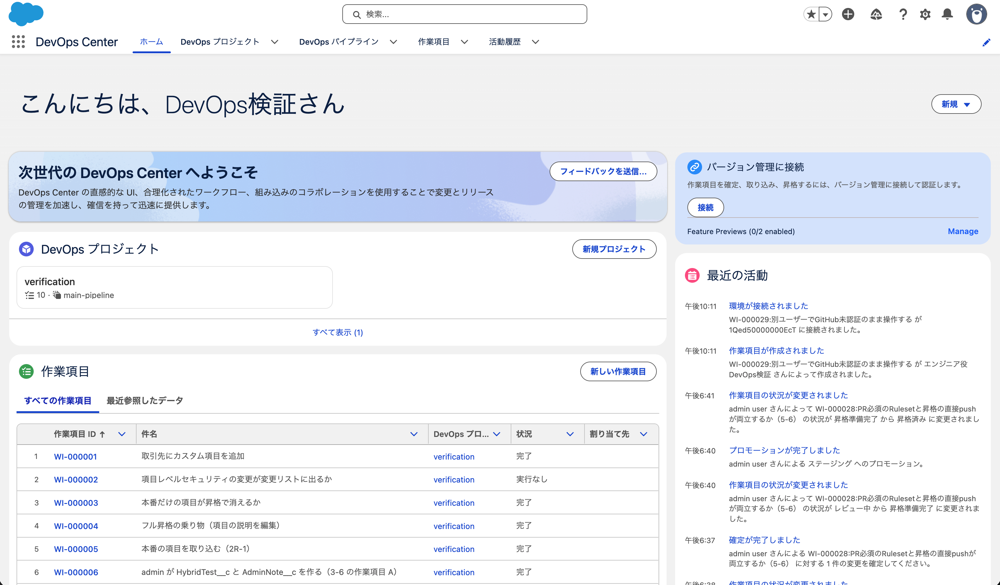

**目的（確定・取り込み・昇格）まで書かれた導線が製品の中にある。**

[接続] を押すとダイアログが出る（原文）。

> **バージョン管理を接続**
>
> 新しいウィンドウで開く承認プロセスを完了してください。承認後は、ここに戻ってください。
>
> GitHub / Bitbucket

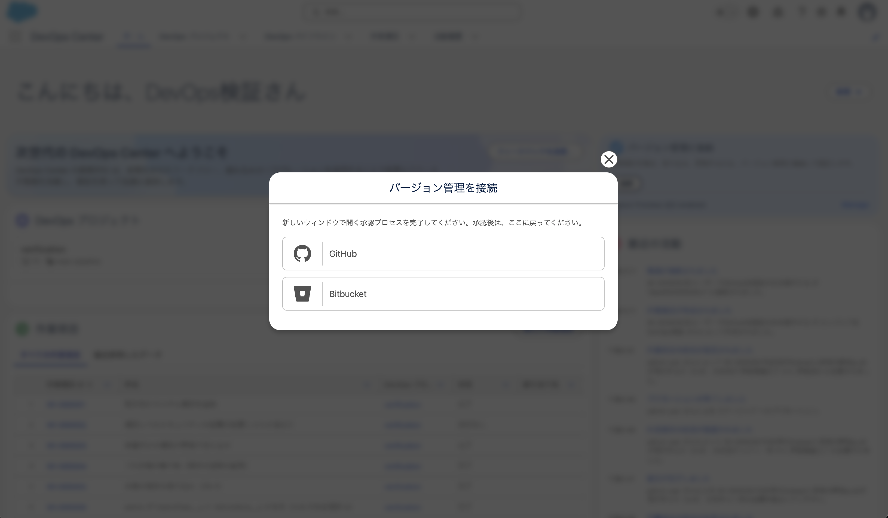

**接続先を GitHub と Bitbucket から選ぶ。** そこから GitHub の承認プロセスに進む

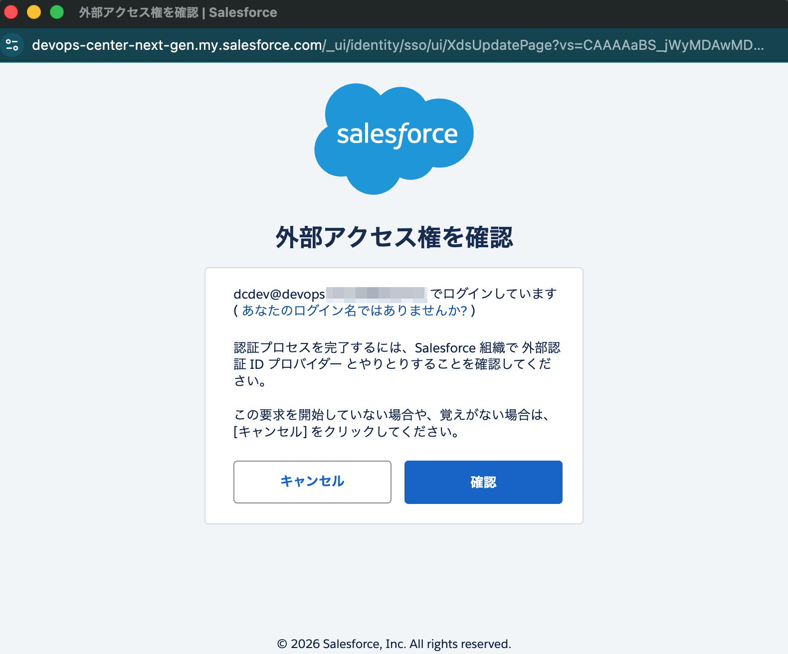

> ⚠ 当初この検証ログに「画面から到達する手がかりが無い」と書いたが誤り。
> パイプライン・作業項目・活動履歴の3画面しか見ておらず、**ホームを見ていなかった。**

### 個人設定

**設定 → 私の個人情報 → 外部ログイン情報**（`/lightning/settings/personal/ExternalCredentials/home`）。

原文。

> 外部ログイン情報
>
> 外部組織への認証を行うには、**[アクセスを許可]** をクリックします。

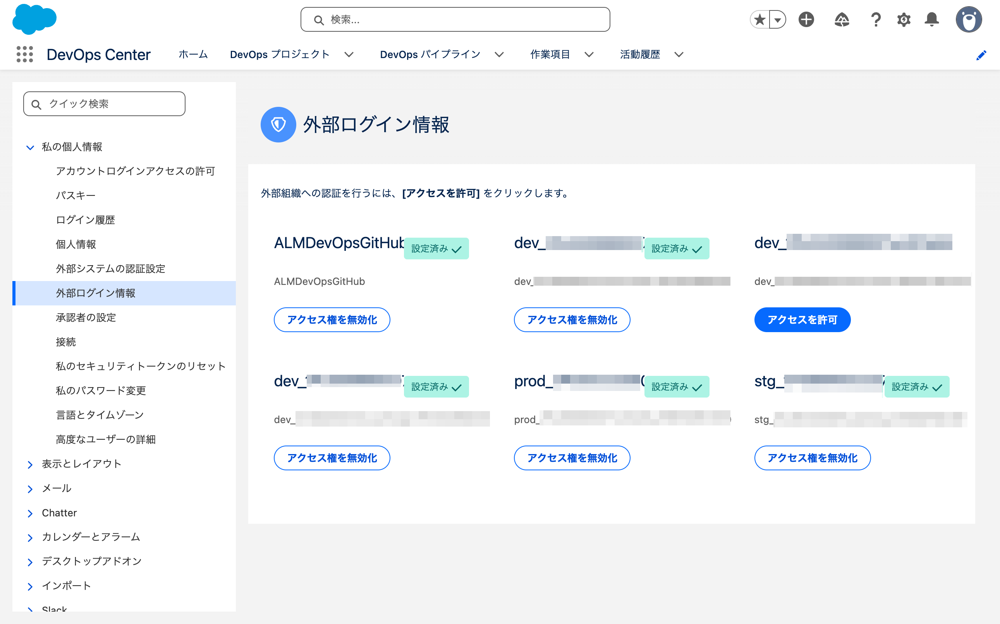

一覧の状態（admin ユーザーで表示したもの）。

| 名前 | 状態 | ボタン |
|---|---|---|
| `ALMDevOpsGitHub` | **設定済み** | アクセス権を無効化 |
| `dev_1PJd..._1785805893032`（dev1） | 設定済み | アクセス権を無効化 |
| `dev_1PJd..._1785831405232` | （表示なし） | **アクセスを許可** |
| `dev_1PJd..._1785833558024`（dev2） | 設定済み | アクセス権を無効化 |
| `prod_1PJd..._1785738512210` | 設定済み | アクセス権を無効化 |
| `stg_1PJd..._1785807684161` | 設定済み | アクセス権を無効化 |

**「設定済み」と「アクセスを許可」が混在している。** 一覧の状態が利用者ごとに違うことを示している。

「設定済み」なのはパイプラインや環境を接続したときに認証した分。
削除済み環境に対応する1件だけが未設定だった。
環境レコードを削除してもNamed Credentialは残る。

なお、隣の **「外部システムの認証設定」は空**だった（`表示するレコードはありません。`）。
そちらは旧方式の Named Credential 用で、`ExternalCredential` を使う接続はこちらに出ない。

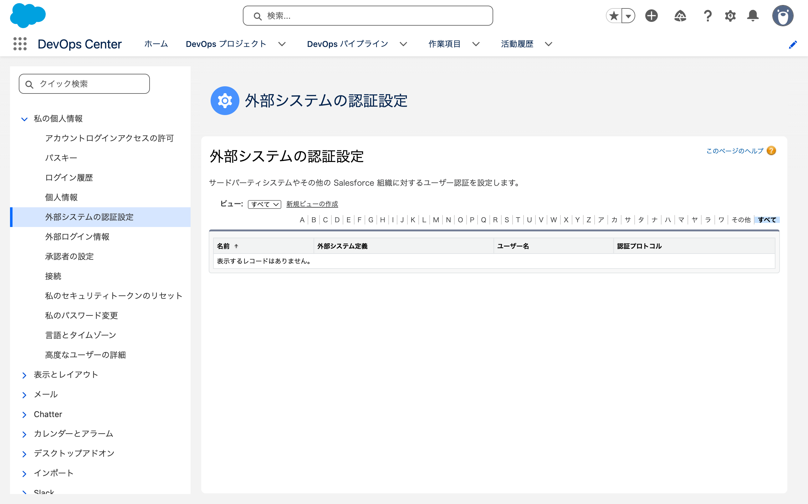

## 4. 分かったこと

**利用者ごとに認証する導線は存在する。** 個人設定の「外部ログイン情報」から
各接続に対して「アクセスを許可」する。

検証環境で1回しか認証していないのは、**1人で全部の役割をやっているため**である。
パイプラインと環境を接続したときの認証がそのまま使われている。

### 確認していないこと

- **別の GitHub アカウントで認証したとき、PR の作成者がそのアカウントになるか**
  （利用できる GitHub アカウントが1つのため実測できない）

## 5. 別の Salesforce ユーザーで操作した

07-31 に作ってあった `<EMAIL_REDACTED>`（エンジニア役）で試した。
**一度もログインしていないユーザー**で、GitHub 認証も権限セットも無い状態だった。

準備（admin 側から実施）。

```
Apex: System.setPassword('<SALESFORCE_ID>', '<パスワード>')
sf org assign permset --name DevOpsCenter --on-behalf-of <EMAIL_REDACTED>
```

### パイプライン画面はリポジトリの値だけが欠ける

`dcdev` でパイプラインを開くと、**リポジトリの欄にラベルはあるのに値が無い。**

| 項目 | admin | dcdev |
|---|---|---|
| プロジェクト | verification | verification |
| リリース環境 | prod | prod |
| **リポジトリ** | `github.com/example-company/example-project` | **（空）** |

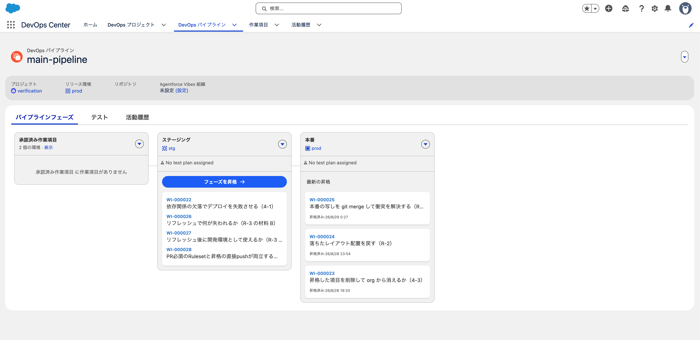

パイプライン、ステージ、作業項目の一覧は Salesforce 側のデータなので普通に見える。
**GitHub から取る情報だけが欠ける。**

**エラーも警告も出ない。** admin の画面と並べないと気づけない。

### 外部ログイン情報は6件すべて「アクセスを許可」

| 接続 | admin | dcdev |
|---|---|---|
| `ALMDevOpsGitHub` | 設定済み | **アクセスを許可** |
| `dev_..._1785805893032`（dev1） | 設定済み | **アクセスを許可** |
| `dev_..._1785831405232`（孤児） | アクセスを許可 | アクセスを許可 |
| `dev_..._1785833558024`（dev2） | 設定済み | **アクセスを許可** |
| `prod_..._1785738512210` | 設定済み | **アクセスを許可** |
| `stg_..._1785807684161` | 設定済み | **アクセスを許可** |

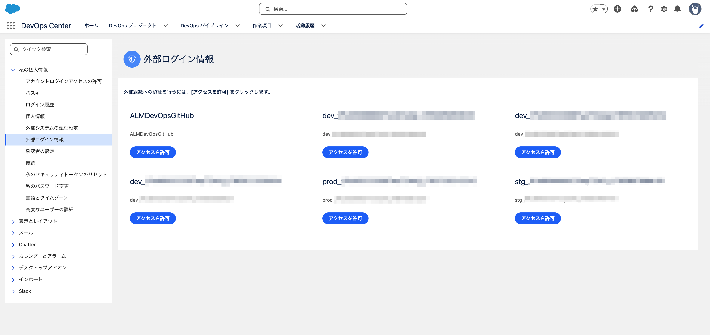

**同じ org、同じ接続レコードなのに、利用者によって状態が違う。**
GitHub だけでなく **Salesforce 環境への接続も利用者ごと**である。

### 作業項目の作成は通る

`WI-000029` を作成できた。**開発環境 `dev1` も選択でき、保存も通った**
（環境の接続が未認証でも選択肢に出る）。

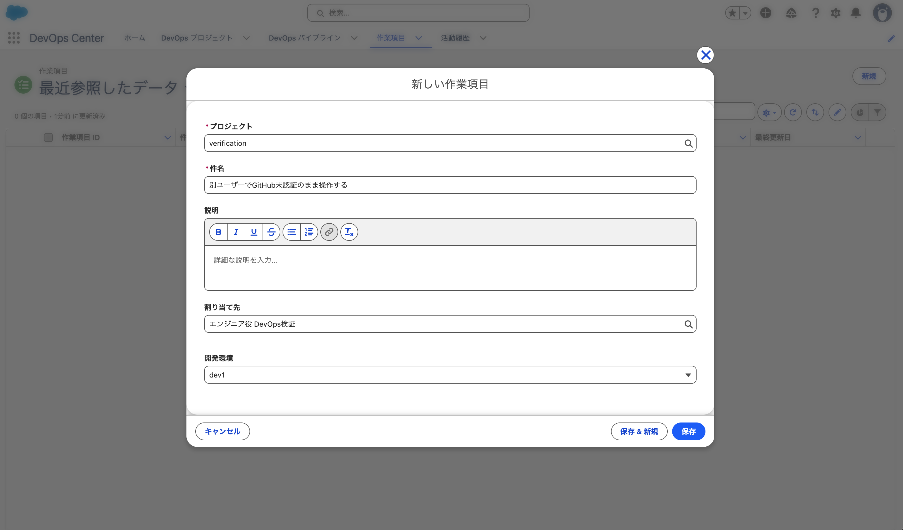

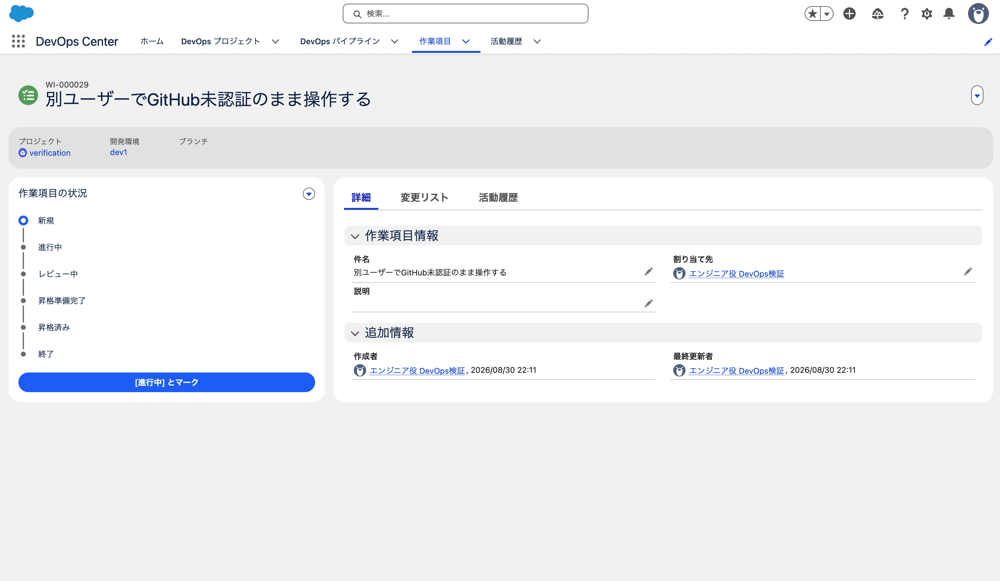

```
Name       WI-000029
Status     NEW
DevelopmentEnvironmentId   <DEVOPS_RECORD_ID>（dev1）
SourceCodeRepositoryBranchId   None
CreatedBy  <EMAIL_REDACTED>
```

**Salesforce 側だけで完結する操作は、未認証でも通る。**

### 「進行中」で止まる。画面には原因が出ない

「[進行中] とマーク」を押すとブランチ作成が走るが、失敗した。

画面に出たトースト（原文）。

> エラー
> 予期せぬエラーが発生しました

**これだけである。** 原因も、対処への誘導も無い。

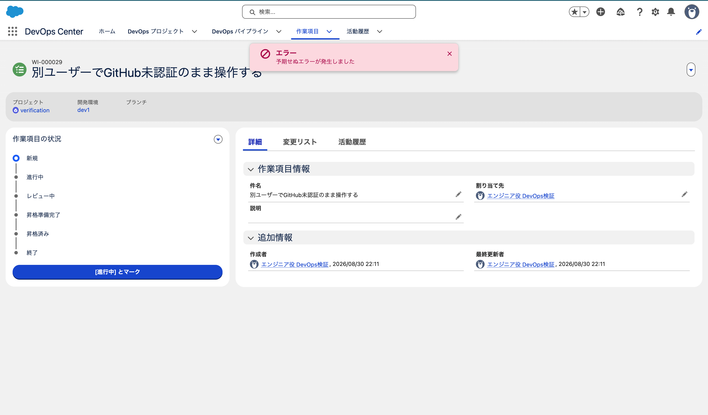

そして**どこにも記録が残らない。**

| 見たもの | 結果 |
|---|---|
| `WorkItem.Status` | **`NEW` のまま** |
| `SourceCodeRepositoryBranchId` | 空のまま |
| **活動履歴（`DevopsActivityLog`）** | **失敗の記録なし。** `WORK_ITEM_CREATED` と `WORK_ITEM_CONNECTED` の `SUCCESS` 2件だけ |
| **`DevopsRequestInfo`** | **記録なし**（直近は 09:40 の admin の操作） |

### ネットワークには原因が入っていた

ブラウザの開発者ツールで `aura?...aura.DevopsConnect.updateWorkItem=1` のレスポンスを見ると、
**原因が明記されている**（人が確認した）。

```
SWITCHING_WORKITEM_FAILED:Failed to switch work item context:
Unexpected error during named credential callout:
We couldn't access the credential(s). You might not have the required permissions,
or the external credential "ALMDevOpsGitHub" might not exist.
```

`errorCode` は `INTERNAL_ERROR`、`statusCode` は 400。

**`SWITCHING_WORKITEM_FAILED` は 08-28 のリポジトリ移管でも出たコード**
（→ [`2026-08-28-repo-transfer.md`](2026-08-28-repo-transfer.md) の142行。
あちらは `Moved Permanently`）。**同じコードが違う原因で出る。**

### 壁は2段階あった

メッセージに `You might not have the required permissions` とあったので、権限セットを確認した。

| ユーザー | 権限セット |
|---|---|
| admin | `DevOpsCenterManager` + **`AccessDevOpsCenterNamedCredentials`** |
| dcdev（当初） | `DevOpsCenter` のみ |

`AccessDevOpsCenterNamedCredentials` を割り当てて再試行すると、
**画面のトーストは同じだが、ネットワークのメッセージが変わった。**

| 状態 | メッセージ |
|---|---|
| 権限セット無し | `We couldn't access the credential(s). **You might not have the required permissions**, or the external credential "ALMDevOpsGitHub" might not exist.` |
| **権限セット有り** | `The external credential "ALMDevOpsGitHub" **isn't authenticated. Authenticate the credential** or contact your Salesforce admin.` |

**壁は2つある。**

1. `AccessDevOpsCenterNamedCredentials` 権限セット
2. GitHub の OAuth 認証（個人設定 → 外部ログイン情報 → アクセスを許可）

**DevOps Center は原因を正確に把握している。** 2つの状態を区別し、
後者では対処法（`Authenticate the credential`）まで返している。**それを画面に出していないだけである。**

なお `facts.md` に書いていた必要権限の記載
（「DevOps Center User」「Customize Application」）に、
**`AccessDevOpsCenterNamedCredentials` は入っていなかった。**

## 6. これまでの失敗の見え方と並べる

| 場面 | 画面 | 記録 |
|---|---|---|
| 昇格が required status check で止まる（[5-2](2026-08-28-ci-branch-protection.md)） | 作業項目には出ない | **活動履歴に git の生出力が全文** |
| 作業項目を経由しないマージ（[08-29](2026-08-29-rogue-branch.md)） | 3画面とも無反応 | 記録なし |
| **GitHub 未認証で「進行中」（今回）** | **「予期せぬエラー」のみ** | **記録なし** |

**ホームを先に見れば、GitHub認証の導線は分かる。**

対処の導線はホームにあり、カードには認証が必要な操作まで書かれている
（→ 3章の「バージョン管理に接続」）。
そのため、ホームから利用を始めれば認証には気づける。

一方、未認証のまま作業項目を操作すると、**エラーからホームへは案内されない。**
「予期せぬエラーが発生しました」だけを見た利用者が、ホームに戻ることを思いつく必要がある。

パイプライン画面のリポジトリ欄が空になっているのも手がかりになりうるが、
**admin の画面と並べないと気づけない。**

問題は認証導線が無いことではなく、作業項目側のエラーが認証導線につながっていないことである。

## 7. 認証後に「進行中」が通った

GitHub の認証（ホームの「バージョン管理に接続」→ GitHub）を済ませてから、
dcdev で「[進行中] とマーク」を押した。**通った。**

`aura?...updateWorkItem=1` のレスポンス（抜粋）。

```
{"actions":[{"id":"757;a","state":"SUCCESS","returnValue":{"success":"true"},"error":[]}]}
```

同じレスポンスの `perfSummary` に所要時間が入っている。

```
"request":1626,"actions":{"757;a":{"total":1592,"db":178}}
```

ブランチ作成を含めて **1.6秒**で返っている。

> トーストは数秒で消えるため撮影できなかった（証拠なし）。
> 成功を示す表示が出たことは人が確認している。

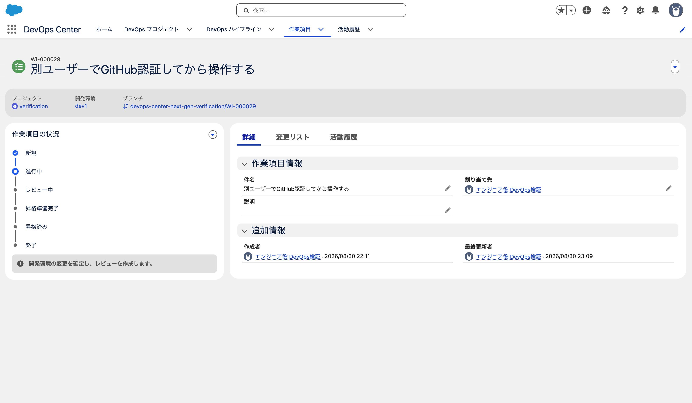

画面の変化。

| 場所 | 押す前 | 押した後 |
|---|---|---|
| ブランチ | （空欄） | `example-project/WI-000029` |
| 作業項目の状況 | 新規 | 進行中 |
| 状況パネルの案内 | （なし） | `開発環境の変更を確定し、レビューを作成します。` |

レコードと GitHub の側。

| 見たもの | 結果 |
|---|---|
| `WorkItem.Status` | `IN_PROGRESS` |
| `SourceCodeRepositoryBranchId` | `<DEVOPS_RECORD_ID>` |
| `SourceCodeRepositoryBranch` | `WI-000029` / 作成者 `<EMAIL_REDACTED>` |
| GitHub のブランチ | `WI-000029` が存在する（`staging` の先端から分岐） |
| 活動履歴 | `WORK_ITEM_STATE_TRANSITION` / `SUCCESS` / `dcdev` |
| `DevopsRequestInfo` | 記録なし |

### 開発環境の接続は未認証のまま通った

5章で見つけた2つの壁（`AccessDevOpsCenterNamedCredentials` 権限セットと GitHub の OAuth 認証）を
越えると、この操作は通った。

一方、開発環境 `dev1` の接続は未認証のままである（5章の表のとおり、dcdev から見て「アクセスを許可」）。
それでもブランチは作られた。「[進行中] とマーク」がやっているのは GitHub のブランチ作成であって、
開発環境には触れていないためだと考えられる。

**認証が要る接続は操作ごとに違う。** 新しい利用者が最初に全部の接続を認証させられるわけではない。

開発環境の接続がどの操作で必要になるかは未確認。
記事の判断にはブランチ作成までの結果で足りるため、この検証はここで終了した。
`WI-000029`では変更のコミットと昇格を実施していない。

なお、画面の操作は人が行った。Claude のブラウザからは dcdev のセッションに入れない
（フロントドアを通しても admin に戻る。Cookie とローカルストレージを消しても同じ）。
CLI 側は `sf api request rest ... -o dcng-dcdev` が dcdev として応答するので、
Connect API 経由なら Claude からも dcdev として叩ける。

## 8. 作業項目の画面を開くと更新日時が動く

`WorkItem.LastModifiedDate` が、誰も操作していない時間帯に2回動いていた（22:59 と 23:02）。
人が件名を変えたのは 22:53 で、それ以降は画面を開いた記憶しかない。

「[進行中] とマーク」を押すと更新日時は必ず動くので、押す前に切り分けた。
画面をリロードしてもらい、その前後で SOQL を投げた。

| 時刻 | `LastModifiedDate` | 何をしたか |
|---|---|---|
| 23:07 | `14:02:12Z` | （リロード前） |
| 23:09 | `14:08:22Z` | 23:08 にリロードした |

**リロードだけで更新される。** 更新者は `dcdev` である。
どのフィールドが書き換わっているかは追っていない。

これは記録の読み方に効く。5章で「進行中」が失敗したとき、
活動履歴にも `DevopsRequestInfo` にも記録が残らなかった。
`LastModifiedDate` はその代わりにならない。画面を開いただけでも動くので、操作の痕跡として読めない。

## 9. 後片付けの対象が増えた

`dev_1PJd..._1785831405232` は 08-04 に削除した環境の孤児で、
現在どの環境レコードからも参照されていない。

| 環境 | Named Credential |
|---|---|
| dev1 | `dev_..._1785805893032` |
| dev2 | `dev_..._1785833558024` |
| prod | `prod_..._1785738512210` |
| stg | `stg_..._1785807684161` |
| **（無し）** | **`dev_..._1785831405232`** ← 孤児 |

使われていないので害は無いが、`ALMDevOpsGitHub` と同じ一覧に並ぶので紛らわしい。

## 10. 関連

名義の話は 共同開発に関する検証 の「git の名義」にまとめている。
08-29 に「誰が操作しても同じ名義になる」と書いて訂正した経緯もそこにある。
