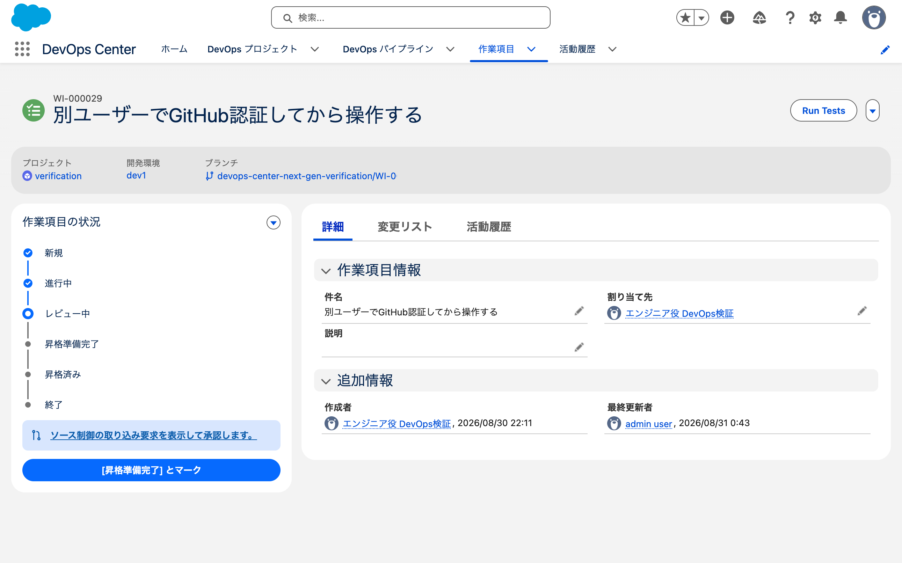
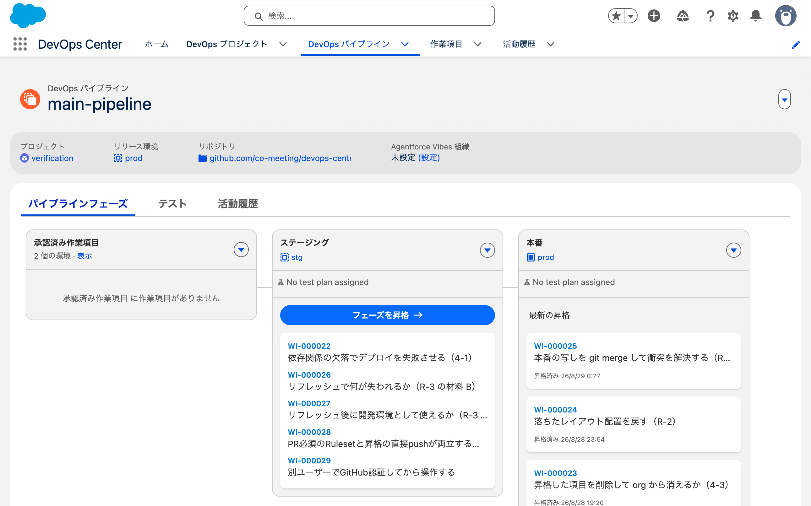
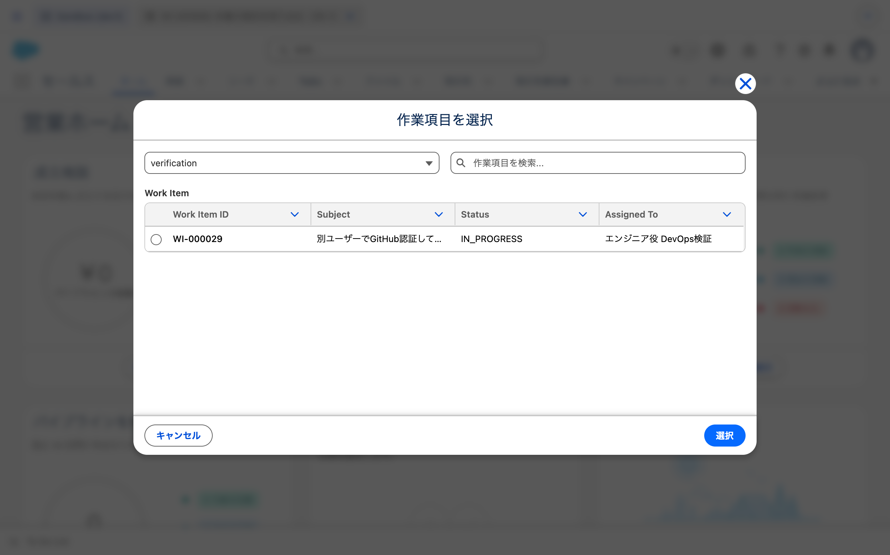
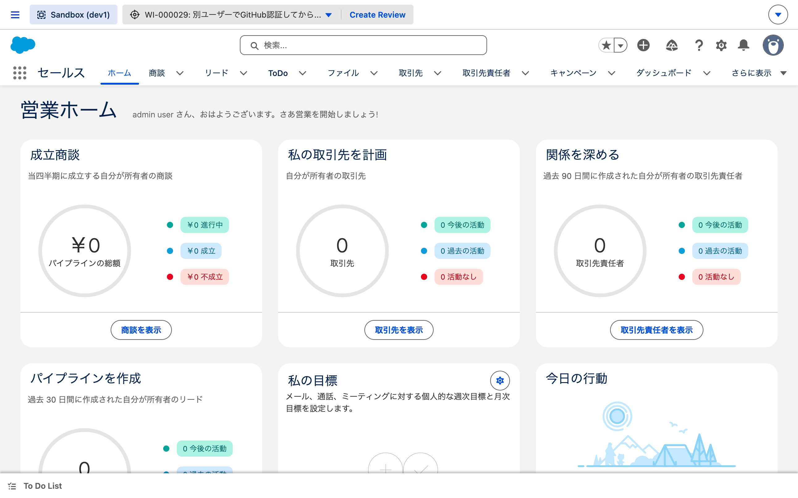
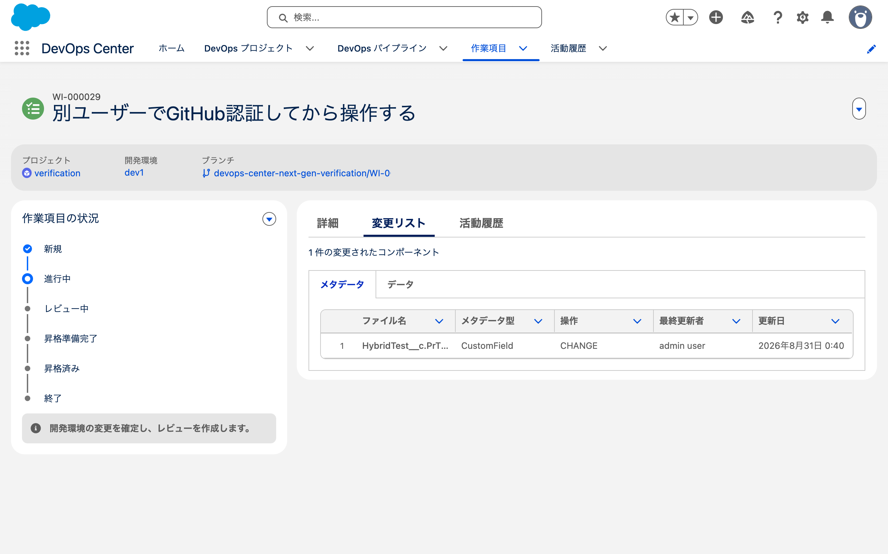

# 2026-08-31 PR のタイトルと本文を書き換えても昇格できるか

- 目的: DevOps Center が作った PR のタイトルと本文を書き換えたあとも、
  DevOps Center が同じ PR を追跡し、昇格が通るかを確かめる
- 使った org: `dcng-prod`（Hub）/ `dcng-dev1`（開発環境）/ `dcng-stg`（第1ステージ）
- 使った作業項目: `WI-000029`（08-30 に dcdev が作ったもの）
- きっかけ: PR のタイトルと本文が製品の定型文で、レビュー時に何の変更か分からない
  （→ 共同開発に関する検証）。
  GitHub Actions で書き換える回避策が使えるかどうかが、この検証にかかっていた

**通った。** 書き換えたタイトルと本文のまま、DevOps Center が PR をマージして昇格が完走した。

---

## 1. 何をしたか

| 時刻（JST） | 何を | 所要 |
|---|---|---|
| 00:34:44 | `dev1` に `HybridTest__c.PrTitleNote__c` を deploy | 6秒 |
| 00:40:05 | DX Inspector で `WI-000029` にコミット（`COMMIT_STARTED`） | |
| 00:40:38 | コミット完了（`COMMIT_COMPLETED`） | 33秒 |
| 00:43:44 | DX Inspector の `Create Review` で PR #40 を作成 | |
| 00:44:41 | **PR のタイトルと本文を全面的に書き換え** | |
| 00:45 | 作業項目を「昇格準備完了」に | |
| 00:48:43 | 昇格を実行（`PROMOTION_STARTED`） | |
| 00:49:01 | 昇格完了（`PROMOTION_COMPLETED`） | 18秒 |

書き換えは `gh api` で行った。実務では `pull_request: opened` で走る GitHub Actions が同じことをする。

## 2. 書き換えた内容

DevOps Center が作った直後の PR #40。

```
title: [DevOps Center] Merge WI-000029 to staging
body : DevOps Center created this pull request. It will be merged automatically upon
       promotion in DevOps Center. If you merge it outside of DevOps Center, DevOps
       Center provides you the option to deploy the changes to complete the promotion.
```

これを次に置き換えた。**定型文は1文字も残していない。**

```
title: [WI-000029] HybridTest__c に PRタイトル検証メモ を追加
body : ## 作業項目
       WI-000029 - 別ユーザーでGitHub認証してから操作する
       ## 変更内容
       | ファイル | 型 | 操作 |
       | `HybridTest__c.PrTitleNote__c` | CustomField | 追加 |
       ...
```

## 3. 追跡は切れなかった

書き換えた直後の `WorkItem`。

```
Name                     WI-000029
Status                   IN_REVIEW
ReviewRemoteReference    40
```

**DevOps Center が PR について持っているのは番号だけである。** タイトルも本文も保持していない。

作業項目の画面に出るリンクも `.../pull/40` で、番号から組み立てている。
リンクの文言は「ソース制御の取り込み要求を表示して承認します。」という製品の固定文で、
**PR のタイトルは画面のどこにも出ない。**

`ReviewRemoteReference` にPR番号が入ることは、過去の検証で確認済み。


今回はそれが**タイトルの書き換えに影響されない**ことを実測した。

共同開発に関する検証に「ブランチ名で識別していると考えられるが、根拠が無い」と書いていたが、
識別しているのは**ブランチ名でも PR のタイトルでもなく、PR 番号**である。

## 4. 昇格は完走した

昇格の結果。

| 見たもの | 結果 |
|---|---|
| 活動履歴 | `PROMOTION_STARTED` / `PROMOTION_WORK_ITEM` / `WORK_ITEM_STATE_TRANSITION` / `PROMOTION_COMPLETED` すべて `SUCCESS` |
| `WorkItem.Status` | `PROMOTED` |
| `ReviewRemoteReference` | 昇格完了後の時点では `null` に戻っていた（クリアの契機は追っていない） |
| PR #40 | `merged: true` / 00:48:59 にマージ / **タイトルは書き換えたまま** |
| `staging` ブランチ | `Merge branch 'WI-000029' into staging` |
| `stg` org の `HybridTest__c` | **`PrTitleNote__c` が届いた**（18項目） |



`stg` org の項目は `sf project retrieve start -m "CustomObject:HybridTest__c"` で数えた。

## 5. 何が言えるか

**GitHub Actions で PR のタイトルと本文を書き換える回避策は成立する。**

書き換えの内容に制約は見つからなかった。定型文を全部消しても、Markdown の表を入れても通った。
ただし試したのは1回で、次は確かめていない。

| 確かめたこと | 結果 |
|---|---|
| タイトルの書き換え | 昇格に影響しない |
| 本文の全面的な書き換え | 同上 |
| ブランチ名の変更 | **試していない**（作業項目の ID で固定されるため変えられない → 共同開発に関する検証） |
| 書き換えを2回以上行う | 試していない |
| マージ後にタイトルが戻るか | 戻らない。マージ後も書き換えたまま |

## 6. 途中で分かったこと

### 他人が作った作業項目を選べる

`WI-000029` は dcdev が作り、割り当て先も dcdev のままである。
それを admin が DX Inspector の「作業項目を選択」から選べた。



一覧に出たのは `WI-000029` の1件だけだった。`IN_PROGRESS` のものだけが並ぶ。
選択して以降の操作（コミット、レビュー作成、昇格）はすべて admin として通り、
**割り当て先は dcdev のまま変わらなかった。**

git 側のコミットは `DevOps Center <EMAIL_REDACTED>` 名義で、
誰が作業したかはコミットからは分からない（→ 共同開発に関する検証の名義の話）。

### レビューを作る導線は開発環境の側にしかない

コミット後、DevOps Center の作業項目画面には「レビューを作成」に当たるボタンが出ない。
状況パネルのメニューは「状況を [対象外] に変更」だけ、
レコードのメニューは「リリース環境を変更」だけだった。

**`Create Review` は DX Inspector の上部バーに出る。**



08-26 に同じことを記録している（→ [`2026-08-26-fls-tracking.md`](2026-08-26-fls-tracking.md) の658行）。
今回は**DevOps Center 側に導線が無いこと**を、3つのメニューを開いて確かめた。

### 変更リストの操作名が画面で違う

同じ変更が、見る場所で違う語になる。

| 画面 | 語 |
|---|---|
| DX Inspector の変更管理 | `Modify` |
| コミットのプレビュー | `modify` |
| DevOps Center の変更リスト | **`CHANGE`** |



新規に作った項目でも `Modify` と出る。`Add` は別の条件で付く
（同じ一覧の `AppSwitcher` と `AccessDevOpsCenterNamedCredentials` は `Add`）。条件は追っていない。

## 7. 作業のノウハウ

この検証で詰まった箇所。次に同じことをするときのために残す。

| 現象 | 対処 |
|---|---|
| `gh pr edit` が `GraphQL: Projects (classic) is being deprecated...` で失敗する | `gh api repos/{owner}/{repo}/pulls/{n} -X PATCH --input <json>` を使う |
| **`FieldDefinition` の SOQL でカスタム項目が返らない** | prod でも stg でも標準項目しか返らなかった。項目の確認は `sf project retrieve start -m "CustomObject:..."` でファイルを数える |
| パイプラインのチェックボックスが click ツールで押せない | 実体が 1×1 px で隠れている。Shadow DOM を辿って `label.click()` を呼ぶと通った |
| DevOps Center の画面がコミットを反映しない | リロードする。変更リストのタブは反映が早い |

## 8. 関連

- PR のタイトルと本文が固定である話は 共同開発に関する検証
- `WI-000029` の生い立ちは [`2026-08-30-github-auth-per-user.md`](2026-08-30-github-auth-per-user.md)
- 昇格が `staging` への push であることは [`2026-08-28-ci-branch-protection.md`](2026-08-28-ci-branch-protection.md)
